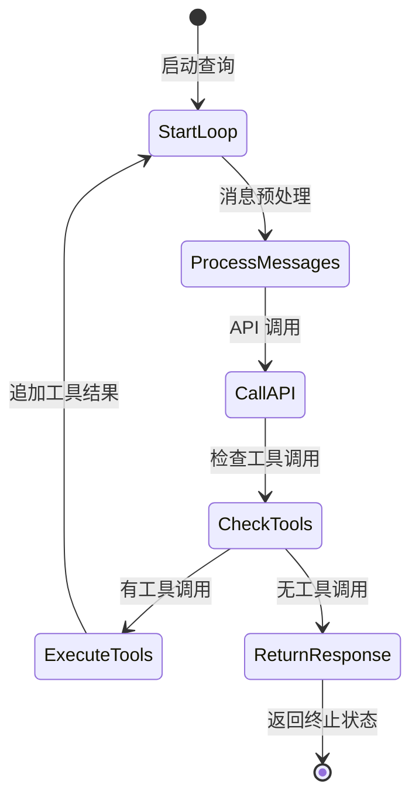
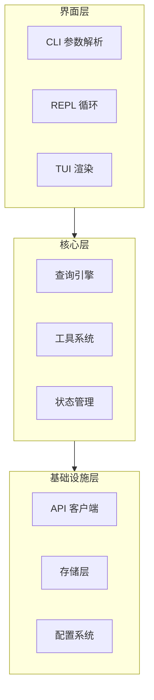
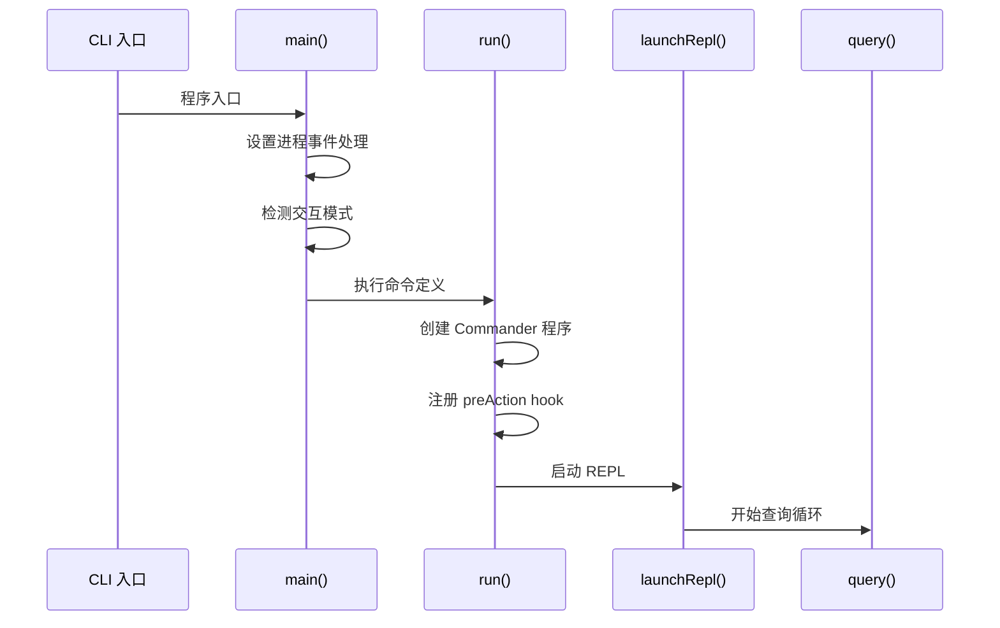
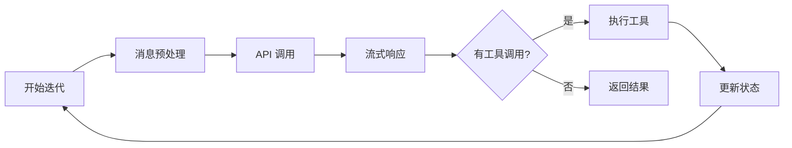
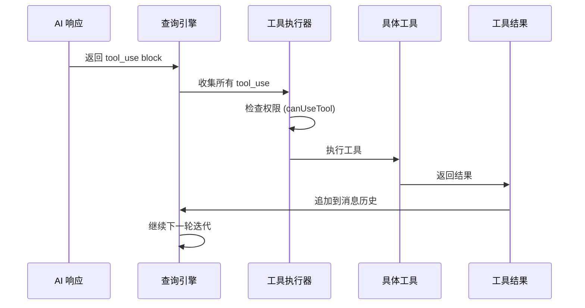
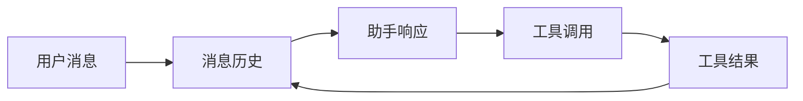

# 架构设计和核心流程

## Relevant source files

- `src/main.tsx` - 程序主入口，命令定义，REPL 启动
- `src/query.ts` - 查询引擎核心，Agent Loop 实现
- `src/bootstrap/state.ts` - 全局状态初始化
- `src/types/index.ts` - 核心类型定义
- `package.json` - 项目依赖与配置

## 本页概述

本页深入分析 Claude Code Annotated 的系统架构与核心执行流程。通过理解 Agent Loop 模式、状态管理机制和分层架构，读者可以掌握整个系统的运作原理，为深入理解各功能模块奠定基础。

## 核心架构模式

### Agent Loop 模式

Claude Code Annotated 采用 **Agent Loop** 作为核心执行模型。这是一种基于无限循环的代理交互模式：



**核心特征**：
- **无限循环**: `while(true)` 结构，直到显式 `return`
- **状态传递**: 每次迭代携带完整的 `State` 对象
- **流式输出**: 使用 `AsyncGenerator` 逐步 yield 中间状态
- **工具驱动**: AI 决定是否调用工具，系统负责执行

### 分层架构

系统采用清晰的分层架构，每层职责单一：



**层间通信**：
- 界面层 → 核心层：通过函数调用和状态注入
- 核心层 → 基础设施层：通过依赖注入 (`deps`)
- 所有层 → 类型层：共享类型定义

## 核心流程详解

### 1. 程序启动流程



**关键步骤**：

1. **入口初始化** (`src/main.tsx:main()`)
   - 设置 Windows 安全配置
   - 注册进程退出处理器 (`exit`, `SIGINT`)
   - 检测交互模式 (`isNonInteractive`)

2. **命令定义** (`src/main.tsx:run()`)
   - 创建 Commander 程序实例
   - 配置帮助系统 (`sortSubcommands`, `sortOptions`)
   - 注册 `preAction` hook（初始化配置、设置等）

3. **REPL 启动** (`launchRepl()`)
   - 创建 Ink root (React 终端渲染器)
   - 准备渲染上下文 (`getRenderContext`)
   - 启动交互式循环

### 2. 查询循环流程



**状态流转**：

```typescript
// State 类型定义 (src/query.ts)
type State = {
  messages: Message[]                    // 消息历史
  toolUseContext: ToolUseContext        // 工具执行上下文
  autoCompactTracking: undefined        // 自动压缩追踪
  maxOutputTokensRecoveryCount: number  // 输出令牌恢复计数
  hasAttemptedReactiveCompact: boolean  // 是否尝试过响应式压缩
  maxOutputTokensOverride: number       // 最大输出令牌覆盖
  pendingToolUseSummary: Promise        // 待处理工具摘要
  stopHookActive: boolean               // 停止 hook 是否激活
  turnCount: number                     // 轮次计数
  transition: Continue | undefined      // 上次迭代的转换原因
}
```

**循环控制**：
- **继续条件**: 收到 `Continue` 转换信号
- **终止条件**: 收到 `Terminal` 转换信号或达到最大轮次

### 3. 工具执行流程

当 AI 返回 `tool_use` block 时，系统执行工具：



**权限控制**：
- 每个工具执行前调用 `canUseTool(name, input)`
- 支持交互式确认和自动批准模式
- 可通过 `--dangerously-skip-permissions` 跳过所有提示

## 状态管理机制

### 全局状态 (Bootstrap State)

```typescript
// src/bootstrap/state.ts
// 启动时初始化的全局状态
// 通过 getAppState/setAppState 访问
```

**作用**：
- 存储跨会话的配置和设置
- 管理运行时标志和开关
- 提供状态访问接口

### 工具执行上下文 (ToolUseContext)

```typescript
// src/Tool.ts
export type ToolUseContext = {
  options: {
    commands: unknown[]
    debug: boolean
    mainLoopModel: string
    tools: unknown[]
    verbose: boolean
    isNonInteractiveSession: boolean
    // ... 更多配置
  }
  abortController: AbortController
  messages: Message[]
  // ... 状态访问器
}
```

**职责**：
- 集中管理工具执行所需的所有依赖
- 支持子代理继承和修改上下文
- 包含权限、配置、回调等完整信息

### 消息状态 (Messages)

消息历史是 Agent Loop 的核心数据：



**消息类型**：
- `user`: 用户输入
- `assistant`: AI 响应（可能包含 `tool_use`）
- `tool_result`: 工具执行结果
- `system`: 系统消息

## 设计要点

### 1. 单向数据流

状态在循环中单向流动：
```
输入 → 处理 → 输出 → 新输入
```

避免双向绑定和复杂的状态同步。

### 2. 不可变参数

`QueryParams` 在整个查询过程中保持不变：
```typescript
const {
  systemPrompt,    // 系统提示
  userContext,     // 用户上下文
  systemContext,   // 系统上下文
  canUseTool,      // 权限检查函数
  fallbackModel,   // 后备模型
  // ...
} = params  // 永不修改
```

### 3. 可变状态封装

所有可变状态封装在 `State` 类型中：
```typescript
let state: State = { /* 初始状态 */ }

while (true) {
  const { messages, toolUseContext, ... } = state
  // ... 处理逻辑
  state = { ...state, messages: newMessages }  // 原子更新
}
```

### 4. 依赖注入

核心功能通过 `deps` 参数注入，便于测试和扩展：
```typescript
const deps = params.deps ?? productionDeps()
```

## 继续阅读

- [02-core-interaction-layer](./02-core-interaction-layer.md) - 了解 CLI 和 REPL 的具体实现
- [03-query-engine-layer](./03-query-engine-layer.md) - 深入查询引擎的实现细节
- [04-tool-execution-layer](./04-tool-execution-layer.md) - 学习工具系统的设计与执行
