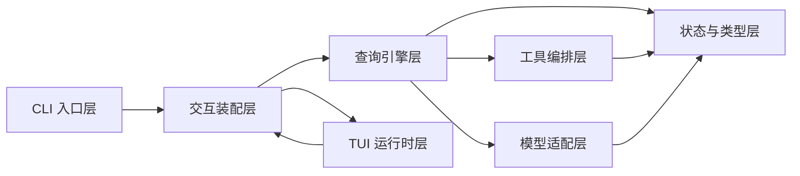
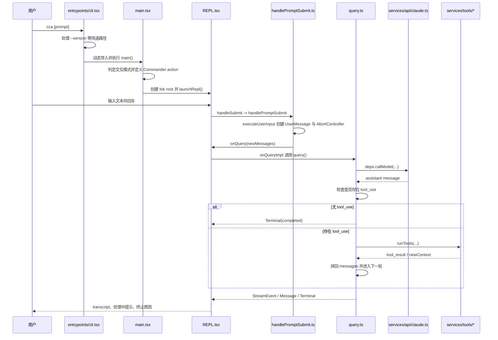
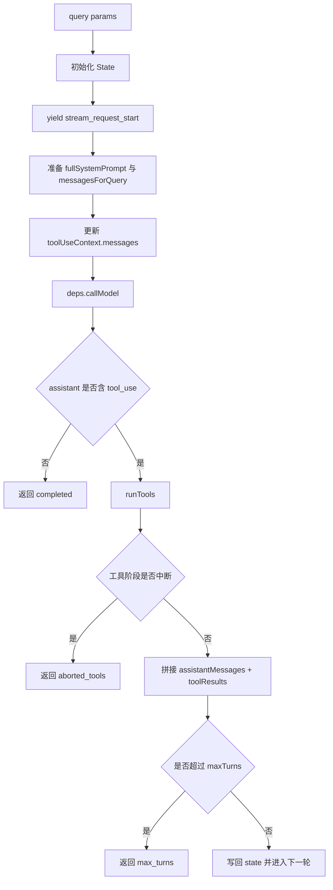
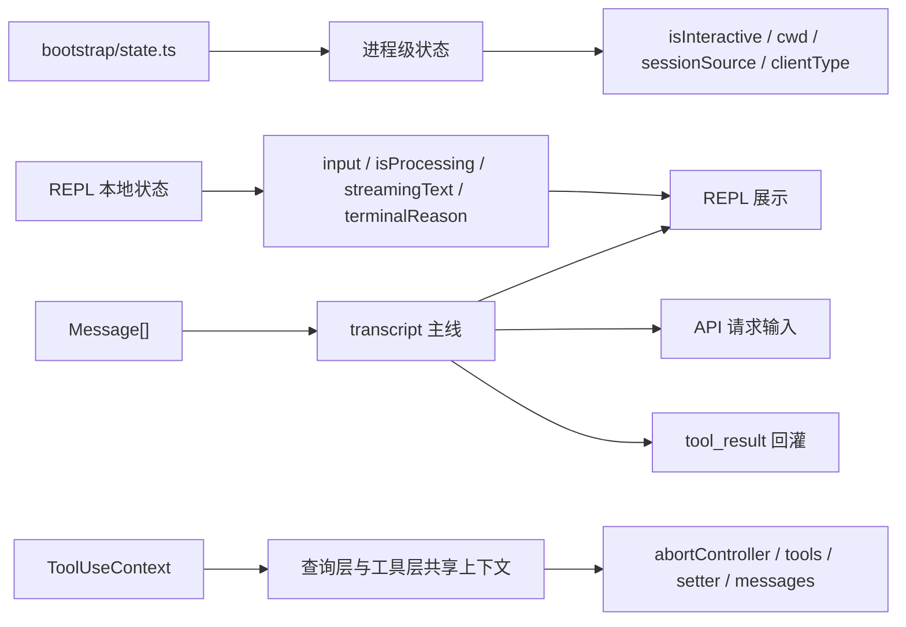

# 01. 架构蓝图与核心流转

## 文档定位

本页按 `architecture-blueprint-generator` 的蓝图思路，重新整理当前仓库已经被源码证明的架构事实。它回答四个问题：

1. 这个项目现在到底是什么架构
2. 最小可运行主链路如何穿过各层
3. 哪些边界已经稳定，后续可以在其内部继续对齐上游
4. 哪些能力仍然只是预留挂点，而不是已实现现状

当前仓库的稳定骨架仍然是：

`CLI 入口 -> Commander 主命令 -> Ink root -> REPL -> handlePromptSubmit 提交编排 -> query() 代理循环 -> 模型调用 / 工具编排 -> 下一轮或终止`

## 技术栈识别

| 维度 | 当前实现 |
| --- | --- |
| 语言 | TypeScript |
| 运行时 | Bun |
| 终端 UI | Ink + React |
| 命令行框架 | `@commander-js/extra-typings` |
| 模型 SDK | `@anthropic-ai/sdk` |
| 产物形态 | 单包 CLI / TUI 工程 |
| 当前主工作模式 | 交互式 REPL |

从目录结构和依赖关系看，这不是典型的多服务系统，而是一个以终端交互为壳、以代理回合循环为内核的单体 CLI 应用。

## 架构结论

### 主体模式

当前代码最接近一种“分层单体 + 端口适配”混合架构：

- 入口装配层负责把命令行环境转成可运行会话
- 交互层负责把用户输入转成消息和查询请求
- 查询引擎层负责推进代理回合
- API 适配层与工具编排层分别作为查询层的两个外部端口
- 状态层与类型层提供跨层共享的数据契约
- TUI 运行时层负责终端渲染和退出语义

### 当前最稳定的两个窄口

- 查询层到模型层：`QueryDeps.callModel`
- 查询层到工具层：`runTools`

这两个窄口意味着后续即便继续补 streaming、权限、真实工具执行、压缩和 token budget，主回合骨架依旧可以保持不变。

### graphify 侧证

从 `graphify-out/GRAPH_REPORT.md` 看，当前最显著的高连接节点是 `executeUserInput()`、`main()`、`run()`、`renderAndRun()`、`gracefulShutdown()`、`createUserTextMessage()`。这与源码观察一致，说明当前仓库的结构重心仍在：

- 启动装配
- REPL 提交编排
- 最小代理回合闭环

## 高层蓝图

## 组件蓝图

| 层次 | 核心模块 | 主要职责 | 明确不负责的事 |
| --- | --- | --- | --- |
| CLI 入口层 | `src/entrypoints/cli.tsx`、`src/main.tsx` | 快速路径分流、Commander 命令定义、交互模式判定、Ink root 创建、REPL 启动 | 不推进单轮 query，不解析 assistant/tool 协议 |
| 交互装配层 | `src/replLauncher.tsx`、`src/screens/REPL.tsx`、`src/utils/handlePromptSubmit.ts` | 输入采集、消息展示、提交编排、查询事件消费、共享 `AbortController` 生命周期管理 | 不直接调用 SDK，不决定工具批次策略 |
| 查询引擎层 | `src/query.ts`、`src/query/deps.ts`、`src/query/transitions.ts` | 维护跨轮状态、发起模型调用、识别 `tool_use`、驱动下一轮或终止 | 不持有终端渲染，不直接依赖 Anthropic 客户端细节 |
| 工具编排层 | `src/Tool.ts`、`src/services/tools/toolOrchestration.ts`、`src/services/tools/toolExecution.ts`、`src/tools/` | 统一工具协议、按并发安全性切批、生成 `tool_result`、真实工具调用与结果映射 | 当前不支持 hooks 系统、telemetry 日志、MCP 工具处理、进度报告 |
| 模型适配层 | `src/services/api/client.ts`、`src/services/api/claude.ts` | 客户端缓存、消息归一化、Anthropic `messages.create()` 调用、assistant 消息回填 | 不推进回合状态，不决定何时继续循环 |
| 状态与类型层 | `src/bootstrap/state.ts`、`src/types/message.ts`、`src/constants/querySource.ts` | 保存进程态、统一 transcript 结构、定义跨层消息协议 | 不承载业务流程控制 |
| TUI 运行时层 | `src/ink.ts`、`src/interactiveHelpers.tsx`、`src/components/App.tsx` | 创建终端 root、挂载 React 树、退出与消息式收尾、预留 App Provider 挂点 | 不理解代理循环语义 |

## 核心时序

## 关键依赖规则

### 1. 入口只装配，不承载回合决策

- `src/entrypoints/cli.tsx` 只处理极少数快速路径，然后动态导入 `main()`
- `src/main.tsx` 只负责会话启动、命令定义、渲染环境创建与 `launchRepl()`
- 是否继续下一轮、何时执行工具、为何结束，都不在入口层判断

### 2. REPL 是提交编排边界，不是代理引擎

当前交互层的最重要变化，不是“直接调 `query()`”，而是先经过一条稳定的提交编排链：

`handleSubmit -> handlePromptSubmit -> executeUserInput -> onQuery -> onQueryImpl -> onQueryEvent`

这条链分别承担：

- `handleSubmit`：输入非空校验、防重入、UI 状态复位
- `handlePromptSubmit`：清空输入框并触发执行
- `executeUserInput`：把输入转成 `UserMessage[]`，创建共享 `AbortController`
- `onQuery`：先把新消息并入 transcript
- `onQueryImpl`：真正消费 `query()` 异步生成器
- `onQueryEvent`：把流式事件回写到 REPL 本地状态

### 3. 查询层只依赖抽象端口

`src/query.ts` 不直接 import Anthropic client，而是通过 `QueryDeps.callModel` 调模型；同样，工具调用也收敛到 `runTools()`。这使查询层能保持“状态机 + 生成器”的核心职责，不被外部 I/O 细节污染。

### 4. 工具层按确定性优先组织

工具编排层最重要的设计选择不是“尽量并发”，而是“并发也要保持可复现”：

- 能否并发由工具自己的 `isConcurrencySafe()` 决定
- schema 校验失败、工具不存在、并发判断异常都降级为串行
- 并发批次中的 `contextModifier` 先缓存，待整批结束后再按原始 `tool_use` 顺序回放

这保证了共享上下文不会被完成时序污染。

## 回合推进蓝图

每轮实际遵循的固定步骤是：

1. 从 `State` 解构本轮状态
2. 向上游发出 `stream_request_start`
3. 准备系统提示与消息历史
4. 调用 `deps.callModel`
5. 从 assistant 内容块中直接收集 `tool_use`
6. 若没有 `tool_use`，返回 `completed`
7. 若有 `tool_use`，进入 `runTools()`
8. 把 assistant 消息和 `tool_result` 拼回消息历史
9. 更新 `turnCount` 与 `transition`
10. 继续下一轮

## 状态架构

### 三条稳定主线

| 主线 | 载体 | 作用 |
| --- | --- | --- |
| 进程态 | `bootstrap/state.ts` | 保存交互模式、cwd、session source、clientType 等全局环境信息 |
| 消息态 | `Message[]` | 统一承载用户消息、assistant 响应、系统消息、`tool_result` |
| 会话共享态 | `ToolUseContext` | 在查询层与工具层之间共享 `AbortController`、工具表、可变 setter 与当前消息快照 |

### 交互层本地状态

`REPL.tsx` 额外维护一组只属于终端界面的本地态：

- `input`
- `isProcessing`
- `streamMode`
- `streamingText`
- `streamingThinking`
- `streamingToolUses`
- `lastTerminalReason`
- `responseLength`
- `userInputOnProcessing`
- `abortController`

这说明当前架构尚未把所有交互态提升到统一 App Store，而是优先让 REPL 单文件闭环可运行。

## 数据与协议边界

### 消息协议

`src/types/message.ts` 是全仓库最重要的跨层契约之一。当前所有关键链路都围绕它组织：

- REPL 把输入转换为 `UserMessage`
- API 适配层把 Anthropic 响应转为 `AssistantMessage`
- 工具层把执行结果转为 `tool_result` 形式的 `UserMessage`
- 查询层以 `Message[]` 作为跨轮次唯一历史来源

### 工具协议

`src/Tool.ts` 先稳定了协议，再延后能力实现：

- `Tool`
- `Tools`
- `ToolUseContext`
- `findToolByName()`

这意味着工具系统当前更像“可扩展框架骨架”，而不是“已完成工具集”。

## 交叉关注点

### 错误处理

- 模型调用异常在 `query.ts` 中被转换为 `model_error`
- REPL 层会在终态是 `model_error` 且包含 `Error` 时追加系统消息
- 工具不存在、输入非法、权限拒绝、执行异常时，工具层统一返回错误型 `tool_result`

当前错误处理已经形成清晰边界，但尚未覆盖更细粒度的重试、分类恢复和 stop hooks。

### 中断与退出

- `executeUserInput` 为单轮提交创建共享 `AbortController`
- REPL 中按 `Escape` 会先触发 `abortController.abort('user_escape')`
- 查询层在流式阶段和工具阶段都检查中断并返回不同终止原因
- TUI 运行时通过 `renderAndRun()`、`gracefulShutdown()`、`exitWithMessage()` 统一收尾

### 配置管理

当前配置仍以环境变量和命令行参数为主：

- `ANTHROPIC_API_KEY`
- `ANTHROPIC_MODEL`
- `ANTHROPIC_DEFAULT_SONNET_MODEL`
- `ANTHROPIC_MAX_OUTPUT_TOKENS`
- `API_TIMEOUT_MS`
- `CLAUDE_CODE_MAX_TOOL_USE_CONCURRENCY`

这说明配置体系尚未抽象成完整配置域，但关键模型与并发参数已经具备入口。

### 可观测性

当前仓库只保留了最小可见指标：

- `responseLength`
- `lastTTFTMs`
- `lastStreamEventType`
- `streamMode`

更完整的统计、FPS、analytics、profileCheckpoint 多数仍停留在 TODO 或挂点阶段。

## 当前实现边界

### 已经稳定的部分

- CLI 快速路径与主模块动态导入
- Commander 主命令装配
- REPL 提交编排链路
- `query()` / `queryLoop()` 最小回合骨架
- `QueryDeps.callModel` 与 `runTools` 两个窄口
- `tool_use -> tool_result -> 下一轮` 的协议闭环
- 工具真实调用链路（查找→校验→权限→调用→结果映射）
- Bash/Edit/Write/Glob/Read 五个真实工具实现
- Shell 命令执行引擎（exec/ShellCommand/命令语义解析）
- 编辑工具函数集（引号规范化、patch 生成、反净化、等价性判断）
- 文件写入权限检查（checkWritePermissionForTool）
- 工具定义转换为 API 格式（toolsToApiFormat）
- 内容块归一化（normalizeContentFromAPI 支持 input 解析与规范化）

### 仍是挂点或存根的部分

- 非交互 `print` 主路径
- 流式 Anthropic 事件细化
- stop hooks / compact / token budget / fallback 恢复
- hooks / telemetry / MCP 工具处理 / 进度报告
- 完整权限决策（分类器、用户提示、hook 执行、写入权限规则匹配）
- App 级 Provider、Stats、FpsMetrics、复杂对话框
- 多 provider API 适配与更完整 `QuerySource`

## 新开发蓝图

如果后续继续在这套架构里补齐能力，建议遵守以下放置规则：

### 1. 新增 CLI 或会话启动能力

放在入口装配层：

- 参数分流放 `src/entrypoints/cli.tsx`
- 命令定义和 action 装配放 `src/main.tsx`
- 不要把 query loop 逻辑塞回 Commander action

### 2. 新增提交前后交互行为

放在 REPL 提交编排链：

- 输入准备、清空、前置校验放 `handlePromptSubmit.ts`
- 展示态、流式消费、终态反馈放 `REPL.tsx`
- 不要在 REPL 里直接复制一份 query loop

### 3. 新增模型侧能力

优先通过 `QueryDeps` 或 `services/api/` 接入：

- 查询层只声明“需要什么模型能力”
- 具体 SDK 参数归一化放 API 适配层
- 避免让 `query.ts` 直接依赖 SDK 细节

### 4. 新增工具能力

优先保持现有两层拆分：

- 工具协议和共享上下文放 `Tool.ts`
- 批次、并发与回放策略放 `toolOrchestration.ts`
- 单工具校验和执行细节放 `toolExecution.ts` 或后续专属工具模块

### 5. 新增全局状态

先判断状态属于哪一层：

- 进程级环境状态放 `bootstrap/state.ts`
- transcript 协议数据放 `types/message.ts`
- 工具与查询共享的会话状态放 `ToolUseContext`
- 只影响 UI 展示的短生命周期状态，先留在 REPL 本地

## 推荐阅读顺序

1. 先读 `overview.md` 建立目录地图
2. 回到本页理解分层、边界和主时序
3. 读 `02-core-interaction-layer.md` 看启动与提交编排
4. 读 `03-query-engine-layer.md` 看 `queryLoop()` 如何推进
5. 读 `04-tool-execution-layer.md` 与 `05-api-client-layer.md` 看两个外部窄口
6. 读 `06-session-management-layer.md` 与 `07-tui-rendering-layer.md` 补齐状态与运行时视角

## 小结

当前仓库的架构重点不是“功能已经很多”，而是“主骨架已经足够清晰，可以继续向上游靠拢”：

- 入口层负责会话装配
- 交互层负责把一次输入编排成查询请求
- 查询层负责推进代理回合
- API 层和工具层提供外部协作窄口
- 状态层与 TUI 运行时提供跨层承载

后续的大多数工作，都会是在这些边界内部继续补深度，而不是推翻这套结构重新设计。
