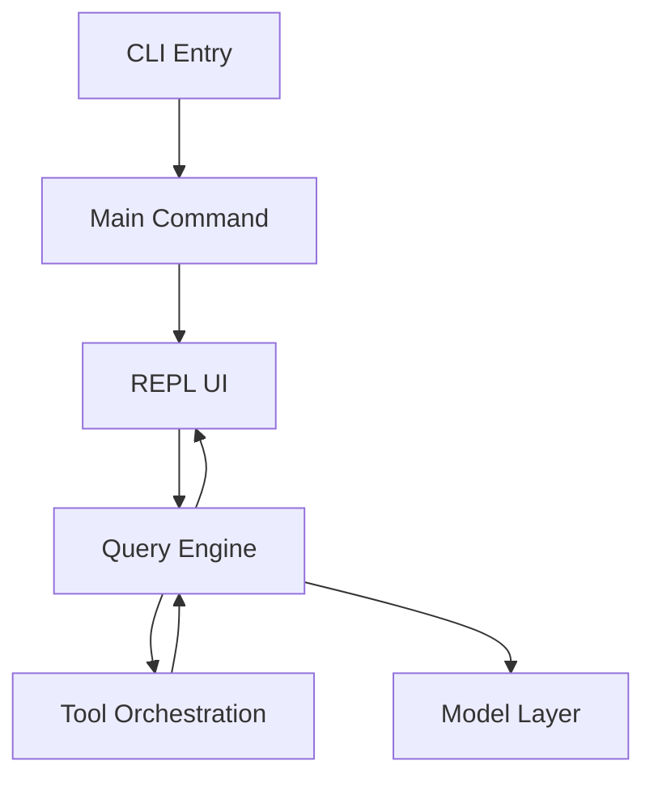
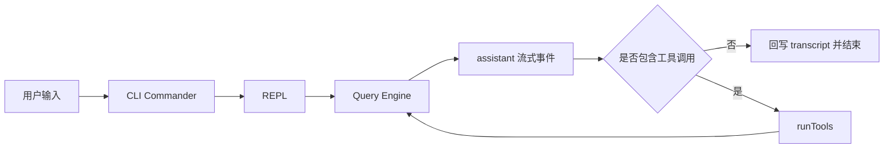

# 架构设计和核心流程

## Relevant source files
- `src/entrypoints/cli.tsx`
- `src/main.tsx`
- `src/replLauncher.tsx`
- `src/screens/REPL.tsx`
- `src/query.ts`
- `src/services/tools/toolOrchestration.ts`

## 本页边界

本页只建立三件事：系统分层、主执行链路、阅读路径。  
不展开函数级源码细节，也不替代各专题页的实现分析。

## Architecture and Runtime

- 运行时基础是 `Bun + TypeScript`
- 命令入口是 `src/entrypoints/cli.tsx`
- 主命令装配落在 `src/main.tsx`
- 终端界面由 `Ink` 承担，业务推进围绕 `query()` 代理循环展开

代码依据：当前仓库的启动入口、REPL 挂载点、`query()` 主循环和工具编排层分别落在 `src/entrypoints/cli.tsx`、`src/main.tsx`、`src/screens/REPL.tsx`、`src/query.ts`、`src/services/tools/toolOrchestration.ts`。

## High-Level System Flow

代码依据：当前 `REPL` 已把输入直接送入 `query()`，`queryLoop` 消费 `callModel` 结果，发现 `tool_use` 后进入 `runTools`，否则以终止原因结束一轮回合。

## 分层视图

- 交互入口层：负责参数解析、模式判定和启动 REPL
- 渲染层：负责终端 root、组件树挂载和退出流程
- 查询引擎层：负责一轮代理回合的状态推进
- 工具层：负责 `tool_use` 分批、串并行调度和结果回传
- 模型依赖层：负责把模型调用封装成 `QueryDeps`
- 状态承载层：负责全局交互态、cwd、消息历史载体等基础状态

## 阅读路径

- 先读 [overview](./overview.md) 建立目录地图和专题索引
- 再读 [02-core-interaction-layer](./02-core-interaction-layer.md) 理解输入如何进入系统
- 然后读 [03-query-engine-layer](./03-query-engine-layer.md) 理解一轮代理回合如何推进
- 需要工具链路时读 [04-tool-execution-layer](./04-tool-execution-layer.md)
- 需要运行时和状态支撑时读 [05-api-client-layer](./05-api-client-layer.md)、[06-session-management-layer](./06-session-management-layer.md)、[07-tui-rendering-layer](./07-tui-rendering-layer.md)
