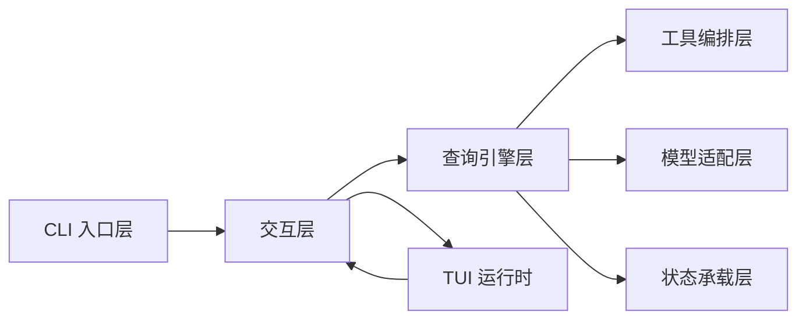

# 01. 架构设计和核心流程

## 概述

当前仓库的目标不是一次性复刻 Claude Code 全量能力，而是先把最小主链路搭起来，并围绕这条主链路持续增量对齐。现阶段最稳定的骨架是：

`CLI 入口 → Commander 主命令 → Ink root → REPL → query() 代理循环 → 模型调用 → tool_use 编排 → 下一轮或终止`

这条链路决定了仓库的模块边界，也决定了源码阅读顺序。

## 架构分层



## 模块职责

| 层次 | 主要模块 | 负责什么 | 不负责什么 |
| --- | --- | --- | --- |
| CLI 入口层 | `src/entrypoints/cli.tsx`、`src/main.tsx` | 解析命令、建立交互模式、启动 REPL | 不推进具体查询回合 |
| 交互层 | `src/replLauncher.tsx`、`src/screens/REPL.tsx` | 收集输入、显示 transcript、把一次提交交给 `query()` | 不直接操作 SDK 或工具调度 |
| 查询引擎层 | `src/query.ts`、`src/query/deps.ts` | 持有主循环状态、决定继续还是终止 | 不直接持有 TUI 渲染逻辑 |
| 工具编排层 | `src/Tool.ts`、`src/services/tools/` | 处理 `tool_use` 批次、顺序和结果回灌 | 当前不提供真实工具执行结果 |
| 模型适配层 | `src/services/api/` | 归一化消息、创建 Anthropic 客户端、发起模型请求 | 不决定 query loop 的状态推进 |
| 状态承载层 | `src/bootstrap/state.ts`、`src/types/message.ts` | 统一进程态、消息态和跨层上下文的基础类型 | 不承担业务流程控制 |
| TUI 运行时 | `src/ink.ts`、`src/interactiveHelpers.tsx`、`src/components/App.tsx` | 创建 root、驱动终端渲染、处理退出 | 不理解代理循环语义 |

## 核心协作关系

### 启动链路

- `src/entrypoints/cli.tsx` 处理极少数快速路径，其余情况动态导入 `main()`
- `src/main.tsx` 定义 Commander 主命令，并在 action 中创建 Ink root
- `src/replLauncher.tsx` 负责把 `App` 与 `REPL` 组合后挂到 root

### 交互链路

- `src/screens/REPL.tsx` 维护本地输入和 transcript 展示
- 用户提交后，REPL 只负责把消息拼好并调用 `query()`
- `query()` 的流式产出再回写给 REPL 进行显示

### 回合链路

- 查询层每一轮都先发起模型请求
- 若本轮没有 `tool_use`，直接终止
- 若出现 `tool_use`，则进入工具编排层生成 `tool_result`
- 工具结果被拼回消息历史后，再进入下一轮

## 状态主线

```mermaid
flowchart TD
    A[bootstrap/state.ts] --> D[运行期进程态]
    B[Message[]] --> E[transcript 主线]
    C[ToolUseContext] --> F[查询层与工具层共享上下文]
    E --> G[REPL 展示]
    E --> H[query loop]
    F --> H
    D --> I[启动模式与环境判断]
```

这三条状态主线的分工如下：

- `bootstrap/state.ts` 负责进程级环境信息，例如是否交互式、cwd、session source
- `Message[]` 负责承载对话历史、assistant 响应、`tool_result` 和系统消息
- `ToolUseContext` 负责工具与查询层共享的可变上下文，例如中断控制器、工具列表和会话级 setter

## 当前架构特征

### 1. 窄口明确

仓库当前最稳定的两个窄口是：

- 查询层到模型层：`QueryDeps.callModel`
- 查询层到工具层：`runTools`

这意味着后续即便补 streaming、权限、真实工具执行，整体架构骨架也不需要重写。

### 2. 先闭环再扩展

当前架构更重视“最小闭环可跑通”，所以很多复杂能力先被显式留在 TODO：

- 非交互 `print` 模式
- stop hooks / token budget / compact
- 多 provider API 支持
- App 级全局状态与更多 UI provider

### 3. 分层清楚但实现深度不均衡

- 入口层、REPL 接线、查询主循环骨架已经比较清晰
- 工具执行层和 API 适配层已经有边界，但内部仍是最小实现
- 状态层与类型层的覆盖比较全，便于后续继续复刻

## 推荐阅读路径

1. 先读 `overview.md` 建立目录地图
2. 回到本页理解层次和协作关系
3. 读 `02-core-interaction-layer.md` 看启动和输入接线
4. 读 `03-query-engine-layer.md` 看主回合怎样推进
5. 读 `04-tool-execution-layer.md` 与 `05-api-client-layer.md` 看两个外部窄口
6. 最后读 `06-session-management-layer.md` 与 `07-tui-rendering-layer.md` 补齐状态与运行时认知

## 小结

当前仓库的核心认知不是“功能很多”，而是“骨架已经稳定”：

- 入口负责把会话启动起来
- REPL 负责把交互转成查询请求
- `query()` 负责推进主回合
- 工具层和 API 层分别作为两个外部协作窄口
- 状态层和 TUI 层提供运行时承载

后续所有增量复刻，基本都会落在这套骨架内部继续加深，而不是推翻重来。
