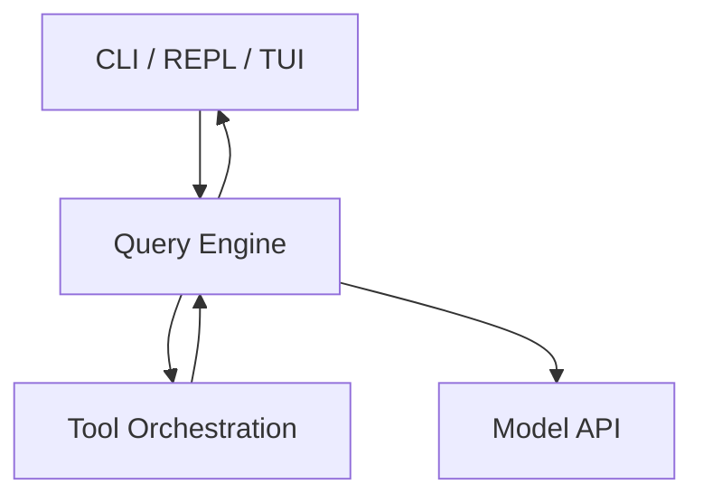
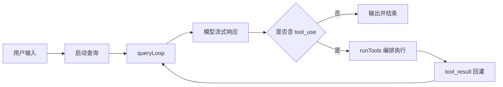

# 架构设计和核心流程

## Relevant source files

- `src/main.tsx`
- `src/entrypoints/cli.tsx`
- `src/replLauncher.tsx`
- `src/query.ts`
- `src/services/tools/toolOrchestration.ts`
- `src/Tool.ts`

## 本页边界

本页只回答三个问题：系统怎么分层、主链路怎么走、下一步该读哪些专题页。  
不展开具体函数实现与源码细节。

## Architecture and Runtime

- 运行时以 Bun + TypeScript 为主，终端交互基于 Ink。
- 架构采用单仓库分层组织，核心执行围绕 query loop 展开。
- 交互层负责输入与会话驱动，核心层负责推理与状态推进，工具层负责工具调度与执行，渲染层负责反馈呈现。

## High-Level System Flow

## 模块协作关系

- `交互入口`：接收输入、触发一次查询回合。
- `查询引擎`：维护跨轮次状态、消费流式响应、决定继续或终止。
- `工具编排`：按并发安全策略调度工具，回传工具结果消息。
- `状态承载`：统一通过上下文对象在轮次间传递执行依赖和会话状态。

## 阅读路径

- 第 1 站：[overview](./overview.md) - 先看仓库地图与导航。
- 第 2 站：[02-core-interaction-layer](./02-core-interaction-layer.md) - 理解输入如何进入系统。
- 第 3 站：[03-query-engine-layer](./03-query-engine-layer.md) - 理解主循环与状态推进。
- 第 4 站：[04-tool-execution-layer](./04-tool-execution-layer.md) - 理解工具调度与执行边界。
