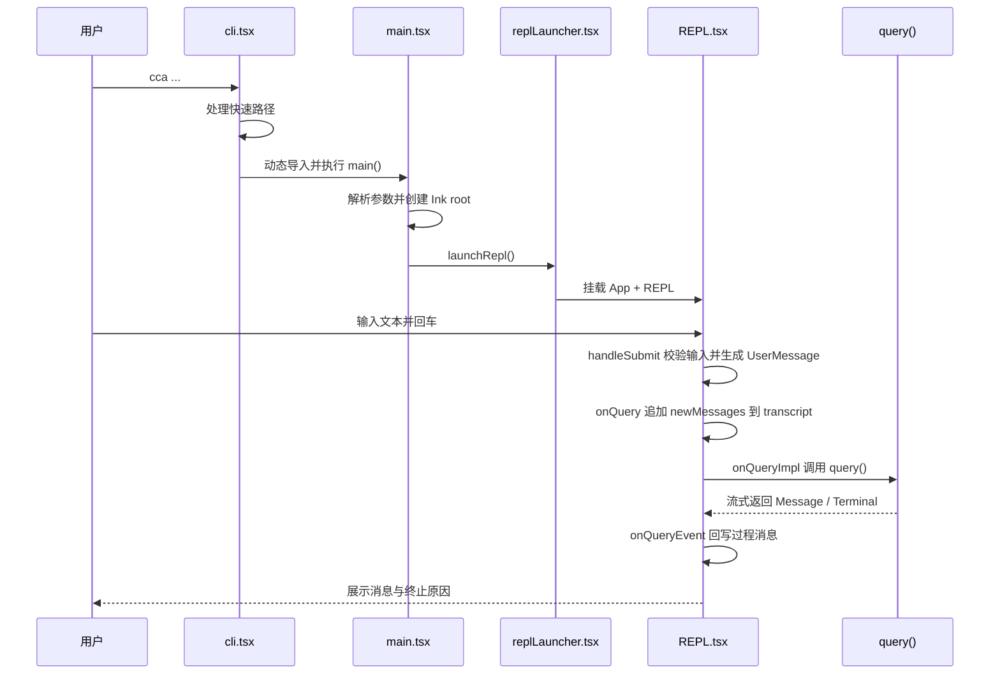

# 02. CLI 入口与 REPL 交互

## 概述

这一层负责把“终端中的一次输入”转换成“查询引擎里的一轮请求”。它覆盖三件事：

1. CLI 快速路径与主模块加载
2. Commander 主命令与交互会话装配
3. REPL 输入采集、提交编排、消息回写与 `query()` 接线

当前源码证实，这一层已经形成最小闭环，但仍只覆盖交互模式的主路径。

## 关键源码

- `src/entrypoints/cli.tsx`
- `src/main.tsx`
- `src/replLauncher.tsx`
- `src/screens/REPL.tsx`

## 设计原理

### 1. 启动成本前移优化

`src/entrypoints/cli.tsx` 在 import 主模块前先处理 `--version`，这样简单查询不需要加载整套运行时。这说明入口层的目标不是承载复杂逻辑，而是尽早做轻量分流。

### 2. 命令装配与交互逻辑分离

`src/main.tsx` 负责：

- 判定是否为交互模式
- 定义 Commander 参数
- 创建 Ink root
- 调用 `launchRepl()`

`src/screens/REPL.tsx` 则只负责交互输入与输出。这样入口装配不会污染 UI 逻辑，REPL 也不需要知道命令解析细节。

### 3. REPL 负责提交编排，不承载主回合决策

REPL 现在不再把“生成消息 + 调 `query()` + 消费终态”堆在一个函数里，而是拆成 `handleSubmit -> onQuery -> onQueryImpl -> onQueryEvent` 四段：提交函数负责校验输入和切换界面状态，`onQuery` 负责把新消息并入 transcript，`onQueryImpl` 负责消费 `query()` 迭代器，`onQueryEvent` 负责把过程事件回写界面。是否继续下一轮、是否执行工具、为何终止，仍然全部交给查询层决定。

## 实现原理



## 功能拆解

### 1. CLI 快速路径

`src/entrypoints/cli.tsx` 当前只落地了最基础的一条快路径：

- 若参数只有 `--version` / `-v` / `-V`
- 直接输出构建时注入的 `MACRO.VERSION`
- 不加载 `main.tsx`

这说明当前入口已经具备“启动前分流”的设计方向，但其余 daemon、bridge、template 等路径仍未复刻。

### 2. Commander 主命令装配

`src/main.tsx` 当前已落地以下职责：

- 根据参数与 TTY 状态判断交互模式
- 通过 `setIsInteractive()` 把模式写入全局状态
- 用 Commander 定义主命令、常见参数和 action
- 在 action 中创建 Ink root，并调用 `launchRepl()`

这里的重点不是参数本身，而是它把“命令解析”与“会话启动”串了起来。

### 3. REPL 提交链路

`src/screens/REPL.tsx` 的提交流程可以概括为：

1. 读取本地 `input`
2. 去掉首尾空白并拒绝空输入
3. 生成 `UserMessage`
4. 通过 `onQuery` 先把新消息追加到本地 transcript
5. 基于最新 `messagesRef.current` 创建最小 `ToolUseContext`
6. 由 `onQueryImpl` 调用 `query()`
7. 持续消费产出的过程事件并交给 `onQueryEvent`
8. 若终止原因是 `model_error`，额外回写系统错误消息

这条链路是当前仓库最直接可运行的用户入口。

## 伪代码

```text
1. 解析命令行参数
2. 对极少数快速路径直接返回
3. 其余情况加载 main() 并建立 Commander 程序
4. 创建 Ink root 并挂载 REPL
5. 用户在 REPL 输入文本
6. handleSubmit 生成 UserMessage 并委派给 onQuery
7. onQuery 先把 newMessages 追加到 transcript，再取最新消息快照
8. onQueryImpl 调用 query() 获取异步消息流
9. onQueryEvent 把返回消息写回 transcript，并根据 Terminal reason 更新界面状态
```

## 数据结构

| 数据 | 位置 | 用途 |
| --- | --- | --- |
| `Props` | `src/screens/REPL.tsx` | 传入 `debug` 和初始消息 |
| `UserMessage` | `src/types/message.ts` | 把用户输入变成统一 transcript 载体 |
| `ToolUseContext` | `src/Tool.ts` | 为 `query()` 提供工具列表、中断控制器和会话 setter |
| `messagesRef` | `src/screens/REPL.tsx` | 在提交编排层保存最新 transcript 快照，避免异步消费读到旧消息 |
| `lastTerminalReason` | `src/screens/REPL.tsx` | 在 UI 中显示本轮为何结束 |

## 当前边界

- `main.tsx` 仍保留大量 TODO，很多上游参数分支只定义了形态，没有真实执行逻辑
- REPL 当前只支持最基本的单行输入、回车提交、ESC 退出
- 权限检查目前直接是 `async () => true`
- 交互层没有真正的全局 AppState、slash commands 或会话恢复 UI

## 小结

这一层的价值在于把入口、命令装配和交互接线拆成三个清晰阶段：

- `cli.tsx` 负责尽早分流
- `main.tsx` 负责把运行时装起来
- `REPL.tsx` 负责把一次输入送进提交编排层，再进入 `query()`

因此后续无论补 print 模式、更多命令，还是完善 REPL 交互，核心边界都不会变化。

## 组合使用

这一层和其他专题页的关系是：

- 与 `03-query-engine-layer.md` 组合，形成“输入如何驱动一轮代理回合”
- 与 `06-session-management-layer.md` 组合，解释 REPL 本地状态与会话共享状态的边界
- 与 `07-tui-rendering-layer.md` 组合，解释终端界面为何能被挂载和退出
