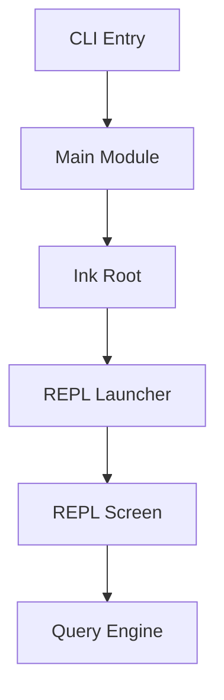

# 核心交互层

## Relevant source files
- `src/entrypoints/cli.tsx`
- `src/main.tsx`
- `src/replLauncher.tsx`
- `src/screens/REPL.tsx`
- `src/interactiveHelpers.tsx`
- `src/bootstrap/state.ts`

## 本页概述

本页回答两个问题：程序怎样从命令行进入交互态，以及 REPL 怎样把一条输入真正送进 `query()`。  
不覆盖 `queryLoop` 内部状态推进，也不展开工具编排实现。

## 核心结构

代码依据：CLI 入口先处理快速路径，再动态导入 `main`；`main.tsx` 创建 Ink root 后调用 `launchRepl()`；`REPL.tsx` 在提交时直接消费 `query()` 生成器。

## 关键机制

### 1. CLI 入口分成快速路径和主路径

- `src/entrypoints/cli.tsx` 先读取 `process.argv.slice(2)`
- 当参数只有 `--version`、`-v`、`-V` 时，直接输出 `MACRO.VERSION`，不加载主模块
- 其余情况才动态导入 `../main`
- 这让版本查询不需要承担整套交互模块初始化成本

### 2. `main.tsx` 负责 Commander 装配和模式判定

- `run()` 用 `@commander-js/extra-typings` 创建 Commander 程序
- 当前已声明的参数包括 `--print`、`--model`、`--resume`、`--continue`、`--permission-mode`、`--output-format`、`--config`、`--debug`
- `main()` 会根据 `--print`、`--init-only` 和 `process.stdout.isTTY` 判断是否为非交互模式
- 判定结果通过 `setIsInteractive()` 写入 `bootstrap/state.ts`

### 3. `launchRepl()` 保持窄职责

- `src/replLauncher.tsx` 不承载业务逻辑
- 它只做三件事：动态导入 `App`、动态导入 `REPL`、调用 `renderAndRun(root, <App><REPL /></App>)`
- 这让启动装配层和 REPL 页面层保持解耦

### 4. REPL 已切到真实 `query()` 入口

- `src/screens/REPL.tsx` 用 `useInput()` 捕获键盘输入
- `Enter` 会触发 `handleSubmit()`
- 提交时先构造 `user` 消息并追加到本地 transcript
- 然后基于当前消息快照创建最小 `ToolUseContext`
- 最后直接迭代 `query()` 的异步生成器，把返回的 `Message` 回写到消息列表

### 5. 当前交互边界仍是最小闭环

- 已实现：输入采集、消息显示、`query()` 接线、终止原因显示、`ESC` 退出
- 未实现：slash commands、历史导航、session restore UI、权限弹窗、完整 hook 体系
- 所以当前交互层的结论应收敛为“主链路已打通”，而不是“完整 REPL 已复刻”

## 设计要点

- 入口分层明确：`cli.tsx` 管路由，`main.tsx` 管命令与启动，`REPL.tsx` 管交互
- REPL 不直接请求模型，而是统一把输入送入 `query()`
- 全局交互态通过 `bootstrap/state.ts` 集中维护
- 当前最重要的源码事实是：`Enter -> query() -> transcript update` 已成立

## 继续阅读

- [03-query-engine-layer](./03-query-engine-layer.md)：继续看 `query()` 怎样推进一轮代理回合。
- [06-session-management-layer](./06-session-management-layer.md)：继续看消息历史和交互态如何跨层承载。
- [07-tui-rendering-layer](./07-tui-rendering-layer.md)：继续看 Ink root、渲染辅助和终端界面如何挂载。
