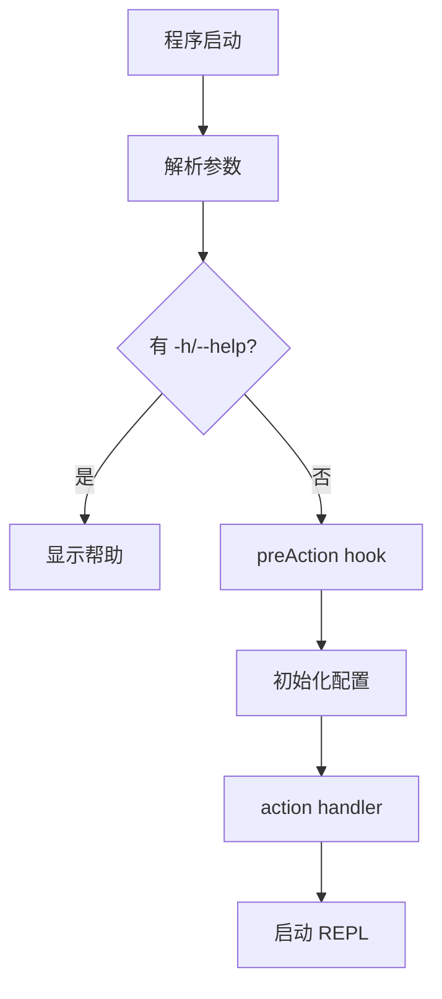
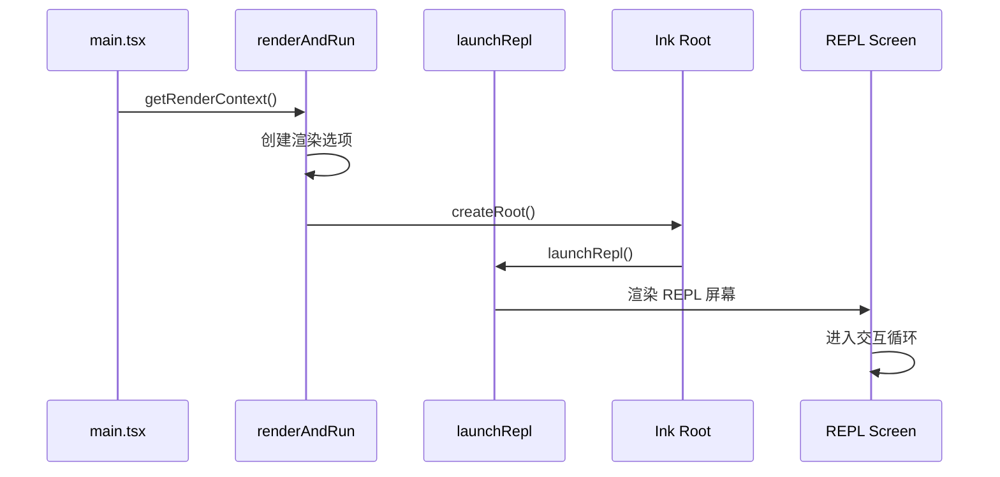
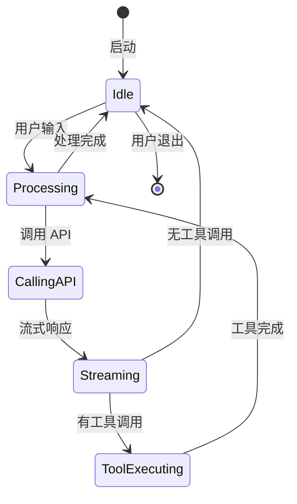
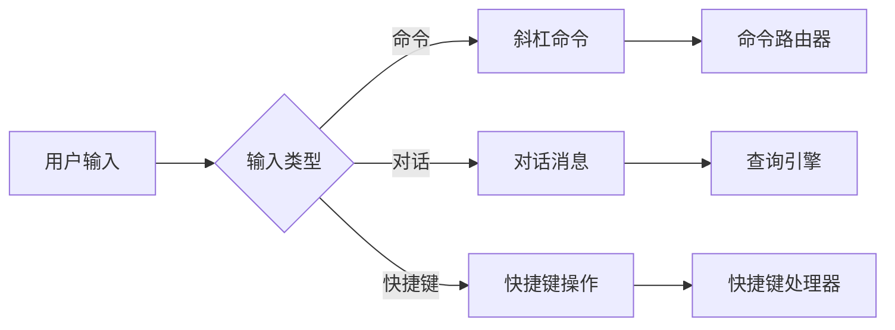
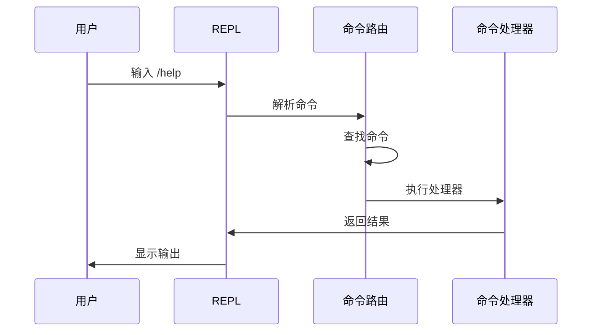

# 核心交互层

## Relevant source files

- `src/main.tsx` - CLI 主入口，命令行参数解析
- `src/entrypoints/cli.tsx` - CLI 入口点
- `src/replLauncher.tsx` - REPL 启动器
- `src/screens/REPL.tsx` - REPL 屏幕
- `src/interactiveHelpers.tsx` - 交互辅助函数

## 本页概述

本页深入分析核心交互层的实现机制，包括 CLI 入口与参数解析、REPL 循环机制、用户输入捕获与路由、命令解析系统等。这是用户与系统交互的第一层，负责接收输入、解析意图并启动核心流程。

## CLI 入口与参数解析

### Commander 程序定义

系统使用 `@commander-js/extra-typings` 构建命令行界面：



**核心命令参数**：

| 参数 | 类型 | 说明 |
|------|------|------|
| `[prompt]` | String | 直接提供提示词 |
| `-p, --print` | Boolean | 非交互模式，打印响应后退出 |
| `--model <model>` | String | 指定使用的模型 |
| `--resume <sessionId>` | String | 恢复指定会话 |
| `-c, --continue` | Boolean | 继续最近的对话 |
| `--dangerously-skip-permissions` | Boolean | 跳过所有权限提示 |
| `--output-format <format>` | Choice | 输出格式 (text/json/stream-json) |
| `--permission-mode <mode>` | Choice | 权限模式 (auto/accept/review) |

### 参数解析流程

```typescript
// src/main.tsx

// 1. 创建 Commander 程序
const program = new CommanderCommand()
  .configureHelp(createSortedHelpConfig())
  .enablePositionalOptions()

// 2. 注册 preAction hook
program.hook('preAction', async () => {
  // 确保配置加载完成
  await Promise.all([
    ensureMdmSettingsLoaded(),
    ensureKeychainPrefetchCompleted()
  ])
  await init()
  process.title = 'claude'
})

// 3. 定义主命令
program
  .name('claude')
  .description('Claude Code - starts an interactive session...')
  .argument('[prompt]', 'Your prompt', String)
  .option('-p, --print', 'Print response and exit', false)
  // ... 更多选项
  .action(async (prompt, options) => {
    // 处理用户输入
  })

// 4. 解析参数
program.parse()
```

### 交互模式检测

系统在启动时检测运行模式：

```typescript
// src/main.tsx

const cliArgs = process.argv.slice(2)
const hasPrintFlag = cliArgs.includes('-p') || cliArgs.includes('--print')
const isNonInteractive =
  hasPrintFlag ||
  cliArgs.includes('--init-only') ||
  !process.stdout.isTTY

setIsInteractive(!isNonInteractive)
```

**模式分类**：
- **交互模式**: 启动 REPL，支持持续对话
- **非交互模式**: 打印响应后退出，适合脚本集成

## REPL 循环机制

### REPL 启动流程



### launchRepl 函数

```typescript
// src/replLauncher.tsx

export async function launchRepl(
  root: Root,
  props: ReplProps,
  replProps: { /* session config, messages, etc */ },
  renderAndRun: Function
): Promise<void> {
  // 启动 REPL 循环
  // 处理用户输入
  // 调用查询引擎
  // 渲染响应
}
```

**职责**：
- 创建 REPL 环境
- 管理会话状态
- 协调输入输出
- 处理中断和恢复

### REPL 状态管理



## 用户输入捕获与路由

### 输入类型

系统支持多种输入方式：



**命令类型**：
- **斜杠命令**: `/help`, `/exit`, `/clear` 等
- **对话消息**: 普通文本输入
- **快捷键**: `Ctrl+C`, `Ctrl+D` 等

### 输入路由

```typescript
// 伪代码示例

function handleUserInput(input: string): void {
  if (input.startsWith('/')) {
    // 处理命令
    handleCommand(input)
  } else {
    // 处理对话
    handleChat(input)
  }
}
```

## 命令解析系统

### 命令注册

系统支持注册自定义命令：

```typescript
// 命令定义示例
interface Command {
  name: string
  description: string
  handler: (args: string[]) => Promise<void>
}

// 注册命令
const commands: Command[] = [
  {
    name: 'help',
    description: '显示帮助信息',
    handler: async () => { /* ... */ }
  },
  {
    name: 'exit',
    description: '退出程序',
    handler: async () => { /* ... */ }
  },
  // ... 更多命令
]
```

### 命令执行流程



## 交互反馈机制

### 进度指示器

系统提供多种进度反馈：

- **Spinner**: 旋转加载动画
- **进度条**: 百分比进度显示
- **状态消息**: 文本状态更新

### 错误处理

```typescript
// 错误处理示例

try {
  await processUserInput(input)
} catch (error) {
  if (error instanceof UserError) {
    // 用户可理解的错误
    showError(error.message)
  } else {
    // 系统错误
    showError('An unexpected error occurred')
    logError(error)
  }
}
```

## 设计要点

### 1. 分离关注点

- CLI 参数解析与 REPL 逻辑分离
- 命令处理与对话处理分离
- 输入捕获与业务逻辑分离

### 2. 可扩展性

- 命令系统支持注册新命令
- 快捷键系统可配置
- 输入处理器可插拔

### 3. 用户体验

- 即时反馈（进度、状态）
- 友好的错误提示
- 支持中断和恢复

### 4. 类型安全

- 使用 TypeScript 强类型
- Commander extra-typings 提供类型推导
- 所有接口都有类型定义

## 继续阅读

- [03-query-engine-layer](./03-query-engine-layer.md) - 了解查询引擎如何处理输入
- [04-tool-execution-layer](./04-tool-execution-layer.md) - 学习工具如何执行
- [07-tui-rendering-layer](./07-tui-rendering-layer.md) - 深入终端 UI 渲染机制
