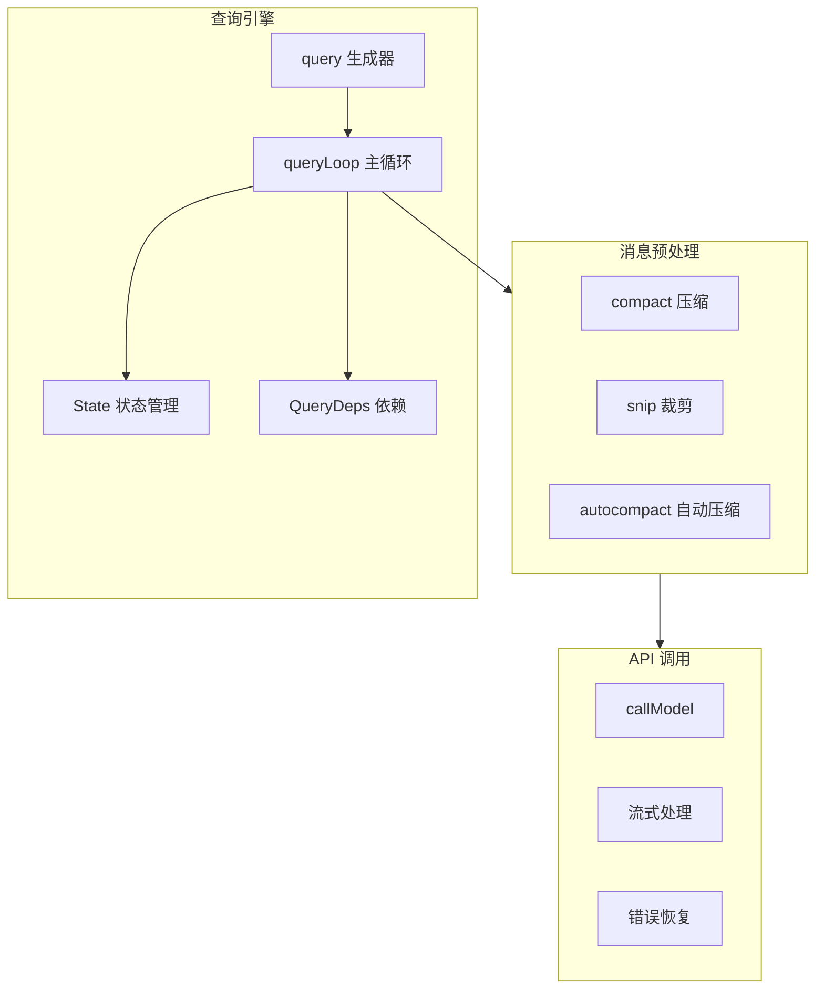
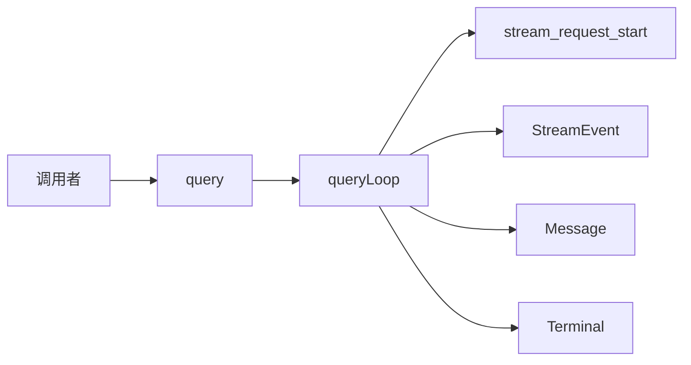
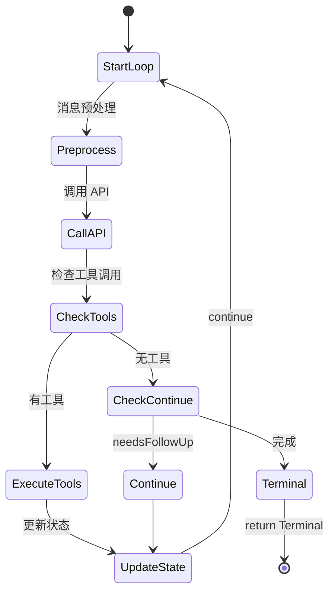
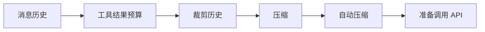
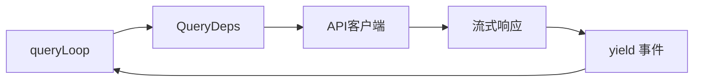

# 查询引擎层

## Relevant source files

- `src/query.ts` - 查询引擎核心实现
- `src/query/deps.ts` - 依赖注入定义
- `src/query/transitions.ts` - 循环转换类型
- `src/types/index.ts` - 核心类型定义
- `src/types/message.ts` - 消息类型定义
- `src/constants/querySource.ts` - 查询源常量

## 本页概述

查询引擎层是系统的核心中的核心，负责实现 Agent Loop 主流程。本页深入分析 State 状态管理、query() 生成器、消息预处理、LLM 调用编排等关键机制，揭示系统如何实现持续对话和工具调用。

## 核心结构

### 查询引擎组成



## State 状态管理

### State 类型定义

```typescript
// src/query.ts

type State = {
  // 核心数据
  messages: Message[]                    // 消息历史
  toolUseContext: ToolUseContext        // 工具执行上下文
  
  // 压缩追踪
  autoCompactTracking: AutoCompactTrackingState | undefined
  
  // 错误恢复
  maxOutputTokensRecoveryCount: number  // 输出令牌恢复计数
  hasAttemptedReactiveCompact: boolean  // 是否尝试响应式压缩
  maxOutputTokensOverride: number | undefined
  
  // 工具执行
  pendingToolUseSummary: Promise<ToolUseSummaryMessage | null> | undefined
  stopHookActive: boolean | undefined
  
  // 循环控制
  turnCount: number                     // 当前轮次
  transition: Continue | undefined      // 上次转换原因
}
```

### 状态初始化

```typescript
// src/query.ts: queryLoop()

let state: State = {
  messages: params.messages,
  toolUseContext: params.toolUseContext,
  maxOutputTokensOverride: params.maxOutputTokensOverride,
  autoCompactTracking: undefined,
  stopHookActive: undefined,
  maxOutputTokensRecoveryCount: 0,
  hasAttemptedReactiveCompact: false,
  turnCount: 1,
  pendingToolUseSummary: undefined,
  transition: undefined,
}
```

### 状态更新模式

```typescript
// 每次迭代开始时解构
const {
  messages,
  toolUseContext,
  autoCompactTracking,
  // ...
} = state

// 处理完成后原子更新
state = {
  ...state,
  messages: newMessages,
  turnCount: turnCount + 1,
  transition: newTransition,
}
```

## query() 生成器

### 函数签名

```typescript
// src/query.ts

export async function* query(
  params: QueryParams,
): AsyncGenerator<
  | StreamEvent           // 流事件
  | RequestStartEvent     // 请求开始事件
  | Message               // 消息
  | TombstoneMessage      // 墓碑消息
  | ToolUseSummaryMessage, // 工具使用摘要
  Terminal               // 返回终止状态
>
```

### QueryParams 参数

```typescript
// src/query.ts

export type QueryParams = {
  // 核心参数
  messages: Message[]                    // 消息历史
  systemPrompt: SystemPrompt            // 系统提示
  canUseTool: CanUseToolFn              // 权限检查函数
  toolUseContext: ToolUseContext        // 工具执行上下文
  querySource: QuerySource              // 查询来源
  
  // 可选参数
  userContext?: { [k: string]: string } // 用户上下文
  systemContext?: { [k: string]: string } // 系统上下文
  fallbackModel?: string                // 后备模型
  maxOutputTokensOverride?: number      // 最大输出令牌覆盖
  maxTurns?: number                     // 最大轮次
  skipCacheWrite?: boolean              // 跳过缓存写入
  taskBudget?: { total: number }        // 任务预算
  deps?: QueryDeps                      // 依赖注入
}
```

### 生成器执行流程



## queryLoop() 主循环

### 循环结构

```typescript
// src/query.ts

async function* queryLoop(
  params: QueryParams,
  consumedCommandUuids: string[],
): AsyncGenerator<..., Terminal> {
  // 1. 解构不可变参数
  const { systemPrompt, userContext, /* ... */ } = params
  const deps = params.deps ?? productionDeps()
  
  // 2. 初始化可变状态
  let state: State = { /* ... */ }
  
  // 3. 主循环
  while (true) {
    // 解构当前状态
    const { messages, toolUseContext, /* ... */ } = state
    
    // 发送请求开始事件
    yield { type: 'stream_request_start' }
    
    // 4. 消息预处理
    // TODO: applyToolResultBudget
    // TODO: snipCompact
    // TODO: autocompact
    
    // 5. API 调用
    // TODO: deps.callModel
    
    // 6. 工具执行
    // TODO: 收集 tool_use blocks
    // TODO: 执行工具
    // TODO: 处理结果
    
    // 7. 循环控制
    // return Terminal 或更新 state 后 continue
  }
}
```

### 核心流程实现 (2026-04-08)

#### 状态解构模式

每次迭代开始时解构 State，保持 bare-name 访问：

```typescript
// src/query.ts: queryLoop()

while (true) {
  let { toolUseContext } = state  // 可变部分单独提取
  const {
    messages,
    autoCompactTracking,
    maxOutputTokensRecoveryCount,
    hasAttemptedReactiveCompact,
    maxOutputTokensOverride,
    pendingToolUseSummary,
    stopHookActive,
    turnCount,
    transition,
  } = state
  
  yield { type: 'stream_request_start' }
  // ...
}
```

#### 消息预处理（简化版）

```typescript
// 构建完整系统提示
const fullSystemPrompt = asSystemPrompt(systemPrompt)

// 准备消息用于查询
let messagesForQuery = [...messages]

// 更新 toolUseContext.messages
toolUseContext = {
  ...toolUseContext,
  messages: messagesForQuery,
}
```

#### 初始化收集容器

```typescript
// 收集 assistant messages（用于后续工具执行和状态更新）
const assistantMessages: AssistantMessage[] = []

// 收集工具结果（用于下一轮 API 调用）
const toolResults: Message[] = []

// 收集 tool_use blocks（用于判断是否需要继续循环）
const toolUseBlocks: ToolUseBlock[] = []

// 是否需要继续循环（有工具调用时为 true）
let needsFollowUp = false
```

#### API 调用与流式处理

```typescript
// 获取当前模型
const currentModel = toolUseContext.options.mainLoopModel

try {
  // 调用 callModel，流式遍历响应
  for await (const message of deps.callModel({
    messages: messagesForQuery,
    systemPrompt: fullSystemPrompt,
    signal: toolUseContext.abortController.signal,
    options: {
      model: currentModel,
      isNonInteractiveSession: toolUseContext.options.isNonInteractiveSession,
    },
  })) {
    // yield message 给调用者
    yield message
    
    // 收集 assistant message
    if (message.type === 'assistant') {
      assistantMessages.push(message)
      
      // 提取 tool_use blocks
      const msgToolUseBlocks = (Array.isArray(message.message?.content) 
        ? message.message.content 
        : []
      ).filter(
        (content) => content.type === 'tool_use',
      ) as ToolUseBlock[]
      
      if (msgToolUseBlocks.length > 0) {
        toolUseBlocks.push(...msgToolUseBlocks)
        needsFollowUp = true
      }
    }
  }
} catch (error) {
  // 为未完成的 tool_use 生成错误结果
  yield* yieldMissingToolResultBlocks(
    assistantMessages,
    error instanceof Error ? error.message : 'Unknown error',
  )
  return { reason: 'model_error', error } as Terminal
}
```

#### 中断信号处理

```typescript
// 检查中断信号
if (toolUseContext.abortController.signal.aborted) {
  // 为未完成的工具生成中断结果
  yield* yieldMissingToolResultBlocks(
    assistantMessages,
    'Interrupted by user',
  )
  return { reason: 'aborted_streaming' } as Terminal
}
```

#### 循环判断逻辑

```typescript
// 检查是否需要继续循环
if (!needsFollowUp) {
  // 没有工具调用，循环结束
  return { reason: 'completed' } as Terminal
}

// 有工具调用，返回 tools_pending 状态（等待工具执行实现）
return {
  reason: 'tools_pending',
  message: `Detected ${toolUseBlocks.length} tool use(s)`,
} as Terminal
```

#### ModelCallParams 类型

```typescript
// src/query/deps.ts

type ModelCallParams = {
  messages: Message[]
  systemPrompt: SystemPrompt
  signal: AbortSignal
  options: {
    model: string
    isNonInteractiveSession: boolean
    [key: string]: unknown
  }
}
```

#### callModel 签名

```typescript
callModel: (params: ModelCallParams) => AsyncGenerator<
  StreamEvent | AssistantMessage
>
```

### 循环控制机制



## 消息预处理

### 预处理流程



### 压缩机制

**compact**: 将长对话历史压缩为摘要，减少 token 使用

**snip**: 裁剪过长的消息内容，保留关键信息

**autocompact**: 自动判断何时需要压缩

```typescript
// 自动压缩追踪状态
type AutoCompactTrackingState = {
  compacted: boolean          // 是否已压缩
  turnId: string             // 轮次 ID
  turnCounter: number        // 轮次计数器
  consecutiveFailures: number // 连续失败次数
}
```

## LLM 调用编排

### API 调用流程



### 流式响应处理

**AsyncGenerator 模式**：通过 `for await` 遍历流式响应，实时 yield 中间状态：

```typescript
for await (const message of deps.callModel(params)) {
  yield message  // 实时输出给调用者
  
  if (message.type === 'assistant') {
    // 收集 assistant message
    // 提取 tool_use blocks
  }
}
```

**关键设计**：
- 流式事件实时输出，用户可看到逐字生成效果
- 收集 assistant message 用于后续工具执行
- 提取 tool_use blocks 判断循环条件

### tool_use 检测机制

**核心原理**：通过 `content.type === 'tool_use'` 判断是否有工具调用

```typescript
// 提取 tool_use blocks
const msgToolUseBlocks = (Array.isArray(message.message?.content) 
  ? message.message.content 
  : []
).filter(
  (content) => content.type === 'tool_use',
) as ToolUseBlock[]

if (msgToolUseBlocks.length > 0) {
  toolUseBlocks.push(...msgToolUseBlocks)
  needsFollowUp = true  // 标记需要继续循环
}
```

**注意**：
> stop_reason === 'tool_use' is unreliable -- it's not always set correctly.
> 
> 实践中通过检测 content.type === 'tool_use' 来判断，这是可靠的循环退出信号。

### 流式事件类型

```typescript
type StreamEvent = {
  type: 'content_block_start'
  // ...
} | {
  type: 'content_block_delta'
  // ...
} | {
  type: 'content_block_stop'
  // ...
}
```

### 错误恢复机制

**yieldMissingToolResultBlocks**：为未完成的工具生成错误结果

```typescript
// 当 API 调用出错或用户中断时
// 为已收集的 assistant message 中未完成的 tool_use 生成错误结果
yield* yieldMissingToolResultBlocks(
  assistantMessages,
  error instanceof Error ? error.message : 'Unknown error',
)
```

**错误类型处理**：
- `model_error`: API 调用失败
- `aborted_streaming`: 用户中断
- `max_output_tokens`: 输出令牌超限

**max_output_tokens 恢复**:
```typescript
// 检测 max_output_tokens 错误
function isWithheldMaxOutputTokens(msg: Message | StreamEvent): boolean {
  return msg?.type === 'assistant' && msg.apiError === 'max_output_tokens'
}

// 恢复计数限制
const MAX_OUTPUT_TOKENS_RECOVERY_LIMIT = 3
```

**中断信号处理**：
```typescript
// 检查 AbortController.signal.aborted
if (toolUseContext.abortController.signal.aborted) {
  yield* yieldMissingToolResultBlocks(assistantMessages, 'Interrupted by user')
  return { reason: 'aborted_streaming' } as Terminal
}
```

## QueryDeps 依赖注入

### 依赖定义

```typescript
// src/query/deps.ts

export type QueryDeps = {
  callModel: (params: ModelCallParams) => AsyncGenerator<StreamEvent>
  // ... 更多依赖
}

export function productionDeps(): QueryDeps {
  return {
    callModel: actualCallModel,
    // ...
  }
}
```

### 依赖注入优势

- **可测试性**: 测试时可注入 mock 依赖
- **灵活性**: 可替换不同实现
- **解耦**: 核心逻辑不依赖具体实现

## 循环转换类型

### Terminal 终止状态

```typescript
// src/query/transitions.ts

export type Terminal = {
  reason: string
  message?: string
}
```

### Continue 继续状态

```typescript
// src/query/transitions.ts

export type Continue = {
  reason: string
  // 可选的额外信息
}
```

## 设计要点

### 1. 无限循环模式

使用 `while(true)` 实现持续循环，直到显式 `return Terminal`。

### 2. 状态原子更新

每次迭代都是完整的状态更新，避免部分状态修改导致的 bug。

### 3. 生成器模式

使用 `AsyncGenerator` 流式输出中间状态，调用者可以实时处理。

### 4. AsyncGenerator 流式模式

```typescript
// 通过 for await 遍历流式响应
for await (const message of deps.callModel(params)) {
  yield message  // 实时输出
  // 收集响应...
}
```

### 5. tool_use 检测机制

```typescript
// 通过 content.type === 'tool_use' 判断是否有工具调用
const toolUseBlocks = content.filter(c => c.type === 'tool_use')
needsFollowUp = toolUseBlocks.length > 0
```

### 6. 中断信号处理

```typescript
// 通过 AbortController.signal.aborted 检测用户中断
if (toolUseContext.abortController.signal.aborted) {
  // 处理中断...
}
```

### 7. 依赖注入

核心功能通过 `deps` 参数注入，便于测试和扩展。

### 8. 错误隔离

API 错误、工具错误等都有相应的恢复机制，不会导致整个循环崩溃。

### 9. 收集容器模式

```typescript
// 收集 assistant messages
const assistantMessages: AssistantMessage[] = []
// 收集 tool_use blocks
const toolUseBlocks: ToolUseBlock[] = []
// 收集工具结果
const toolResults: Message[] = []
```

## 继续阅读

- [04-tool-execution-layer](./04-tool-execution-layer.md) - 了解工具如何被检测和执行
- [05-api-client-layer](./05-api-client-layer.md) - 深入 API 调用和流式处理
- [06-session-management-layer](./06-session-management-layer.md) - 学习会话如何被管理
