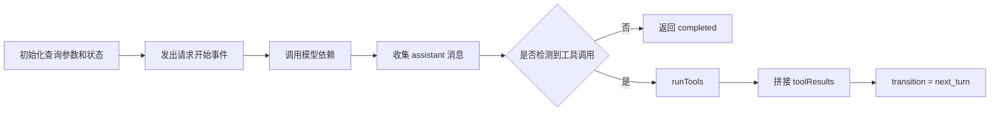

# 查询引擎层

## Relevant source files
- `src/query.ts`
- `src/query/deps.ts`
- `src/query/transitions.ts`
- `src/types/message.ts`
- `src/constants/querySource.ts`
- `src/utils/systemPromptType.ts`

## 本页概述

本页只讨论 `query()` 这一层如何维护一轮代理回合：它接收哪些输入、循环内部保存哪些状态、何时继续下一轮、何时返回终止原因。  
不展开 UI 交互，也不把未实现的压缩、预算、stop hooks 写成既有能力。

## 核心流程

代码依据：`query()` 把控制权交给 `queryLoop()`；每轮先 `yield { type: 'stream_request_start' }`，再消费 `deps.callModel(...)`，发现 `tool_use` 后进入 `runTools(...)`。

## 关键机制

### 1. `QueryParams` 定义了查询层边界

- 入口消息由 `messages` 提供
- 系统提示由 `systemPrompt`、`userContext`、`systemContext` 提供
- 工具权限和工具上下文分别来自 `canUseTool`、`toolUseContext`
- 模型层通过可替换的 `deps` 注入，而不是直接在 `query.ts` 内部硬编码

### 2. `State` 负责跨轮次可变状态

- `messages` 保存当前已知消息历史
- `toolUseContext` 保存本轮及下一轮继续复用的工具上下文
- `turnCount` 和 `transition` 记录轮次推进情况
- `maxOutputTokensRecoveryCount`、`hasAttemptedReactiveCompact` 等字段已经预留，但当前仓库还未把对应恢复逻辑补齐

### 3. `callModel` 的消费方向是“边流式产出，边收集 assistant”

- `queryLoop()` 通过 `for await` 迭代 `deps.callModel(...)`
- 每个流式产出都会先向上层 `yield`
- 当产出对象是 `assistant` 消息时，会被收集到 `assistantMessages`
- 如果 `assistant.message.content` 中出现 `tool_use` block，就把它们加入 `toolUseBlocks` 并标记 `needsFollowUp = true`

### 4. 工具回合已经形成闭环

- 没有 `tool_use` 时，当前轮直接返回 `{ reason: 'completed' }`
- 有 `tool_use` 时，会把检测到的 blocks 交给 `runTools(...)`
- 工具执行阶段产生的 `update.message` 会继续 `yield` 给上层，同时收集到 `toolResults`
- 本轮结束后，新的 `state.messages` 会被更新为 `messagesForQuery + assistantMessages + toolResults`

### 5. 终止原因目前是显式返回对象

- 模型调用抛错时返回 `{ reason: 'model_error', error }`
- 流式阶段中断时返回 `{ reason: 'aborted_streaming' }`
- 工具阶段中断时返回 `{ reason: 'aborted_tools' }`
- 超过 `maxTurns` 时返回 `{ reason: 'max_turns', turnCount }`
- 正常完成时返回 `{ reason: 'completed' }`

## 当前实现边界

- 已实现：`query() -> callModel -> assistant 收集 -> tool_use 检测 -> runTools -> next_turn`
- 已实现：最小中断检查与错误路径返回
- 未完全实现：消息归一化、attachment 注入、压缩、token budget、stop hooks、完整 `Transition` 类型
- 因此这一层现在更准确的定位是“最小代理循环主链路”而不是“完整查询引擎”

## 设计要点

- `query()` 采用异步生成器，让上层可以同时拿到流式事件和最终终止原因
- 模型调用通过 `QueryDeps` 注入，便于后续替换真实 API 实现
- `tool_use` 是否存在，决定当前轮是终止还是继续
- 查询层只负责推进回合，不负责真实工具业务实现

## 继续阅读

- [04-tool-execution-layer](./04-tool-execution-layer.md)：看 `tool_use` 怎样被分批、调度和回传结果。
- [05-api-client-layer](./05-api-client-layer.md)：看 `callModel` 这一依赖目前如何提供流式产出。
- [06-session-management-layer](./06-session-management-layer.md)：看 `messages` 和 `ToolUseContext` 怎样作为跨轮次状态载体。
