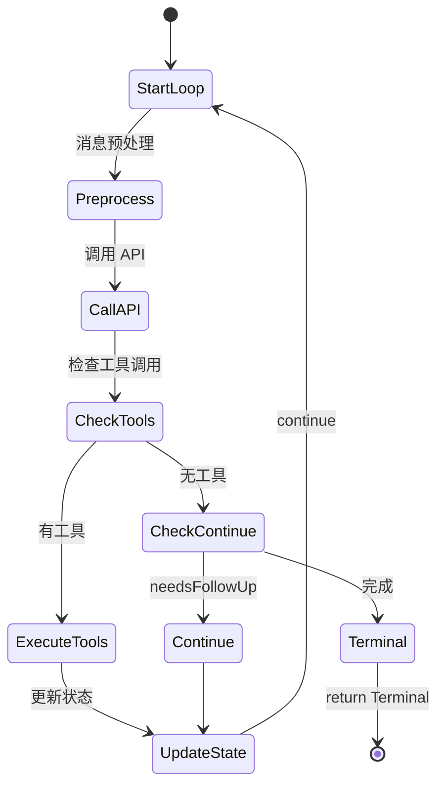
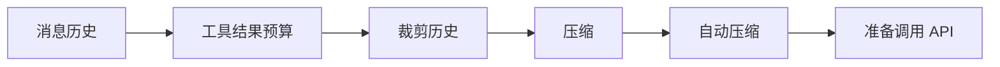

# 查询引擎层

## Relevant source files

- `src/query.ts` - 查询引擎核心实现
- `src/query/deps.ts` - 依赖注入定义
- `src/query/transitions.ts` - 循环转换类型
- `src/types/index.ts` - 核心类型定义
- `src/types/message.ts` - 消息类型定义
- `src/constants/querySource.ts` - 查询源常量

## 本页概述

查询引擎层是系统的核心中的核心，负责实现 Agent Loop 主流程。本页深入分析 State 状态管理、query() 生成器、消息预处理、LLM 调用编排等关键机制，揭示系统如何实现持续对话和工具调用。

## 核心结构

### 查询引擎组成

```mermaid
flowchart TB
    subgraph QueryEngine["查询引擎"]
        Query[query() 生成器]
        Loop[queryLoop() 主循环]
        State[State 状态管理]
        Deps[QueryDeps 依赖]
    end
    
    subgraph Preprocessing["消息预处理"]
        Compact[compact 压缩]
        Snip[snip 裁剪]
        AutoCompact[autocompact 自动压缩]
    end
    
    subgraph APILayer["API 调用"]
        CallModel[callModel]
        Stream[流式处理]
        Error[错误恢复]
    end
    
    Query --> Loop
    Loop --> State
    Loop --> Deps
    Loop --> Preprocessing
    Preprocessing --> APILayer
```

## State 状态管理

### State 类型定义

```typescript
// src/query.ts

type State = {
  // 核心数据
  messages: Message[]                    // 消息历史
  toolUseContext: ToolUseContext        // 工具执行上下文
  
  // 压缩追踪
  autoCompactTracking: AutoCompactTrackingState | undefined
  
  // 错误恢复
  maxOutputTokensRecoveryCount: number  // 输出令牌恢复计数
  hasAttemptedReactiveCompact: boolean  // 是否尝试响应式压缩
  maxOutputTokensOverride: number | undefined
  
  // 工具执行
  pendingToolUseSummary: Promise<ToolUseSummaryMessage | null> | undefined
  stopHookActive: boolean | undefined
  
  // 循环控制
  turnCount: number                     // 当前轮次
  transition: Continue | undefined      // 上次转换原因
}
```

### 状态初始化

```typescript
// src/query.ts: queryLoop()

let state: State = {
  messages: params.messages,
  toolUseContext: params.toolUseContext,
  maxOutputTokensOverride: params.maxOutputTokensOverride,
  autoCompactTracking: undefined,
  stopHookActive: undefined,
  maxOutputTokensRecoveryCount: 0,
  hasAttemptedReactiveCompact: false,
  turnCount: 1,
  pendingToolUseSummary: undefined,
  transition: undefined,
}
```

### 状态更新模式

```typescript
// 每次迭代开始时解构
const {
  messages,
  toolUseContext,
  autoCompactTracking,
  // ...
} = state

// 处理完成后原子更新
state = {
  ...state,
  messages: newMessages,
  turnCount: turnCount + 1,
  transition: newTransition,
}
```

## query() 生成器

### 函数签名

```typescript
// src/query.ts

export async function* query(
  params: QueryParams,
): AsyncGenerator<
  | StreamEvent           // 流事件
  | RequestStartEvent     // 请求开始事件
  | Message               // 消息
  | TombstoneMessage      // 墓碑消息
  | ToolUseSummaryMessage, // 工具使用摘要
  Terminal               // 返回终止状态
>
```

### QueryParams 参数

```typescript
// src/query.ts

export type QueryParams = {
  // 核心参数
  messages: Message[]                    // 消息历史
  systemPrompt: SystemPrompt            // 系统提示
  canUseTool: CanUseToolFn              // 权限检查函数
  toolUseContext: ToolUseContext        // 工具执行上下文
  querySource: QuerySource              // 查询来源
  
  // 可选参数
  userContext?: { [k: string]: string } // 用户上下文
  systemContext?: { [k: string]: string } // 系统上下文
  fallbackModel?: string                // 后备模型
  maxOutputTokensOverride?: number      // 最大输出令牌覆盖
  maxTurns?: number                     // 最大轮次
  skipCacheWrite?: boolean              // 跳过缓存写入
  taskBudget?: { total: number }        // 任务预算
  deps?: QueryDeps                      // 依赖注入
}
```

### 生成器执行流程

```mermaid
sequenceDiagram
    participant Caller as 调用者
    participant Query as query()
    participant Loop as queryLoop()
    participant Yield as yield 事件
    
    Caller->>Query: 调用 query(params)
    Query->>Loop: 启动 queryLoop
    Loop->>Yield: yield stream_request_start
    Loop->>Yield: yield StreamEvent
    Loop->>Yield: yield Message
    Loop->>Caller: return Terminal
```

## queryLoop() 主循环

### 循环结构

```typescript
// src/query.ts

async function* queryLoop(
  params: QueryParams,
  consumedCommandUuids: string[],
): AsyncGenerator<..., Terminal> {
  // 1. 解构不可变参数
  const { systemPrompt, userContext, /* ... */ } = params
  const deps = params.deps ?? productionDeps()
  
  // 2. 初始化可变状态
  let state: State = { /* ... */ }
  
  // 3. 主循环
  while (true) {
    // 解构当前状态
    const { messages, toolUseContext, /* ... */ } = state
    
    // 发送请求开始事件
    yield { type: 'stream_request_start' }
    
    // 4. 消息预处理
    // TODO: applyToolResultBudget
    // TODO: snipCompact
    // TODO: autocompact
    
    // 5. API 调用
    // TODO: deps.callModel
    
    // 6. 工具执行
    // TODO: 收集 tool_use blocks
    // TODO: 执行工具
    // TODO: 处理结果
    
    // 7. 循环控制
    // return Terminal 或更新 state 后 continue
  }
}
```

### 循环控制机制



## 消息预处理

### 预处理流程



### 压缩机制

**compact**: 将长对话历史压缩为摘要，减少 token 使用

**snip**: 裁剪过长的消息内容，保留关键信息

**autocompact**: 自动判断何时需要压缩

```typescript
// 自动压缩追踪状态
type AutoCompactTrackingState = {
  compacted: boolean          // 是否已压缩
  turnId: string             // 轮次 ID
  turnCounter: number        // 轮次计数器
  consecutiveFailures: number // 连续失败次数
}
```

## LLM 调用编排

### API 调用流程

```mermaid
sequenceDiagram
    participant Loop as queryLoop
    participant Deps as QueryDeps
    participant API as API Client
    participant Stream as 流式响应
    
    Loop->>Deps: deps.callModel(params)
    Deps->>API: 发送请求
    API->>Stream: 返回流
    Stream->>Loop: yield 事件
    Loop->>Loop: 收集响应
```

### 流式响应处理

```typescript
// 流式事件类型
type StreamEvent = {
  type: 'content_block_start'
  // ...
} | {
  type: 'content_block_delta'
  // ...
} | {
  type: 'content_block_stop'
  // ...
}
```

### 错误恢复机制

**max_output_tokens 恢复**:
```typescript
// 检测 max_output_tokens 错误
function isWithheldMaxOutputTokens(msg: Message | StreamEvent): boolean {
  return msg?.type === 'assistant' && msg.apiError === 'max_output_tokens'
}

// 恢复计数限制
const MAX_OUTPUT_TOKENS_RECOVERY_LIMIT = 3
```

## QueryDeps 依赖注入

### 依赖定义

```typescript
// src/query/deps.ts

export type QueryDeps = {
  callModel: (params: ModelCallParams) => AsyncGenerator<StreamEvent>
  // ... 更多依赖
}

export function productionDeps(): QueryDeps {
  return {
    callModel: actualCallModel,
    // ...
  }
}
```

### 依赖注入优势

- **可测试性**: 测试时可注入 mock 依赖
- **灵活性**: 可替换不同实现
- **解耦**: 核心逻辑不依赖具体实现

## 循环转换类型

### Terminal 终止状态

```typescript
// src/query/transitions.ts

export type Terminal = {
  reason: string
  message?: string
}
```

### Continue 继续状态

```typescript
// src/query/transitions.ts

export type Continue = {
  reason: string
  // 可选的额外信息
}
```

## 设计要点

### 1. 无限循环模式

使用 `while(true)` 实现持续循环，直到显式 `return Terminal`。

### 2. 状态原子更新

每次迭代都是完整的状态更新，避免部分状态修改导致的 bug。

### 3. 生成器模式

使用 `AsyncGenerator` 流式输出中间状态，调用者可以实时处理。

### 4. 依赖注入

核心功能通过 `deps` 参数注入，便于测试和扩展。

### 5. 错误隔离

API 错误、工具错误等都有相应的恢复机制，不会导致整个循环崩溃。

## 继续阅读

- [04-tool-execution-layer](./04-tool-execution-layer.md) - 了解工具如何被检测和执行
- [05-api-client-layer](./05-api-client-layer.md) - 深入 API 调用和流式处理
- [06-session-management-layer](./06-session-management-layer.md) - 学习会话如何被管理
