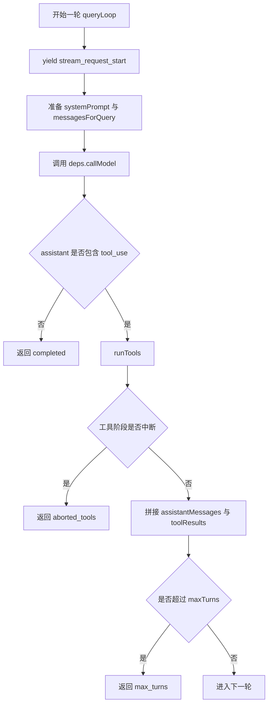

# 03. 查询引擎与回合推进

## 概述

`src/query.ts` 是当前仓库的核心。它把一次用户请求推进成“模型调用 → 工具执行 → 下一轮或终止”的代理循环，并通过异步生成器持续向上游产出消息。

这一层决定了：

- 哪些状态要跨轮次保留
- 模型返回后如何判断是否需要继续
- 工具结果怎样回灌回下一轮
- 为什么本轮会以 `completed`、`model_error`、`aborted_*`、`max_turns` 结束

## 关键源码

- `src/query.ts`
- `src/query/deps.ts`
- `src/query/transitions.ts`
- `src/types/message.ts`
- `src/utils/messages.ts`

## 设计原理

### 1. 查询层只依赖抽象，不依赖 SDK

查询层通过 `QueryDeps.callModel` 调模型，而不是直接调用 Anthropic SDK。这样模型适配逻辑可以留在 `services/api/`，查询层只专注回合推进。

### 2. `State` 集中承载跨轮次信息

`State` 把以下信息放在一处维护：

- `messages`
- `toolUseContext`
- `turnCount`
- 各种恢复/压缩相关标记
- `transition`

这样每次继续下一轮时，只需要构造新的 `state`，不需要散落地修改多个局部变量。

### 3. `tool_use` 是继续循环的唯一硬信号

当前实现并不依赖 `stop_reason === 'tool_use'`，而是直接从 assistant 内容块里收集 `tool_use`。这是比依赖单个标志位更稳的方式。

## 主循环



## 实现原理

### 1. 入口生成器 `query()`

`query()` 自身只是一个薄包装：

- 创建 `consumedCommandUuids`
- 把主要逻辑委托给 `queryLoop()`
- 在 `queryLoop()` 正常返回后做收尾

也就是说，真正的回合推进都发生在 `queryLoop()`。

### 2. 每轮固定步骤

当前每轮都有相同骨架：

1. 从 `state` 解构本轮要用的可变状态
2. 向上游发送 `stream_request_start`
3. 准备 `fullSystemPrompt` 和 `messagesForQuery`
4. 更新 `toolUseContext.messages`
5. 调用 `deps.callModel`
6. 收集 assistant 消息和 `tool_use`
7. 若没有 `tool_use`，直接结束
8. 若有 `tool_use`，调用 `runTools()`
9. 组装新状态并继续下一轮

### 3. 错误与中断路径

当前查询层已明确区分三类终止：

- 模型阶段异常：返回 `model_error`
- 流式阶段被中断：返回 `aborted_streaming`
- 工具阶段被中断：返回 `aborted_tools`

此外还保留了 `max_turns` 保护，防止代理循环无限继续。

### 4. 流式事件处理与消息转换

`src/utils/messages.ts` 是查询层与 TUI 层之间的桥梁，核心函数 `handleMessageFromStream()` 统一消费 `query()` 产出的流式事件。

**设计动机**：
- 对齐上游实现，保持分支结构与调用协议
- 避免在 REPL 层重写事件判定逻辑
- 解耦事件处理与 UI 状态更新

**事件分类处理**：

| 事件类型 | 处理动作 | 状态映射 |
|---------|---------|---------|
| `stream_request_start` | 设置 `requesting` 模式 | spinner 启动 |
| `content_block_start` | 按 block 类型设置模式 | thinking/responding/tool-input |
| `content_block_delta` | 累加文本/JSON | streamingText/streamingToolUses |
| `message_stop` | 清空工具调用列表 | 准备下一阶段 |
| `message_delta` | 设置 `responding` 模式 | 文本输出中 |

**回调协议**：

```text
handleMessageFromStream(event, {
  onMessage,           // 完整消息回写
  onSetStreamMode,     // spinner 模式切换
  onStreamingToolUses, // 流式工具调用（函数式更新）
  onStreamingThinking, // 流式思考（函数式更新）
  onStreamingText,     // 流式文本（函数式更新）
  onApiMetrics,        // TTFT 等指标
  onUpdateLength,      // 响应长度累加
})
```

**函数式更新设计**：`onStreamingToolUses`、`onStreamingThinking`、`onStreamingText` 均采用 `f: (current) => next` 形式，让 React 状态更新保持幂等性，避免竞态。

## 伪代码

```text
1. 初始化 State
2. 进入 while(true)
3. 发出请求开始事件
4. 准备本轮 messagesForQuery
5. 调用 callModel 并逐条产出消息
6. 收集 assistant 消息里的 tool_use
7. 若模型报错则返回 model_error
8. 若没有 tool_use 则返回 completed
9. 若有 tool_use 则执行 runTools
10. 把 assistant 结果和 tool_result 拼回消息历史
11. 更新 turnCount 和 transition
12. 进入下一轮
```

## 状态结构

| 状态 | 作用 | 为什么放在这里 |
| --- | --- | --- |
| `messages` | 保存完整消息历史 | 下一轮模型请求要基于它继续 |
| `toolUseContext` | 保存共享上下文 | 工具层和查询层都要可见 |
| `turnCount` | 限制最大轮次 | 防止无限递归式继续 |
| `transition` | 标记上一轮为何继续 | 便于测试与恢复路径断言 |
| `maxOutputTokensOverride` 等恢复字段 | 为未来恢复逻辑预留空间 | 对齐上游结构，便于后续继续补齐 |

## 当前实现边界

### 已落地

- `query()` / `queryLoop()` 的主循环骨架
- `QueryParams` 和 `State` 的稳定结构
- assistant 消息收集与 `tool_use` 检测
- `runTools()` 接线
- 错误、中断、最大轮次终止

### 未落地

- compact / auto compact / microcompact
- token budget 与 task budget
- fallback 模型切换
- stop hooks
- 更完整的 `Terminal` / `Continue` 类型

## 设计取舍

### 优点

- 回合骨架已经稳定，后续增强逻辑有明确挂点
- `QueryDeps` 让查询层与外部 I/O 解耦
- 异步生成器很适合把流式事件直接透传给 UI

### 代价

- `query.ts` 现在仍偏大，且保留了大量 TODO
- 很多恢复字段已预留，但当前并未真正发挥作用
- `transitions.ts` 仍是占位类型，文档和实现之间还有一层未收敛

## 小结

查询引擎层是当前仓库最需要优先理解的一层，因为它把所有模块串成了一个回合系统：

- REPL 把请求送进来
- API 层返回 assistant 消息
- 工具层处理 `tool_use`
- 状态层保存跨轮次上下文

只要抓住这条回合主线，后续再补 streaming、budget 或 compact，理解成本都会低很多。

## 组合使用

- 和 `02-core-interaction-layer.md` 组合，能看清“输入怎样进入 query loop”
- 和 `04-tool-execution-layer.md` 组合，能看清“tool_use 怎样把 completed 改成 next turn”
- 和 `05-api-client-layer.md` 组合，能看清“query loop 如何通过依赖注入访问外部模型”
