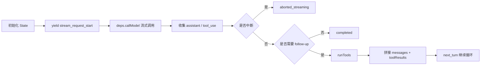

# 查询引擎层

## Relevant source files

- `src/query.ts`
- `src/query/deps.ts`
- `src/query/transitions.ts`
- `src/types/message.ts`
- `src/constants/querySource.ts`

## 本页概述

查询引擎层负责维护代理主循环、消费模型流式输出、识别 `tool_use`、并在需要时把工具结果回灌后推进下一轮。  
本页只覆盖当前仓库已落地逻辑，不将未实现 TODO 写成既成事实。

## 核心流程

## 核心机制

### 1. State 跨轮次承载

- `messages` 保存历史消息链。
- `toolUseContext` 保存工具执行上下文。
- `turnCount` 与 `transition` 控制轮次推进。
- `maxOutputTokensRecoveryCount`、`hasAttemptedReactiveCompact` 预留恢复路径。

### 2. 流式处理与 `tool_use` 检测

- 每轮通过 `for await ... of deps.callModel(...)` 消费流式响应。
- 只要 assistant content 中出现 `content.type === 'tool_use'`，就标记 `needsFollowUp = true`。
- 检测依据来自内容块本身，而不是单纯依赖 `stop_reason`。

### 3. 工具闭环已接入

- 识别到 `tool_use` 后不再返回 `tools_pending`。
- 当前实现会调用 `runTools(...)`，持续消费 `MessageUpdate`。
- `update.message` 会被 `yield` 给上层并收集到 `toolResults`。
- 结束后将 `messagesForQuery + assistantMessages + toolResults` 写回 `state.messages`，`transition` 标记为 `next_turn`。

### 4. 终止与异常路径

- 模型流调用异常：走 `model_error` 返回。
- 流式过程中用户中断：走 `aborted_streaming` 返回。
- 工具执行后中断：走 `aborted_tools` 返回。
- 超过 `maxTurns`：走 `max_turns` 返回。

## 当前实现边界

- 已实现：`tool_use -> runTools -> tool_result -> next_turn` 的主链路闭环。
- 未完全实现：`messages` 归一化、attachment 注入、完整 stop hooks、完整 token 恢复等分支仍在 TODO。
- 结论：查询引擎已从“检测工具后退出”升级为“检测工具后继续推进下一轮”，但仍处在增量对齐阶段。

## 继续阅读

- [04-tool-execution-layer](./04-tool-execution-layer.md) - 查看 `runTools` 如何分批调度和回传结果。
- [05-api-client-layer](./05-api-client-layer.md) - 查看 `callModel` 的调用边界与流式事件来源。
