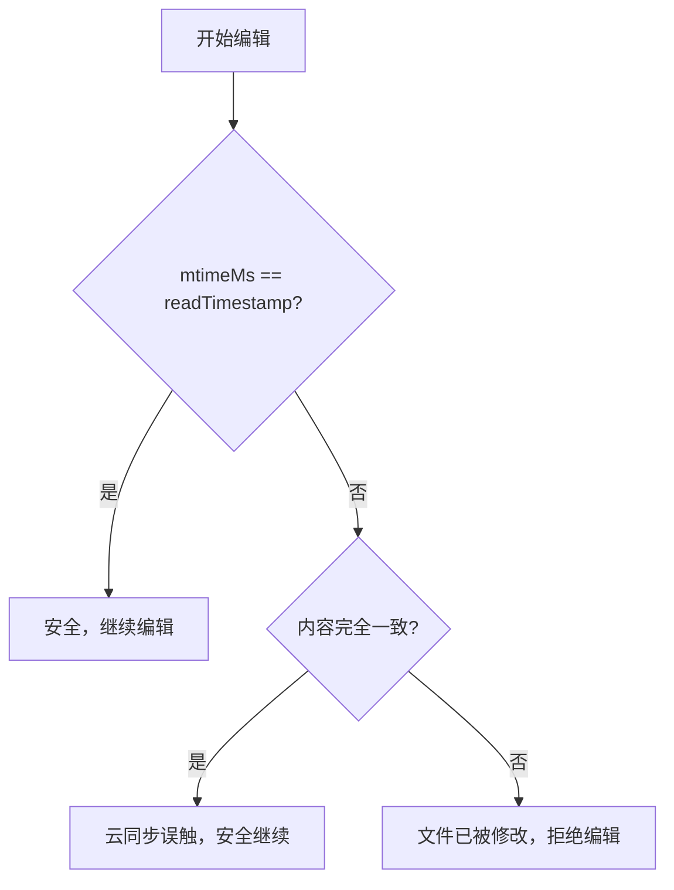
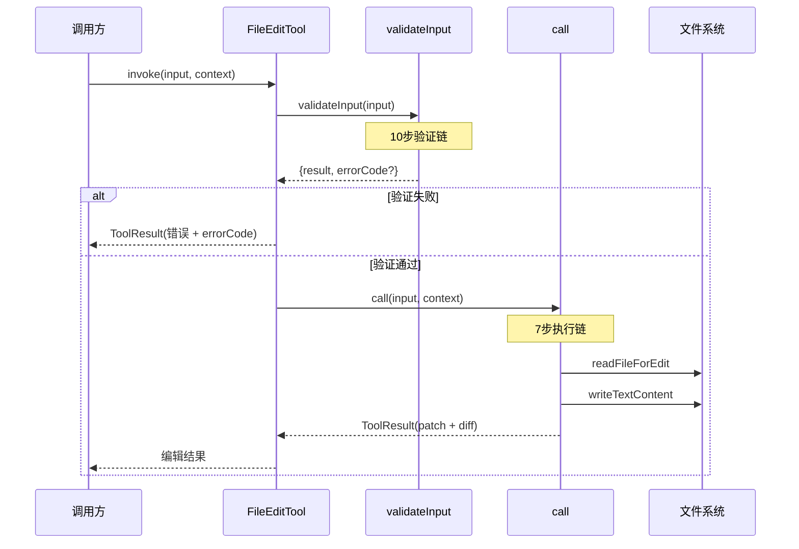
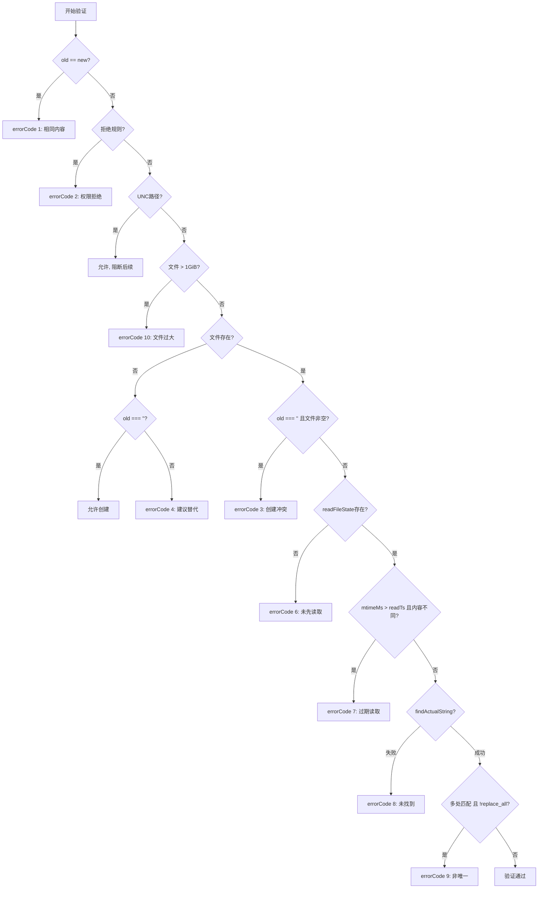
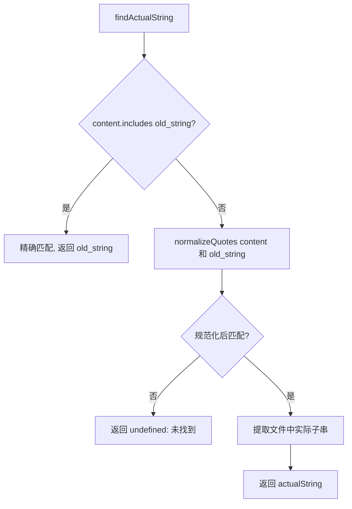

# 04-04. Edit 工具实现

## 概述

FileEditTool 是系统中文件修改的核心工具，暴露名为 `Edit`。它将"精确字符串替换"封装为原子操作——LLM 提供 `old_string` 和 `new_string`，工具在目标文件中定位并替换。设计围绕"安全、精确、防冲突"三个目标展开：先验证后执行的 10 步验证链、引号规范化系统、读后修改的冲突检测，确保编辑操作的原子性与一致性。

## 关键源码

| 文件 | 职责 |
| --- | --- |
| `src/tools/FileEditTool/FileEditTool.ts` | 主工具定义：buildTool 工厂、validateInput 验证链、call 执行链 |
| `src/tools/FileEditTool/types.ts` | 输入/输出 Schema 与类型定义 |
| `src/tools/FileEditTool/utils.ts` | 编辑工具函数集：引号规范化、编辑应用、Patch/Snippet 生成、反净化 |
| `src/tools/FileEditTool/constants.ts` | 常量：MAX_EDIT_FILE_SIZE 等 |
| `src/tools/FileEditTool/prompt.ts` | 工具提示文本 |
| `src/utils/diff.ts` | Diff 工具函数：Patch 生成与展示 |

## 设计原理

### 1. 精确字符串替换

Edit 工具的核心语义是**精确字符串替换**：在文件中找到 `old_string` 的唯一出现位置，替换为 `new_string`。这是一个原子操作——要么完全成功，要么完全失败，不存在部分替换的中间态。

```
old_string ──[定位]──→ 唯一匹配 ──[替换]──→ new_string
     │                      │
     └── 不唯一/不存在 ──────┴──→ 错误，不执行
```

选择字符串匹配而非行号匹配的原因：行号会因并行编辑而偏移，字符串内容是更稳定的锚点。要求唯一匹配（除非 `replace_all=true`）进一步保证操作的可预测性。

### 2. 先验证后执行

编辑操作分为两个阶段：`validateInput` 检查所有前置条件，`call` 执行实际编辑。验证阶段不修改任何状态，执行阶段不再做可回退的判断。这种分离使得：

- 验证阶段的错误可以附带精确的 errorCode，供上游做条件化处理
- 执行阶段逻辑更简洁，只需关注核心替换流程
- 验证阶段可以做权限检查和路径安全检查，在写入前拦截

### 3. 引号规范化

LLM 输出的引号字符与文件中的引号字符可能不一致：模型倾向于输出直引号（`'` `"`），而文件中可能使用弯引号（`'` `"` `\u2018` `\u2019` `\u201C` `\u201D`）。Edit 工具通过规范化系统桥接这一差异：

1. 先尝试精确匹配
2. 精确匹配失败时，对文件内容和 `old_string` 同时做引号规范化后再匹配
3. 匹配成功后，根据文件中引号的实际风格，将 `new_string` 中的引号转换为相同风格

### 4. 防冲突机制

"读后修改"（read-before-edit）是核心防冲突策略：工具要求 LLM 在编辑前必须先读取文件（通过 Read 工具），`readFileState` 记录每次读取的时间戳和文件 mtimeMs。编辑时比对两者：

- mtimeMs 未变 → 文件未被外部修改，安全编辑
- mtimeMs 改变 → 文件被外部修改，进入内容回退比较（Windows 云同步场景下 mtimeMs 不可靠）



## 实现原理

### 工具接口

| 属性 | 值 |
| --- | --- |
| name | `'Edit'` (FILE_EDIT_TOOL_NAME) |
| searchHint | `'modify file contents in place'` |
| maxResultSizeChars | 100,000 |
| strict | true |
| userFacingName | `old_string === ''` ? `'Create'` : `'Update'` |

**输入 Schema**：

```typescript
z.strictObject({
  file_path: z.string(),                              // 必填，绝对路径
  old_string: z.string(),                             // 必填，待替换内容
  new_string: z.string(),                             // 必填，替换后内容
  replace_all: semanticBoolean(z.boolean()).default(false), // 全局替换
})
```

**输出 Schema**：

```typescript
{
  filePath: string,
  oldString: string,
  newString: string,
  originalFile: string,
  structuredPatch: hunkSchema[],
  userModified: boolean,
  replaceAll: boolean,
  gitDiff?: string,
}
```

### validateInput → call 整体流程



## 验证链

`validateInput` 按顺序执行 10 步检查，任一步失败即返回对应 errorCode，短路后续检查：

| 步骤 | 检查项 | 失败条件 | errorCode | 错误含义 |
| --- | --- | --- | --- | --- |
| 1 | 相同内容拒绝 | `old_string === new_string` | 1 | 替换内容与原内容相同，无操作 |
| 2 | 拒绝规则检查 | `matchingRuleForInput` 命中写入拒绝 | 2 | 权限规则禁止写入 |
| 3 | UNC 路径安全 | `\\` 或 `//` 前缀 | — | 允许但阻断后续处理（Windows SMB 凭据泄露防护） |
| 4 | 文件大小检查 | > 1 GiB (MAX_EDIT_FILE_SIZE) | 10 | 文件过大 |
| 5 | 文件存在性 | ENOENT | — | `old_string === ''` 允许创建，否则 errorCode 4 建议替代路径 |
| 6 | 创建冲突 | 文件存在且 `old_string === ''` | 3 | 仅允许空文件上创建 |
| 7 | 读后编辑 | `readFileState` 无记录 | 6 | 必须先读取文件 |
| 8 | 过期读取 | mtimeMs > readTimestamp | 7 | 文件读取后已被修改（内容回退比较失败） |
| 9 | 字符串匹配 | `findActualString` 失败 | 8 | old_string 在文件中未找到 |
| 10 | 唯一性 | 多处匹配且 `replace_all=false` | 9 | old_string 非唯一，需明确 replace_all |



### 错误码速查

| errorCode | 触发条件 | 恢复策略 |
| --- | --- | --- |
| 1 | old_string === new_string | 检查编辑意图 |
| 2 | 写入拒绝规则 | 调整权限配置 |
| 3 | 非空文件上创建 | 改为 Update 模式 |
| 4 | 文件不存在 | 检查路径或使用创建模式 |
| 6 | 未先读取文件 | 先调用 Read 工具 |
| 7 | 读取后文件被修改 | 重新读取后编辑 |
| 8 | old_string 未找到 | 检查内容是否匹配 |
| 9 | old_string 非唯一 | 使用 replace_all 或缩小范围 |
| 10 | 文件超过 1GiB | 使用其他方式编辑 |

## 执行链

`call` 方法在验证通过后执行 7 步操作：

| 步骤 | 操作 | 说明 |
| --- | --- | --- |
| 1 | `readFileForEdit` | 同步读取文件：检测 BOM 编码、规范化 CRLF→LF |
| 2 | 确认未修改 | mtimeMs vs readFileState，内容比较回退 |
| 3 | `findActualString` | 引号规范化匹配，返回文件中实际子串 |
| 4 | `preserveQuoteStyle` | 弯引号风格保持：将 new_string 引号转为文件风格 |
| 5 | `getPatchForEdit` | 生成结构化 Patch：应用编辑、生成 structuredPatch |
| 6 | `writeTextContent` | 写入磁盘：恢复原始编码和行尾 |
| 7 | `readFileState.set()` | 更新读取时间戳，标记文件已被当前会话修改 |

```
call(input, context)
  │
  ├─ 1. readFileForEdit(filePath)
  │     └─ 同步读取, BOM检测(0xFF 0xFE → UTF-16LE), CRLF→LF
  │
  ├─ 2. 确认未修改: mtimeMs vs readFileState
  │     └─ mtimeMs改变 → 内容比较回退(Windows云同步)
  │
  ├─ 3. findActualString(content, old_string)
  │     ├─ 精确匹配 → 直接返回
  │     └─ 规范化匹配 → 返回文件中实际子串
  │
  ├─ 4. preserveQuoteStyle(new_string, actualOldString, old_string)
  │     └─ 根据上下文推断弯引号风格, 转换new_string
  │
  ├─ 5. getPatchForEdit(content, actualOld, newString, filePath)
  │     └─ 应用编辑 → structuredPatch(context=3, timeout=5000ms)
  │
  ├─ 6. writeTextContent(filePath, newContent)
  │     └─ 恢复原始编码(BOM)和行尾(CRLF)
  │
  └─ 7. readFileState.set(filePath, {mtimeMs, content})
        └─ 更新时间戳, 标记会话已修改
```

## 编辑工具函数集

### 引号规范化与风格保持

三个函数构成完整的引号处理流水线：

**normalizeQuotes**：弯引号 → 直引号

```
' \u2018  ─┐
' \u2019  ─┤→  '
" \u201C  ─┤
" \u201D  ─┘→  "
```

**findActualString**：精确匹配优先，规范化匹配兜底



**preserveQuoteStyle**：将 `new_string` 中引号转换为文件风格

核心启发式规则：

| 规则 | 判定条件 | 转换 |
| --- | --- | --- |
| 开引号上下文 | 引号前为空格/Tab/换行/`(`/`[`/`{`/em-dash/en-dash | 直引号 → 弯开引号（`'` → `'`，`"` → `"`) |
| 闭引号上下文 | 其他情况 | 直引号 → 弯闭引号（`'` → `'`，`"` → `"`) |
| 撇号检测 | 单引号两侧均有字母 | 直单引号 → 右弯引号 `'`（apostrophe） |

```
示例:
文件中: He said, "Hello"    →  isOpeningContext = true before "
new_string: He said, "Hi"   →  preserveQuoteStyle → He said, \u201CHi\u201D
```

### 编辑应用

**applyEditToFile**：核心编辑函数

```
applyEditToFile(content, oldString, newString, replaceAll)
  │
  ├─ replaceAll=true
  │     └─ String.replaceAll(oldString, newString)
  │
  └─ replaceAll=false
        ├─ 替换第一个匹配
        └─ 智能尾部换行删除:
             │  old_string 不以 \n 结尾
             │  但文件中 old_string 后紧跟 \n
             └─ 同时删除尾部 \n（避免删除后留空行）
```

智能尾部换行删除示例：

```
原文:
  line1\n
  line2\n    ← old_string = "line2"，不以\n结尾
  line3\n

普通替换:
  line1\n
  \n          ← 残留空行
  line3\n

智能删除:
  line1\n
  line3\n     ← 无残留空行
```

### Patch 与 Snippet 生成

**getPatchForEdits**：多编辑冲突检测 + Patch 生成

```
getPatchForEdits(originalContent, edits[], filePath)
  │
  ├─ 空文件特殊处理
  │
  ├─ 顺序应用编辑 + 冲突检测
  │     └─ old_string 不能是前一个 new_string 的子串
  │
  ├─ 无效编辑检查
  │     ├─ 编辑后无变化 → throw
  │     └─ 最终结果与原文相同 → throw
  │
  └─ structuredPatch(context=3, timeout=5000ms)
        └─ Tab → 空格 (仅展示用)
```

**Snippet 生成函数**：

| 函数 | 上下文行数 | 大小限制 | 用途 |
| --- | --- | --- | --- |
| `getSnippetForTwoFileDiff` | 8 行 | 8KB | 双文件对比 |
| `getSnippetForPatch` | 4 行 | — | Hunk 上下文 |
| `getSnippet` | — | — | 便捷包装器 |

### 反净化处理

**normalizeFileEditInput**：处理 LLM 输出中被净化的标签

LLM 输出可能包含已净化的 XML 标签，需要在编辑前还原：

```
<fnr>       →  <function_results>
<n>         →  <name>
<tp>        →  <type>
<cnt>       →  <content>
<at>        →  <argument>
```

额外处理：
- `new_string` 尾部空白剥离（`.md`/`.mdx` 例外——双空格 = Markdown 硬换行）
- 对 `new_string` 同样应用反净化

### 编辑等价性判断

**areFileEditsEquivalent**：判断两组编辑是否语义等价

```
areFileEditsEquivalent(editsA, editsB, content)
  │
  ├─ 快速路径: 字面相等
  │     └─ old_string/new_string/replaceAll 完全相同
  │
  └─ 语义路径: 应用后比较
        ├─ applyEditToFile(content, ...editsA) → resultA
        ├─ applyEditToFile(content, ...editsB) → resultB
        └─ resultA === resultB → 等价
```

**areFileEditsInputsEquivalent**：读取文件内容后委托给 `areFileEditsEquivalent`

## diff 工具函数

`src/utils/diff.ts` 提供 Patch 生成与展示的底层支持：

| 函数 | 职责 |
| --- | --- |
| `getPatchForDisplay` | 应用编辑到内容，生成 structuredPatch |

**特殊字符转义**：`&` 和 `$` 会干扰 diff 库的正则处理，采用 token 替换策略：

```
& → 临时 token → diff → 还原
$ → 临时 token → diff → 还原
```

**常量**：

| 常量 | 值 | 用途 |
| --- | --- | --- |
| CONTEXT_LINES | 3 | Patch 上下文行数 |
| DIFF_TIMEOUT_MS | 5000 | diff 计算超时 |

## 数据结构

### 输入类型 (FileEditInput)

```typescript
{
  file_path: string,       // 目标文件绝对路径
  old_string: string,      // 待查找替换的原始内容
  new_string: string,      // 替换后的新内容
  replace_all: boolean,    // 是否全局替换（默认 false）
}
```

### 输出类型 (FileEditOutput)

```typescript
{
  filePath: string,           // 编辑的文件路径
  oldString: string,          // 原始字符串
  newString: string,          // 新字符串
  originalFile: string,       // 编辑前完整文件内容
  structuredPatch: hunkSchema[], // 结构化 Patch（hunk 列表）
  userModified: boolean,      // 文件是否被用户外部修改过
  replaceAll: boolean,        // 是否全局替换
  gitDiff?: string,           // Git diff 格式输出（可选）
}
```

### readFileState

```typescript
Map<filePath, {
  content: string,    // 文件内容
  mtimeMs: number,    // 文件修改时间戳
}>
```

工具级闭包，跨 Read/Edit 调用共享。Read 写入，Edit 读取并更新。

### hunkSchema

```typescript
{
  oldStart: number,     // 旧文件起始行
  oldLines: number,     // 旧文件行数
  newStart: number,     // 新文件起始行
  newLines: number,     // 新文件行数
  lines: string[],      // diff 行内容（+/-/ 前缀）
}
```

## 小结

FileEditTool 的设计体现了三个层次的防御性编程：

1. **前置防御**（验证链）：10 步验证在写入前拦截所有异常情况，从同内容拒绝到权限检查到唯一性约束，每一步都有精确的 errorCode
2. **过程防御**（执行链）：同步读取避免竞态、mtimeMs + 内容双重确认、引号规范化消除 LLM 输出差异
3. **后置防御**（冲突检测）：readFileState 跨工具共享状态，确保 Read 后 Edit 的原子性；智能尾部换行处理避免编辑残留

引号规范化系统是一个精巧的工程妥协：它不要求 LLM 输出完全精确的引号，而是通过规范化匹配 + 风格保持，在保持文件一致性的同时降低 LLM 输出约束。

## 组合使用

### Read → Edit 标准流程

```
1. LLM 调用 Read(file_path)
   └─ readFileState.set(file_path, {content, mtimeMs})

2. LLM 基于读取内容构造 Edit(file_path, old_string, new_string)
   └─ validateInput 检查 readFileState 中有记录
   └─ call 确认 mtimeMs 未变或内容一致
   └─ 执行替换, readFileState.set 更新时间戳

3. 若步骤2失败(errorCode 7)
   └─ 重新 Read, 获取最新内容
   └─ 基于新内容重新构造 Edit
```

### 多编辑冲突避免

```
// 连续编辑同一文件时, 后续编辑应基于前一次编辑的结果构造 old_string
// 而非基于最初 Read 的内容

Read(file_path)           → content_v1
Edit(file_path, A→B)      → content_v2  (readFileState 更新)
Edit(file_path, B→C)      → content_v3  (old_string 使用 B, 而非 A)
```

### replace_all 使用场景

```
// 批量重命名变量
Edit(file_path, "oldName", "newName", replace_all=true)

// 单点修改（默认）
Edit(file_path, "unique_context_oldName", "unique_context_newName")
```

### 创建新文件

```
// old_string 为空时, 创建文件
Edit(new_file_path, "", "file content")
  └─ 文件不存在 → 允许创建
  └─ 文件存在且为空 → 允许（等效覆盖）
  └─ 文件存在且非空 → errorCode 3 拒绝
```
