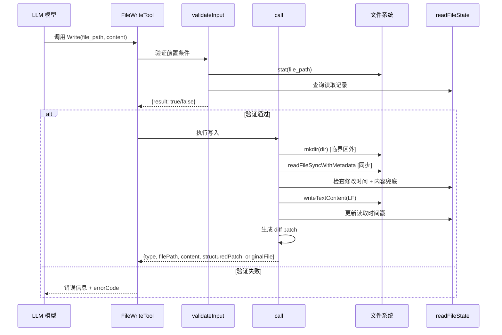
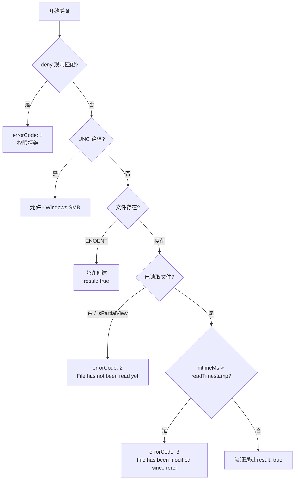
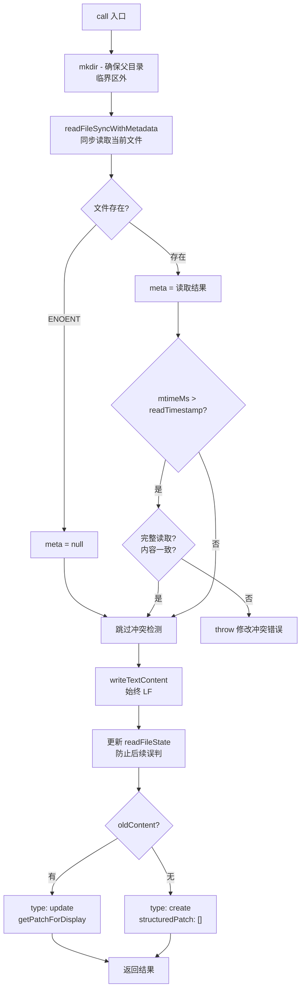

# FileWriteTool 实现分析

> 源文件：`src/tools/FileWriteTool/FileWriteTool.ts`（396 行）、`src/tools/FileWriteTool/prompt.ts`（43 行）

---

## 1. 概述

FileWriteTool 是文件系统工具链中的**全量写入**工具，负责创建新文件或完整覆盖已有文件。其核心定位是：模型提供完整文件内容，工具原子性地完成验证-读取-写入-差异生成流程。

与 FileEditTool 的精确替换不同，Write 工具的操作粒度是整个文件——每次调用都用 `content` 参数完全替换目标文件。这种设计决定了它适用于两类场景：

1. **创建新文件**：文件尚不存在，直接写入
2. **完全重写**：文件已存在但需要大规模修改，用完整内容替换

```
工具名：'Write'（常量 FILE_WRITE_TOOL_NAME）
搜索提示：'create or overwrite files'
maxResultSizeChars：100,000
strict：true（拒绝无效输入）
```

---

## 2. 设计原理

### 2.1 全量写入与精确编辑的分工

系统同时提供 Write 和 Edit 两个文件修改工具，它们的职责划分基于操作粒度：

| 维度 | Write | Edit |
|------|-------|------|
| 输入 | 完整文件内容 | 旧字符串 → 新字符串 |
| 网络开销 | 随文件大小线性增长 | 仅传输变更部分 |
| 适用场景 | 新建文件、大规模重写 | 局部修改、定向替换 |

Prompt 中明确指示模型"Prefer the Edit tool for modifying existing files"，将 Write 限定为创建和完全重写的场景，避免不必要的全量传输。

### 2.2 先验证后执行

Write 工具采用两阶段架构：

- **validateInput**：纯检查，不产生副作用。验证 deny 规则、先读后写、文件修改时间等前置条件
- **call**：原子执行。在临界区内同步完成读取-比对-写入，中间不插入异步操作

这种分离确保验证失败时不会有任何文件系统副作用，同时执行阶段的原子性防止并发编辑导致数据丢失。

### 2.3 行尾策略

这是 Write 工具中一个**看似简单但影响深远**的设计决策：**始终以 LF 行尾写入**。

```
writeTextContent(fullFilePath, content, enc, 'LF')  // 始终 LF
```

**为什么不保留原文件的行尾风格？**

1. **模型发送明确行尾**：LLM 生成的 `content` 参数中已包含具体的行尾字符，不应被旧文件的行尾风格覆盖
2. **跨平台编辑的 CRLF 腐败**：之前的做法（保留旧文件行尾或用 ripgrep 采样仓库行尾风格）在 Linux 上编辑 CRLF 文件时会产生 `\r` 损坏
3. **仓库采样被污染**：当工作目录中存在二进制文件时，仓库行尾采样结果不可靠

这与 FileEditTool 的策略不同——Edit 工具保留原始行尾，因为它的操作是局部替换，不应改变未修改部分的行尾风格。

### 2.4 防冲突机制

Write 工具通过两层检测防止覆盖用户在读取后的修改：

1. **时间戳检测**：比较文件的 `mtimeMs` 与读取时记录的 `timestamp`
2. **内容比较兜底**：Windows 上云同步/杀毒软件可能改变时间戳但内容未变，此时用内容比对避免误判

---

## 3. 实现原理

### 整体架构



---

## 4. 验证链

`validateInput` 按顺序执行 5 步检查，任何一步失败即返回错误：



### 各步骤详解

| 步骤 | 检查内容 | 失败结果 | 源码位置 |
|------|---------|---------|---------|
| 1. Deny 规则 | `matchingRuleForInput(path, ctx, 'edit', 'deny')` | errorCode: 1，权限拒绝 | `:189-202` |
| 2. UNC 路径 | `\\` 或 `//` 前缀 | 直接放行（Windows SMB 场景） | `:206-208` |
| 3. 文件不存在 | `fs.stat` 抛出 ENOENT | 允许创建，`{result: true}` | `:213-221` |
| 4. 未读取 | `readFileState` 无记录或 `isPartialView` | errorCode: 2，必须先读取 | `:224-233` |
| 5. 过期读取 | `Math.floor(mtimeMs) > readTimestamp` | errorCode: 3，文件已被修改 | `:236-244` |

**步骤 4 的 isPartialView 检查**：如果模型只读取了文件的部分内容（使用 offset/limit），则不允许写入。全量写入必须基于对完整文件的理解。

---

## 5. 执行链

`call` 方法在验证通过后执行，流程如下：



### 关键实现细节

#### 5.1 目录创建必须在临界区外

```typescript
// 必须在临界区外执行，await 之间的 yield 会让并发编辑交错
await getFsImplementation().mkdir(dir)
```

`mkdir` 是异步操作，如果放在同步读写之间（临界区内），`await` 的 yield 点会让其他并发编辑操作交错执行，破坏原子性。因此它被放在 `readFileSyncWithMetadata` 之前——即使目录已存在也不会有副作用。

#### 5.2 同步读取确保原子性

```typescript
meta = readFileSyncWithMetadata(fullFilePath)  // 同步
```

读取使用同步 API，确保从读取到写入之间不会有任何 yield 点，维持临界区的完整性。

#### 5.3 内容比较兜底

```typescript
if (!lastRead || lastWriteTime > lastRead.timestamp) {
  const isFullRead = lastRead && lastRead.offset === undefined && lastRead.limit === undefined
  if (!isFullRead || meta.content !== lastRead.content) {
    throw new Error(FILE_UNEXPECTEDLY_MODIFIED_ERROR)
  }
}
```

时间戳检测可能误判的场景（特别是 Windows）：
- 云同步服务修改文件元数据
- 杀毒软件扫描触发时间戳更新

此时如果模型进行了完整读取且内容未变，允许写入继续。

#### 5.4 写入后更新 readFileState

```typescript
readFileState.set(fullFilePath, {
  content,
  timestamp: getFileModificationTime(fullFilePath),
  offset: undefined,
  limit: undefined,
})
```

写入后立即更新读取状态，防止同一轮对话中后续的写入操作因时间戳过期而误判。

#### 5.5 输出类型区分

| 场景 | type | structuredPatch | originalFile |
|------|------|-----------------|-------------|
| 新建文件 | `'create'` | `[]` | `null` |
| 更新文件 | `'update'` | diff hunks 数组 | 旧文件内容 |

对于更新场景，`getPatchForDisplay` 将整个旧内容到新内容的变更生成为结构化 patch，供 UI 展示差异。

---

## 6. 与 Edit 工具的对比

| 方面 | FileWriteTool | FileEditTool |
|------|--------------|-------------|
| **操作方式** | 全量内容覆盖 | 精确字符串替换 |
| **验证步骤** | 5 步 | 10 步 |
| **行尾策略** | 始终 LF | 保留原始行尾 |
| **读取方法** | `readFileSyncWithMetadata` | `readFileForEdit` |
| **冲突检测** | mtimeMs + 内容兜底 | mtimeMs + 内容兜底 |
| **权限检查** | `checkWritePermissionForTool` | `checkReadPermissionForTool` |
| **适用场景** | 新建文件、完全重写 | 定向修改、局部替换 |
| **共享常量** | `FILE_UNEXPECTEDLY_MODIFIED_ERROR`（来自 Edit/constants） | 定义方 |
| **共享类型** | `hunkSchema`, `gitDiffSchema`（来自 Edit/types） | 定义方 |
| **共享工具** | `getPatchForDisplay`（来自 utils/diff） | 同 |

Write 工具复用了 Edit 工具的多个定义（错误常量、hunk schema、diff 工具函数），这体现了两个工具在差异展示层面的一致性——无论全量写入还是局部编辑，用户看到的 diff 格式是统一的。

---

## 7. 数据结构

### Input Schema

```typescript
z.strictObject({
  file_path: z.string(),   // 绝对路径
  content: z.string(),     // 完整文件内容
})
```

`strictObject` 确保不接受额外字段，防止模型传递非预期参数。

### Output Schema

```typescript
z.object({
  type: z.enum(['create', 'update']),  // 操作类型
  filePath: z.string(),                 // 文件路径
  content: z.string(),                  // 写入的内容
  structuredPatch: z.array(hunkSchema()), // 差异 patch
  originalFile: z.string().nullable(),   // 原始内容（新建为 null）
  gitDiff: gitDiffSchema().optional(),   // Git 差异（待实现）
})
```

### readFileState 条目

```typescript
{
  timestamp: number        // 读取时的文件修改时间
  content: string          // 读取的文件内容（用于内容兜底比较）
  offset?: number          // 部分读取的偏移量
  limit?: number           // 部分读取的行数限制
  isPartialView?: boolean  // 是否为部分读取
}
```

### 错误码

| errorCode | 含义 | 用户提示 |
|-----------|------|---------|
| 1 | Deny 规则拒绝 | "File is in a directory that is denied by your permission settings." |
| 2 | 未先读取 | "File has not been read yet. Read it first before writing to it." |
| 3 | 读取后已修改 | "File has been modified since read..." |

---

## 8. 小结

FileWriteTool 的设计体现了几个关键工程决策：

1. **全量写入的简洁性**：相比 Edit 的 10 步验证，Write 只需 5 步，因为操作语义更简单——没有字符串匹配、没有多重替换、没有 old_string 校验
2. **LF 行尾的坚定选择**：不尝试保留或采样行尾风格，直接使用 LF。这是一个务实的选择——跨平台编辑的行尾问题极易引发难以排查的 bug，统一 LF 消除了整个问题域
3. **临界区的严格维护**：从同步读取到写入之间不允许任何异步操作，目录创建被前置到临界区外
4. **内容比较作为安全网**：时间戳检测是主要手段，但 Windows 平台的特殊性使得内容比较成为必要的兜底机制

当前标记为 TODO 的功能（fileHistory 备份/撤销、LSP 通知、VSCode 集成、日志事件、团队密钥检测、技能目录发现、plan 文件检测）都是与外围模块的集成点，核心读写逻辑已经完整。

---

## 9. 组合使用

### Write 与 Read 的协作

Write 工具的先读后写约束使其与 Read 工具形成强协作关系：

```
Read(file_path) → readFileState 记录 {timestamp, content}
                                    ↓
Write(file_path, content) → validateInput 检查 readFileState
                                    ↓
                            call 执行写入并更新 readFileState
```

### Write 与 Edit 的选择

```
决策流程：
文件不存在？ → Write（唯一选择）
文件存在，需要修改？
  ├─ 修改范围 > 50%？ → Write（全量重写更高效）
  ├─ 精确定位替换？ → Edit（只传输 diff）
  └─ 不确定？ → Edit（更安全，不会意外覆盖未修改部分）
```

### Write 与权限系统

```
backfillObservableInput → expandPath（防 hook allowlist 绕过）
preparePermissionMatcher → matchWildcardPattern（通配符匹配文件路径）
checkPermissions → checkWritePermissionForTool（写入权限检查）
```

`expandPath` 是安全关键点：将 `~` 和相对路径展开为绝对路径，防止用户通过 `~/secret` 这样的路径绕过 hook 中基于路径模式的 allowlist。
