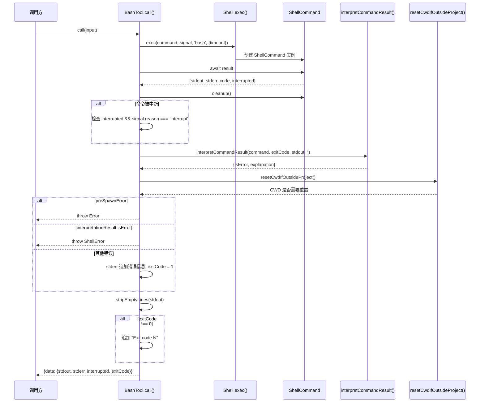
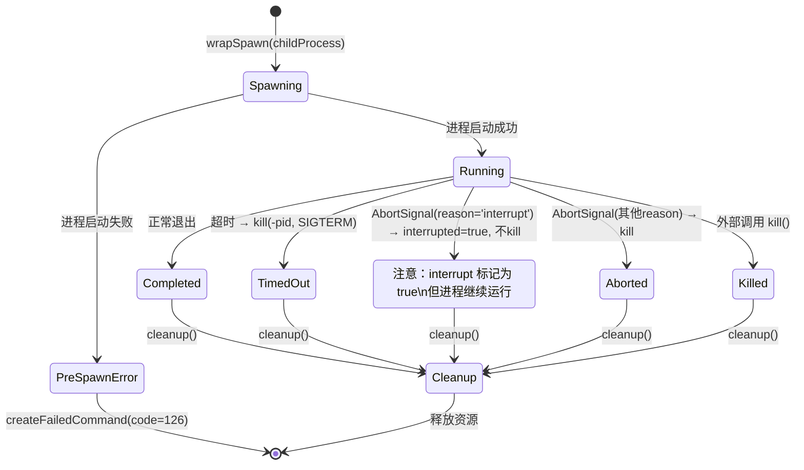
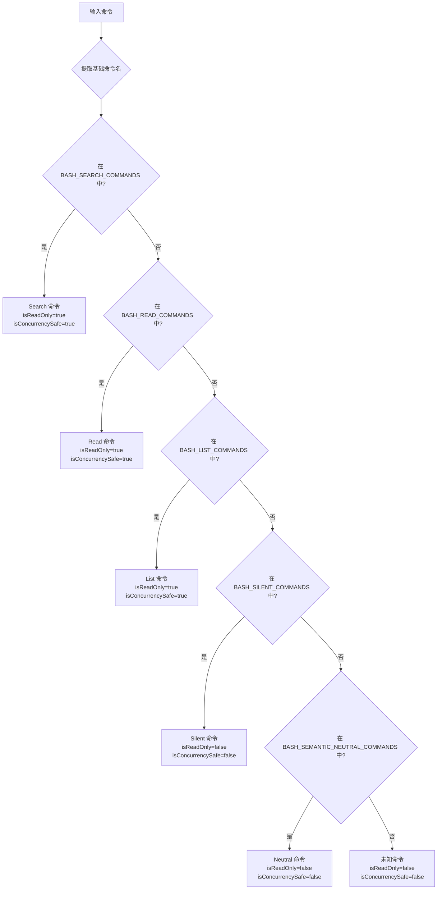
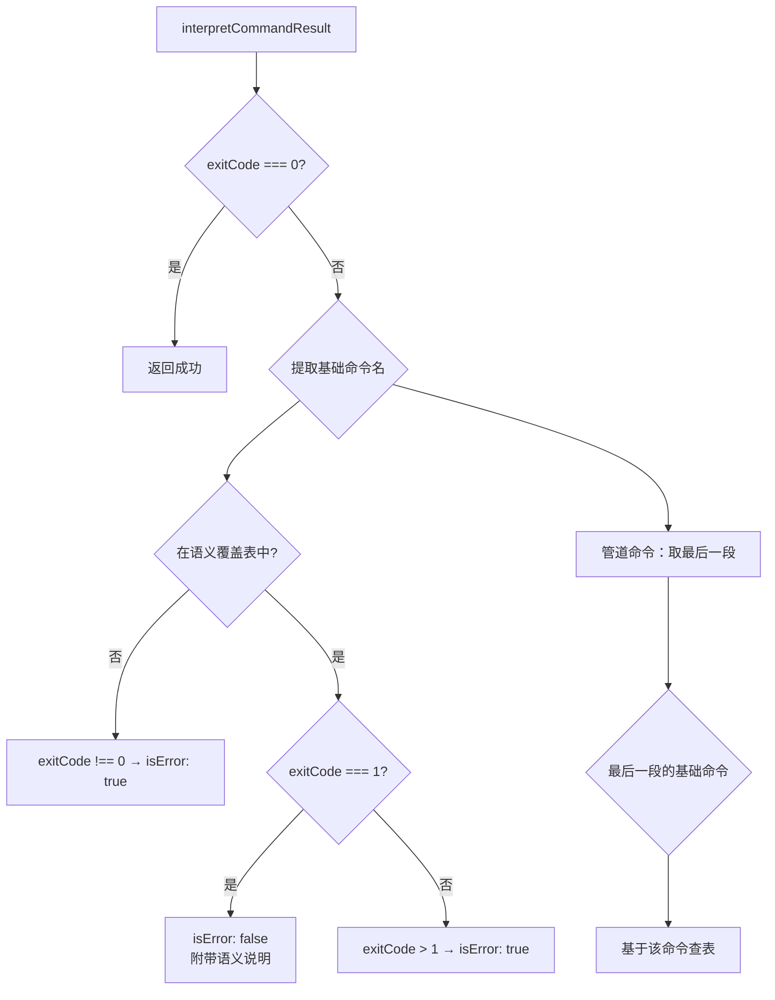

# BashTool 实现原理图文分析

## 1. 概述

BashTool 是 Claude Code 中最核心的工具之一，为 AI Agent 提供了与系统 shell 交互的能力。它不仅能执行任意 shell 命令，还内置了命令分类体系、语义感知的退出码解析、并发安全策略以及 CWD 状态管理等机制，使得 AI 在执行命令时具备精细的行为控制。

**源文件清单：**

| 文件 | 行数 | 职责 |
|------|------|------|
| `src/tools/BashTool/BashTool.ts` | 411 | 主工具定义，执行入口 |
| `src/tools/BashTool/commandSemantics.ts` | 131 | 退出码语义解析 |
| `src/tools/BashTool/prompt.ts` | 39 | Prompt 规则与超时配置 |
| `src/tools/BashTool/toolName.ts` | 2 | 工具名常量 |
| `src/tools/BashTool/utils.ts` | 57 | 输出处理与 CWD 恢复 |
| `src/utils/Shell.ts` | 234 | Shell 执行引擎 |
| `src/utils/ShellCommand.ts` | 264 | 命令生命周期管理 |

## 2. 设计原理

### 2.1 命令分类体系

BashTool 并非对所有命令一视同仁。它将 shell 命令划分为五个语义类别，每个类别决定了命令的只读性和并发安全性：

- **Search 命令**：`find`, `grep`, `rg`, `ag`, `ack`, `locate`, `which`, `whereis`
- **Read 命令**：`cat`, `head`, `tail`, `less`, `more`, `wc`, `stat`, `file`, `strings`, `jq`, `awk`, `cut`, `sort`, `uniq`, `tr`
- **List 命令**：`ls`, `tree`, `du`
- **Silent 命令**：`mv`, `cp`, `rm`, `mkdir`, `rmdir`, `chmod`, `chown`, `chgrp`, `touch`, `ln`, `cd`, `export`, `unset`, `wait`
- **Semantic Neutral 命令**：`echo`, `printf`, `true`, `false`, `:`

分类的核心逻辑：

```
isReadOnly = search || read || list → true
isConcurrencySafe = isReadOnly
```

这意味着 search/read/list 命令可以并行执行，而所有其他命令（包括 silent 命令）必须串行执行，以避免竞争条件。

### 2.2 命令语义解析

传统 shell 中，退出码 0 表示成功，非 0 表示失败。但某些命令的退出码 1 并不代表错误，而是有特定的语义含义。BashTool 通过 `commandSemantics.ts` 实现了这一语义层面的解析：

| 命令 | 退出码 1 含义 | 原因 |
|------|-------------|------|
| `grep` | 未找到匹配 | 常见模式：grep 在无匹配行时返回 1 |
| `rg` | 未找到匹配 | 与 grep 行为一致 |
| `find` | 部分成功 | 某些目录不可访问 |
| `diff` | 发现差异 | diff 退出码 1 表示存在差异 |
| `test` | 条件为假 | test/[ 对假条件返回 1 |
| `[` | 条件为假 | 与 test 行为一致 |

**关键设计决策**：命令语义解析**明确不适用于安全决策**——它仅为 AI 的结果解读提供上下文，而非权限判断的依据。

### 2.3 并发安全策略

BashTool 的并发模型基于命令分类的只读性判断：

- **只读命令**（search/read/list）→ `isConcurrencySafe: true` → 可并行执行
- **所有其他命令** → `isConcurrencySafe: false` → 必须串行执行

这种设计的权衡在于：silent 命令（如 `mkdir`、`touch`）在理论上也是幂等的，但为了安全起见，所有写入类操作都被强制串行化，以避免文件系统竞争。

## 3. 实现原理

### 3.1 执行主链路

BashTool 的 `call` 方法是命令执行的核心入口，其执行流程如下：



关键步骤解析：

1. **命令执行**：通过 `Shell.exec()` 启动子进程
2. **结果等待**：`await shellCommand.result` 阻塞直到命令完成
3. **清理**：`shellCommand.cleanup()` 释放资源
4. **中断检查**：区分用户主动中断（`signal.reason === 'interrupt'`）与其他中断
5. **语义解读**：`interpretCommandResult()` 根据命令类型解析退出码含义
6. **CWD 恢复**：如果命令改变了工作目录到项目外，自动恢复
7. **错误处理**：三级错误策略——preSpawnError 直接抛出、语义错误抛 ShellError、其他错误附加到 stderr
8. **输出格式化**：去除首尾空行，非零退出码追加提示

### 3.2 Shell 执行引擎

Shell.ts 是命令执行的底层引擎，负责 shell 发现、配置和进程管理：

**Shell 发现策略**：
```
CLAUDE_CODE_SHELL 环境变量 > SHELL 环境变量（仅 bash/zsh） > /bin/bash
```

**Shell 配置**（memoized）：
- 使用 bash 执行，参数 `['-c', '-l', commandString]`
- `detached: true`（创建独立进程组，便于整组终止）

**CWD 处理链**：
```
realpath(cwd) → 存在？使用它 : originalCwd → 存在？使用它 : createFailedCommand()
```

**环境变量注入**：
- `SHELL`：设置为实际使用的 shell 路径
- `GIT_EDITOR=true`：防止 git 打开交互式编辑器
- `CLAUDECODE=1`：标识当前运行在 Claude Code 环境中

### 3.3 ShellCommand 生命周期

ShellCommand 封装了子进程的完整生命周期，从创建到终止：



## 4. 命令分类体系

命令分类是 BashTool 的核心设计，决定了并发行为和结果处理方式。

**分类决策流程：**



**管道命令的处理**：对于管道命令（如 `grep foo | sort | uniq`），分类系统只取管道**最后一段**的基础命令名进行判断。这意味着 `cat file | grep pattern` 的分类取决于 `grep`（search），而非 `cat`（read）。

## 5. 命令语义解析

`interpretCommandResult()` 函数根据命令类型智能解读退出码：



**命令提取启发式**：对于管道命令 `cmd1 | cmd2 | cmd3`，系统按 `|` 分割后取最后一段，再提取其基础命令名（去除参数和选项）。

**示例**：
- `grep "pattern" file.txt` 退出码 1 → **非错误**（未找到匹配）
- `grep "pattern" file.txt` 退出码 2 → **错误**（真正的执行错误）
- `ls nonexistent` 退出码 1 → **错误**（ls 不在语义覆盖表中）

## 6. Shell 执行引擎

Shell.ts 提供了进程级别的执行基础设施。

**核心接口**：

| 函数 | 职责 |
|------|------|
| `exec()` | 命令执行入口，创建 ShellCommand |
| `findSuitableShell()` | 三级回退的 shell 发现 |
| `getShellConfig()` | memoized 的 shell 配置 |
| `getEnvironment()` | 环境变量注入 |

**ExecOptions 配置项**：

| 选项 | 作用 |
|------|------|
| `timeout` | 命令超时时间（ms） |
| `onProgress` | 进度回调 |
| `preventCwdChanges` | 阻止 CWD 变更（TODO） |
| `shouldUseSandbox` | 沙箱模式（TODO） |
| `shouldAutoBackground` | 自动后台运行（TODO） |
| `onStdout` | stdout 流式回调 |

**超时配置**：
- 默认超时：2 分钟（120,000 ms）
- 最大超时：30 分钟（1,800,000 ms）

**CWD 状态管理架构**：

```
bootstrap/state.ts
├── originalCwd  ─── 稳定锚点（项目根目录），不变
└── cwd          ─── 当前工作目录，随操作变化
```

`resetCwdIfOutsideProject()` 的逻辑：比较 `getCwd()` 与 `getOriginalCwd()`，如果 CWD 被命令改到了项目目录之外，则自动恢复到 `originalCwd`，并在 stderr 中追加提示信息。

## 7. ShellCommand 生命周期

ShellCommand.ts 封装了 Node.js `ChildProcess` 的完整生命周期。

**核心类型**：

```typescript
// 执行结果
type ExecResult = {
  stdout: string
  stderr: string
  code: number
  interrupted: boolean
  backgroundTaskId?: string
  // ...
}

// ShellCommand 接口
interface ShellCommand {
  background(): Promise<string>    // 转为后台任务
  result: Promise<ExecResult>      // 等待结果
  kill(): void                     // 终止进程
  status: 'running' | 'completed'  // 状态查询
  cleanup(): void                  // 资源清理
}
```

**wrapSpawn() 核心逻辑**：

1. **输出收集**：通过 `data` 事件收集 stdout/stderr（UTF-8 编码）
2. **超时处理**：超时后 `kill(-pid, 'SIGTERM')` 终止整个进程组
3. **AbortSignal 处理**：
   - `reason === 'interrupt'`（用户新消息）→ 设置 `interrupted=true`，**不终止进程**
   - 其他 reason → 终止进程
4. **退出处理**：resolve 带 trimmed 的 stdout/stderr 和退出码
5. **kill() 实现**：`process.kill(-pid, 'SIGTERM')`（进程组终止），回退到 `childProcess.kill('SIGTERM')`

**工厂函数**：

| 函数 | 退出码 | 场景 |
|------|--------|------|
| `createAbortedCommand()` | 130 | 用户中断（符合 POSIX 惯例） |
| `createFailedCommand()` | 126 | 启动前失败（符合 POSIX 惯例） |

## 8. 数据结构

**工具接口**：

| 属性 | 值 |
|------|-----|
| Name | `'Bash'`（BASH_TOOL_NAME） |
| Search Hint | `'execute shell commands'` |
| maxResultSizeChars | 30,000 |
| strict | true |

**输入 Schema**：

```typescript
z.strictObject({
  command: string,                              // 必需：要执行的命令
  timeout: semanticNumber.optional(),           // 可选：超时时间（ms）
  description: string.optional(),               // 可选：命令描述
  run_in_background: boolean.optional()         // 可选：后台运行
  // 注意：当 CLAUDE_CODE_DISABLE_BACKGROUND_TASKS 为 truthy 时，
  // run_in_background 字段从 schema 中完全移除
})
```

**输出 Schema**：

```typescript
z.object({
  stdout: string,
  stderr: string,
  interrupted: boolean,
  exitCode: number
})
```

**Prompt 规则（getSimplePrompt）**：

| 规则 | 说明 |
|------|------|
| 多个独立命令 | 使用**并行的** Bash tool calls |
| 有依赖的顺序命令 | 使用 `&&` 链接在单次调用中 |
| 不关心前序失败 | 使用 `;` 分隔 |
| 命令分隔 | **不要**用换行符分隔命令 |
| 带空格路径 | 使用双引号包裹 |
| 工作目录 | 使用绝对路径，避免 `cd` |

**框架集成方法**：

| 方法 | 行为 |
|------|------|
| `userFacingName` | → `'Bash'` |
| `getToolUseSummary` | → `description` 或截断的命令（80 字符） |
| `getActivityDescription` | → `'Running {desc}'` |
| `isSearchOrReadCommand` | → 命令分类结果 |
| `toAutoClassifierInput` | → 原始命令字符串 |
| `extractSearchText` | → stdout + stderr 合并 |
| `mapToolResultToToolResultBlockParam` | → 去首空行、trim 尾部、追加 abort 错误 |

## 9. 小结

BashTool 的设计体现了几个关键工程决策：

1. **语义感知而非盲目执行**：通过命令分类和语义解析，BashTool 让 AI 能正确理解 `grep` 返回 1 不是错误，避免误判和多余的补救操作。

2. **保守的并发策略**：只读命令可并行，所有写入操作串行化。虽然 silent 命令可能也是安全的，但选择了更保守的路径，以避免文件系统竞争。

3. **健壮的 CWD 管理**：通过 `originalCwd` 锚点 + 自动恢复机制，确保命令不会将 AI 的工作上下文"带偏"到项目外。

4. **POSIX 兼容的进程管理**：使用进程组终止（`kill(-pid)`）而非仅终止子进程，确保管道中的所有进程都被正确清理。

5. **渐进式中断**：区分"用户新消息中断"（设置标记但不 kill）和"其他原因中断"（直接 kill），前者允许命令完成当前工作后再报告。

6. **分层抽象**：BashTool → Shell → ShellCommand 三层架构，各层职责清晰，便于独立测试和扩展。

## 10. 组合使用

**场景 1：搜索并处理**

```
# 并行执行两个搜索（两者都是 read-only，可并发）
Bash: grep -r "TODO" src/
Bash: find . -name "*.test.ts"

# 然后基于结果执行写入操作（必须串行）
Bash: npm run fix-todos
```

**场景 2：条件执行**

```
# 使用 && 链接有依赖的命令
Bash: npm run build && npm test

# 使用 ; 执行不关心前序结果的命令
Bash: npm run lint; echo "lint done"
```

**场景 3：长时间运行的任务**

```
# 使用 run_in_background 启动开发服务器
Bash: npm run dev (run_in_background: true)

# 然后继续执行其他操作
Bash: curl http://localhost:3000/api/health
```

**场景 4：CWD 安全**

```
# 即使命令 cd 到项目外，CWD 也会自动恢复
Bash: cd /tmp && ls
# 执行后，CWD 自动恢复到项目目录
# stderr 可能包含 "Shell cwd was reset" 提示
```

**场景 5：语义感知的错误处理**

```
# grep 返回 1 不会被视为错误
Bash: grep "pattern" file.txt
# 即使没有匹配（exit code 1），AI 也不会误判为执行失败

# 但 grep 返回 2 会被视为真正的错误
Bash: grep "pattern" nonexistent_file.txt
# exit code 2 → isError: true
```

---

**当前未完成项（TODO）**：

| 功能 | 状态 |
|------|------|
| `checkPermissions` | 始终返回 allow |
| `validateInput` | 始终返回 true |
| sandbox 集成 | 未实现 |
| PowerShell 支持 | 未实现 |
| 后台任务实现 | 未实现 |
| preventCwdChanges 集成 | 未实现 |
| UI 渲染 | 未实现 |
