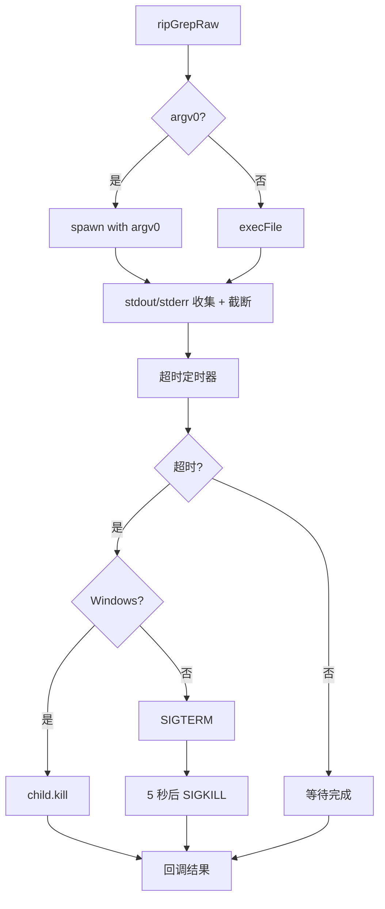

# 4.8 ripgrep 搜索引擎集成

## 概述

ripgrep 是一个高性能的命令行搜索工具，比传统 grep 和 Node.js 原生文件遍历快得多。本模块将其集成到工具系统中，为 GlobTool 和 GrepTool 提供底层搜索能力。

## 关键源码

| 文件 | 职责 |
| --- | --- |
| `src/utils/ripgrep.ts` | ripgrep 核心封装：配置选择、执行、错误恢复 |
| `src/utils/glob.ts` | glob 文件搜索，使用 ripgrep --files |
| `src/tools/GrepTool/GrepTool.ts` | 文件内容搜索，使用 ripgrep 正则搜索 |
| `src/utils/execFileNoThrow.ts` | 跨平台执行包装器 |
| `src/utils/platform.ts` | 平台检测（macOS/Windows/WSL/Linux） |
| `src/utils/which.ts` | 可执行文件查找 |
| `src/utils/bundledMode.ts` | Bun 编译模式检测 |
| `src/utils/findExecutable.ts` | 替代 spawn-rx 的可执行文件查找 |

## 设计原理

### 1. 三种配置模式

`getRipgrepConfig()` 自动选择最优配置：

```
优先级：USE_BUILTIN_RIPGREP 环境变量 → 系统 rg → Bun 编译模式 → vendor 目录
```

| 模式 | 条件 | 命令 | 说明 |
| --- | --- |
| system | `USE_BUILTIN_RIPGREP=false` 且系统有 rg | `rg` | 用户系统安装的 ripgrep |
| embedded | `isInBundledMode()` 为真 | `process.execPath --no-config` (argv0='rg') | Bun 编译的独立可执行文件 |
| builtin | 默认 | `vendor/ripgrep/{arch}-{platform}/rg` | 项目内置的二进制文件 |

**安全设计**：使用命令名 `'rg'` 而非完整路径，防止 PATH 劫持（NoDefaultCurrentDirectoryInExePath 保护）。

### 2. 超时与错误恢复

#### 超时机制

```
平台自适应超时：
- WSL: 60 秒（文件系统性能惩罚）
- 其他: 20 秒
- 环境变量覆盖: CLAUDE_CODE_GLOB_TIMEOUT_SECONDS
```

#### EAGAIN 错误恢复

资源受限环境（Docker、CI）中，ripgrep 可能因线程过多触发 EAGAIN（os error 11）：

```typescript
// 检测 EAGAIN
function isEagainError(stderr: string): boolean {
  return stderr.includes('os error 11') || 
         stderr.includes('Resource temporarily unavailable')
}

// 单线程降级重试
if (!isRetry && isEagainError(stderr)) {
  ripGrepRaw(args, target, abortSignal, callback, true) // -j 1
}
```

#### 超时升级机制

```
超时 → SIGTERM → 5 秒后 → SIGKILL（不可被捕获或忽略）
Windows 特殊处理：SIGTERM/SIGKILL 会抛出，使用默认 kill()
```

### 3. 流式处理

#### ripGrep()

缓冲整个 stdout，适合大多数场景：

```typescript
async function ripGrep(
  args: string[],
  target: string,
  abortSignal: AbortSignal,
): Promise<string[]>
```

退出码语义：
- `0` = 找到匹配
- `1` = 无匹配（正常情况）
- `2` = 用法错误

#### ripGrepStream()

流式处理，每个 stdout 块立即返回完整行：

```typescript
async function ripGrepStream(
  args: string[],
  target: string,
  abortSignal: AbortSignal,
  onLines: (lines: string[]) => void,
): Promise<void>
```

适用场景：fzf `change:reload` 模式，首批结果在 rg 遍历树时立即显示。

#### ripGrepFileCount()

仅计数换行符，峰值内存 ~64KB：

```typescript
async function ripGrepFileCount(
  args: string[],
  target: string,
  abortSignal: AbortSignal,
): Promise<number>
```

用于遥测统计大型仓库文件数（避免 16MB stdout 缓冲）。

### 4. macOS 代码签名

Bundled ripgrep 二进制文件在 macOS 上需要签名：

```typescript
async function codesignRipgrepIfNecessary() {
  // 检查是否需要签名（linker-signed 标记）
  const needsSigned = lines.find(line => line.includes('linker-signed'))
  
  // 签名
  execFileNoThrow('codesign', ['--sign', '-', '--force', ...])
  
  // 清除隔离属性
  execFileNoThrow('xattr', ['-d', 'com.apple.quarantine', ...])
}
```

## 执行流程

### ripGrepRaw() 核心实现



### 错误处理流程

```typescript
handleResult(error, stdout, stderr, isRetry):
  // 1. 成功
  if (!error) → resolve(结果数组)
  
  // 2. 无匹配（退出码 1）
  if (error.code === 1) → resolve([])
  
  // 3. 关键错误
  if (ENOENT/EACCES/EPERM) → reject(error)
  
  // 4. EAGAIN 重试
  if (!isRetry && isEagainError(stderr)) → 单线程重试
  
  // 5. 部分结果
  if (hasOutput && (timeout || bufferOverflow)) → 丢弃最后一行
  if (isTimeout && noResults) → reject(RipgrepTimeoutError)
  else → resolve(lines)
```

## 关键实现细节

### 缓冲区管理

```typescript
const MAX_BUFFER_SIZE = 20_000_000 // 20MB

// spawn 模式：手动截断
if (stdout.length > MAX_BUFFER_SIZE) {
  stdout = stdout.slice(0, MAX_BUFFER_SIZE)
  stdoutTruncated = true
}

// execFile 模式：maxBuffer 选项
execFile(rgPath, args, { maxBuffer: MAX_BUFFER_SIZE })
```

### AbortSignal 响应

```typescript
// spawn 模式
spawn(rgPath, args, { signal: abortSignal })

// execFile 模式
execFile(rgPath, args, { signal: abortSignal })
```

AbortSignal 触发时，进程被杀死，回调收到 `ABORT_ERR`。

### 首次使用测试

```typescript
const testRipgrepOnFirstUse = memoize(async () => {
  // 测试 --version
  const test = await execFileNoThrow(rgPath, ['--version'])
  
  // 验证输出以 'ripgrep ' 开头
  const working = test.code === 0 && test.stdout.startsWith('ripgrep ')
  
  // 缓存状态
  ripgrepStatus = { working, lastTested, config }
})
```

## 辅助模块

### execFileNoThrow

始终 resolve 的 execFile 包装器：

```typescript
export function execFileNoThrow(
  file: string,
  args: string[],
  options: ExecFileOptions,
): Promise<{ stdout: string; stderr: string; code: number; error?: string }>
```

设计特点：
- 使用 execa 实现 Windows .bat/.cmd 兼容性
- `reject: false` 确保非零退出码不抛出
- `preserveOutputOnError` 选项保留输出用于诊断

### 平台检测

```typescript
export const getPlatform = memoize((): Platform => {
  darwin → 'macos'
  win32 → 'windows'
  linux → {
    /proc/version 包含 'microsoft'/'wsl' → 'wsl'
    else → 'linux'
  }
})

export const getWslVersion = memoize((): string | undefined => {
  // WSL2/WSL3 检测：/proc/version 中的 "WSL2" 标记
  // WSL1 检测：包含 "Microsoft" 但无版本号
})

export const getLinuxDistroInfo = memoize(async () => {
  // 读取 /etc/os-release 提取 ID 和 VERSION_ID
})
```

### 可执行文件查找

```typescript
// Bun 优先
export const which = bunWhich ?? whichNodeAsync

// 同步版本
export const whichSync = bunWhich ?? whichNodeSync

// 替代 spawn-rx
export function findExecutable(exe: string, args: string[]) {
  const resolved = whichSync(exe)
  return { cmd: resolved ?? exe, args }
}
```

## 与工具系统集成

### GlobTool 使用

```typescript
// src/utils/glob.ts
const args = [
  '--files',           // 列出文件
  '--glob', searchPattern,
  '--sort=modified',   // 按修改时间排序
  '--no-ignore',       // 忽略 .gitignore
  '--hidden',          // 包含隐藏文件
]

const allPaths = await ripGrep(args, searchDir, abortSignal)
```

### GrepTool 使用

```typescript
// src/tools/GrepTool/GrepTool.ts
const args = [
  '--hidden',
  '--glob', `!${dir}`, // 排除 VCS 目录
  '--max-columns', '500',
  output_mode === 'files_with_matches' ? '-l' : 
  output_mode === 'count' ? '-c' : '-n',
]

const results = await ripGrep(args, absolutePath, abortSignal)
```

## 性能优化

### 大型仓库支持

- **缓冲区上限**：20MB，支持 200k+ 文件（~16MB 路径）
- **流式处理**：`ripGrepFileCount` 仅计数，峰值内存 ~64KB
- **早期终止**：结果超过 `offset + limit + 100` 时停止遍历

### WSL 性能惩罚

```
WSL 文件系统性能比原生慢 3-5 倍
解决方案：超时从 20 秒提升到 60 秒
```

### 内存安全

```typescript
// 防止 stdout 爆炸
if (stdout.length > MAX_BUFFER_SIZE) {
  stdout = stdout.slice(0, MAX_BUFFER_SIZE)
  stdoutTruncated = true
}

// 防止 stderr 爆炸
if (stderr.length > MAX_BUFFER_SIZE) {
  stderr = stderr.slice(0, MAX_BUFFER_SIZE)
  stderrTruncated = true
}
```

## 错误分类

| 错误类型 | 处理方式 | 说明 |
| --- | --- | --- |
| 无匹配（code 1） | `resolve([])` | 正常情况，不是错误 |
| EAGAIN | 单线程重试 | 资源受限环境，降级处理 |
| 超时 + 无结果 | `reject(RipgrepTimeoutError)` | 区分"无匹配"和"搜索未完成" |
| 超时 + 有结果 | 丢弃最后一行，返回部分结果 | 平衡可用性和准确性 |
| 缓冲区溢出 | 丢弃最后一行，返回部分结果 | 防止内存爆炸 |
| ENOENT/EACCES/EPERM | `reject(error)` | 关键错误，必须报告 |
| ABORT_ERR | `resolve(lines)` | 用户取消，返回已收集结果 |

## 当前局限

1. **analytics 集成**：`logEvent` 调用已注释，待 analytics 模块实现
2. **plugins 集成**：孤立的插件版本目录排除逻辑已注释
3. **Windows argv0**：Bun.spawn 支持 argv0，但 TypeScript 类型未反映
4. **部分结果处理**：超时和缓冲区溢出时丢弃最后一行（可能不完整），但无法确定边界

## 设计取舍

### 为什么选择 ripgrep？

1. **性能**：比 Node.js 原生 `fs.readdir` + 过滤快得多
2. **内置 .gitignore**：自动遵守 .gitignore 规则
3. **跨平台**：统一的搜索行为，无需处理平台差异
4. **成熟稳定**：被广泛使用，问题已充分暴露

### 为什么三种模式？

- **system**：用户可能已安装更新的 ripgrep 版本
- **embedded**：Bun 编译的独立可执行文件需要内嵌搜索能力
- **builtin**：保证兼容性，无需依赖系统环境

### 为什么不用 Node.js 原生？

```
大型 monorepo（247k 文件，16MB 路径）：
- Node.js fs.readdir + 过滤：内存爆炸，速度慢
- ripgrep --files：秒级完成，内存可控
```

## 小结

ripgrep 集成为工具系统提供了高性能、可靠的底层搜索能力。通过三种配置模式、完善的错误恢复和流式处理，确保在各种环境下稳定运行。macOS 代码签名解决了 quarantine 问题，EAGAIN 重试确保资源受限环境下的可用性。
