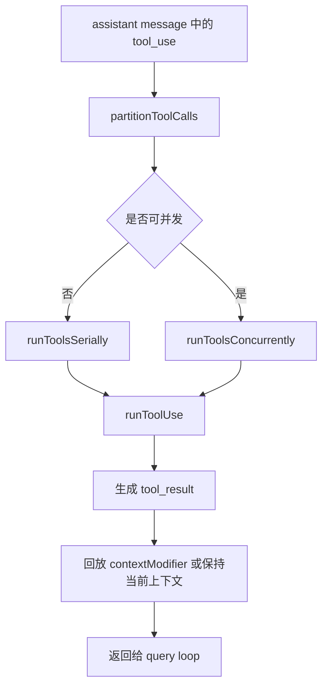

# 04. 工具编排与执行框架

## 概述

这一层负责接住模型返回的 `tool_use`，并把它们转换成下一轮可消费的 `tool_result`。核心职责划分为：类型体系与工厂（`Tool.ts`）、工具注册与池组装（`tools.ts`）、批次编排（`toolOrchestration.ts`）、单工具执行（`toolExecution.ts`），以及具体工具实现（GlobTool、MCP 等）。

## 关键源码

| 文件 | 职责 |
| --- | --- |
| `src/Tool.ts` | 工具类型体系 + buildTool 工厂 + 辅助函数 |
| `src/tools.ts` | 工具注册机制：getAllBaseTools/getTools/assembleToolPool/filterToolsByDenyRules |
| `src/services/tools/toolOrchestration.ts` | 批次编排：partitionToolCalls → 串行/并发调度 → 上下文汇总 |
| `src/services/tools/toolExecution.ts` | 单工具执行：查找→校验→权限→调用→结果映射 |
| `src/constants/tools.ts` | 工具名称常量 + 代理禁用列表 + 异步代理允许列表 + 协调器模式允许列表 |
| `src/utils/envUtils.ts` | 环境变量判断：isEnvTruthy/hasEmbeddedSearchTools |
| `src/utils/lazySchema.ts` | 延迟 Schema 构建 |
| `src/utils/api.ts` | 工具输入规范化：normalizeToolInput |
| `src/utils/json.ts` | 安全 JSON 解析：safeParseJSON |
| `src/hooks/useCanUseTool.ts` | 权限检查函数类型：CanUseToolFn |

## 设计原理

### 1. 完整接口先行，工厂模式收口

`src/Tool.ts` 定义完整的工具能力模型：

- `Tool<I, O, P>` — 工具完整接口（调用、权限、验证、渲染等 30+ 方法/属性）
- `ToolDef<I, O, P>` — 工具定义类型（可省略默认方法的 Partial Tool）
- `buildTool(def)` — 工厂函数，将 ToolDef 展开为完整 Tool
- `TOOL_DEFAULTS` — 安全默认值（fail-closed 原则）

工具系统优先稳定"工具长什么样、如何创建、如何校验"，而非先堆实现。

### 2. buildTool 的 fail-closed 默认策略

| 默认方法 | 默认值 | 设计意图 |
| --- | --- | --- |
| `isEnabled` | `() => true` | 工具默认启用 |
| `isConcurrencySafe` | `(_input?) => false` | 假设不安全，保守串行 |
| `isReadOnly` | `(_input?) => false` | 假设写入，触发权限检查 |
| `isDestructive` | `(_input?) => false` | 非破坏性，仅不可逆操作覆盖 |
| `checkPermissions` | `allow + updatedInput` | 委托通用权限系统 |
| `toAutoClassifierInput` | `(_input?) => ''` | 跳过分类器，安全工具必须覆盖 |
| `userFacingName` | `() => def.name` | 默认取工具名 |

### 3. 编排层与执行层分离

- `toolOrchestration.ts` 负责切批、串并行调度、上下文合并
- `toolExecution.ts` 负责单个 `tool_use` 的校验和结果生成

这让后续真实工具执行可以直接往 `runToolUse()` 深挖，而不需要重写批次调度逻辑。

### 4. 工具注册机制：单一真相源 + 按需过滤

`src/tools.ts` 提供工具注册的完整链路：

| 函数 | 作用 |
| --- | --- |
| `getAllBaseTools()` | 所有内置工具的唯一真相源，尊重环境变量标志 |
| `getTools(permissionContext)` | 根据权限上下文过滤可用工具 |
| `assembleToolPool(permissionContext, mcpTools)` | 合并内置工具和 MCP 工具，排序去重 |
| `filterToolsByDenyRules(tools, permissionContext)` | 按拒绝规则过滤工具 |
| `getMergedTools(permissionContext, mcpTools)` | 内置+MCP 合并不排序（用于 token 计数） |

**关键设计**：
- 条件引入：`hasEmbeddedSearchTools()` 为真时，不需要独立 Glob/Grep 工具
- Simple 模式：`CLAUDE_CODE_SIMPLE=1` 时仅返回 Bash/Read/Edit
- 排序稳定性：内置工具按名称排序为连续前缀，确保 prompt cache 稳定
- 去重策略：内置工具优先，同名 MCP 工具被忽略

### 5. 并发安全优先于吞吐

是否并发执行由工具的 `isConcurrencySafe()` 决定。若工具缺失、schema 校验失败或判断抛错，统一保守降级为串行。

### 6. 工具常量集中管理

`src/constants/tools.ts` 集中管理工具名称常量和代理权限规则。设计原因：工具重命名后，旧名称仍需支持（通过 `permissionRuleParser.ts` 的别名映射）。

## 主流程

## 子功能点导航

- **4.1 glob 搜索工具实现** — [`04-01-glob-search-tool.md`](04-01-glob-search-tool.md)
  - GlobTool 完整实现：buildTool 工厂落地、延迟 Schema 构建、路径相对化
  - 输入验证边界处理：UNC 路径、目录存在性/类型检查
  - glob 搜索核心实现：模式匹配、递归遍历、截断
  - 路径/文件工具函数：expandPath、toRelativePath、getCwd、isENOENT 等

- **4.2 MCP 工具实现** — [`04-02-mcp-tool-implementation.md`](04-02-mcp-tool-implementation.md)
  - MCP 名称解析/构建：mcpInfoFromString、buildMcpToolName、getToolNameForPermissionCheck
  - MCP 名称规范化：normalizeNameForMCP、getMcpPrefix、显示名提取
  - Tool 类型 MCP 扩展：isMcp 标记、mcpInfo 元数据、inputJSONSchema 直通
  - MCP 工具注册与权限匹配
  - MCP 权限匹配：服务器级规则、通配符匹配、完整名匹配

## 组合使用

- 和 `03-query-engine-layer.md` 组合，能看清 query loop 为什么会继续下一轮
- 和 `06-session-management-layer.md` 组合，能看清 `ToolUseContext` 为什么是共享状态中心
- 和 `07-tui-rendering-layer.md` 组合，能看清 in-progress 标记未来如何驱动 UI 状态
- 和 `08-permission-system.md` 组合，能看清 `checkPermissions` → `PermissionResult` 的完整权限链路
