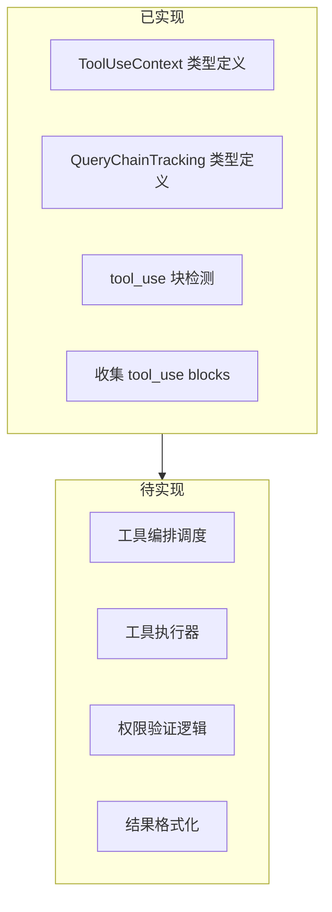
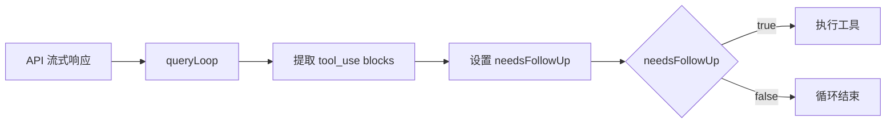

# 工具执行层

## Relevant source files

- `src/Tool.ts` - 工具执行上下文类型定义
- `src/types/tools.ts` - 工具进度类型（当前为 stub）
- `src/hooks/useCanUseTool.ts` - 权限检查函数类型（当前为 stub）
- `src/query.ts` - tool_use 检测与触发点

## 本页概述

工具执行层负责定义工具执行所需的上下文类型，以及在查询循环中检测和处理 tool_use 块。本页基于当前源码实现状态，说明已实现的内容和 TODO 待完成的部分。

> **注意**：工具编排（scheduleTools）、并行/串行执行、权限验证等逻辑在当前源码中尚未实现，仅存在于注释中的 TODO 标记。

## 当前实现状态



## 核心类型定义

### ToolUseContext - 工具执行上下文

`ToolUseContext` 是工具执行的核心类型，定义在 `src/Tool.ts`，包含执行工具所需的所有依赖和状态。

```typescript
// src/Tool.ts

export type ToolUseContext = {
  // 配置选项
  options: {
    commands: unknown[]          // 可用命令
    debug: boolean               // 调试模式
    mainLoopModel: string        // 主循环模型
    tools: unknown[]             // 可用工具列表
    verbose: boolean             // 详细模式
    isNonInteractiveSession: boolean
    maxBudgetUsd?: number        // 预算限制
    customSystemPrompt?: string  // 自定义系统提示
    appendSystemPrompt?: string  // 追加系统提示
    refreshTools?: () => unknown[] // 刷新工具列表
    [key: string]: unknown
  }
  
  // 中断控制
  abortController: AbortController
  
  // 状态访问
  getAppState(): unknown
  setAppState(f: (prev: unknown) => unknown): void
  setAppStateForTasks?: (f: (prev: unknown) => unknown) => void
  
  // 消息历史
  messages: Message[]
  
  // 通知回调
  addNotification?: (notif: unknown) => void
  appendSystemMessage?: (msg: unknown) => void
  sendOSNotification?: (opts: { message: string, notificationType: string }) => void
  
  // 权限追踪
  userModified?: boolean
  setInProgressToolUseIDs: (f: (prev: Set<string>) => Set<string>) => void
  setHasInterruptibleToolInProgress?: (v: boolean) => void
  setResponseLength: (f: (prev: number) => number) => void
  
  // 文件历史与归因
  updateFileHistoryState: (updater: (prev: unknown) => unknown) => void
  updateAttributionState: (updater: (prev: unknown) => unknown) => void
  
  // 代理相关
  agentId?: AgentId              // 子代理 ID
  agentType?: string             // 代理类型
  queryTracking?: QueryChainTracking
  
  // 限制配置
  fileReadingLimits?: {
    maxTokens?: number
    maxSizeBytes?: number
  }
  globLimits?: {
    maxResults?: number
  }
  
  // 决策追踪
  toolDecisions?: Map<string, {
    source: string
    decision: 'accept' | 'reject'
    timestamp: number
  }>
  
  // 其他
  toolUseId?: string
  preserveToolUseResults?: boolean
  renderedSystemPrompt?: SystemPrompt
}
```

**设计要点**：
1. `options` - 集中所有配置项，支持子代理继承修改
2. `abortController` - 支持中断工具执行
3. `getAppState/setAppState` - 全局状态访问，子代理可覆盖为 no-op
4. `toolDecisions` - 记录用户的工具权限决策，避免重复询问
5. `queryTracking` - 追踪嵌套代理调用的层级关系

### QueryChainTracking - 查询链追踪

用于追踪嵌套代理调用的层级关系：

```typescript
// src/Tool.ts

export type QueryChainTracking = {
  chainId: string   // 链 ID，标识一次查询链
  depth: number     // 嵌套深度，0 表示顶层
}
```

## tool_use 检测流程

在 `query.ts` 的 `queryLoop` 中实现了 tool_use 块的检测和收集：

### 检测位置

```typescript
// src/query.ts:350-380（简化版）

// 收集 tool_use blocks（用于判断是否需要继续循环）
const toolUseBlocks: ToolUseBlock[] = []
// 是否需要继续循环
let needsFollowUp = false

// 在流式响应处理中：
for await (const message of deps.callModel(...)) {
  yield typedMessage
  
  if (typedMessage.type === 'assistant') {
    const assistantMessage = typedMessage as AssistantMessage
    assistantMessages.push(assistantMessage)
    
    // 提取 tool_use blocks
    const msgToolUseBlocks = (Array.isArray(assistantMessage.message?.content) 
      ? assistantMessage.message.content 
      : []
    ).filter(
      (content: { type: string }) => content.type === 'tool_use',
    ) as ToolUseBlock[]
    
    if (msgToolUseBlocks.length > 0) {
      toolUseBlocks.push(...msgToolUseBlocks)
      needsFollowUp = true
    }
  }
}
```

### 循环判断



### 中断处理

```typescript
// src/query.ts:395-410

if (toolUseContext.abortController.signal.aborted) {
  // 为未完成的工具生成中断结果
  yield* yieldMissingToolResultBlocks(
    assistantMessages,
    'Interrupted by user',
  )
  
  return { reason: 'aborted_streaming' } as Terminal
}
```

`yieldMissingToolResultBlocks` 为每个未完成的 tool_use 生成错误结果：

```typescript
// src/query.ts:30-50

function* yieldMissingToolResultBlocks(
  assistantMessages: AssistantMessage[],
  errorMessage: string,
) {
  for (const assistantMessage of assistantMessages) {
    const toolUseBlocks = (Array.isArray(assistantMessage.message?.content) 
      ? assistantMessage.message.content 
      : []
    ).filter(
      (content: { type: string }) => content.type === 'tool_use',
    ) as ToolUseBlock[]
    
    for (const toolUse of toolUseBlocks) {
      // TODO: 需要 createUserMessage 函数
      // yield createUserMessage({
      //   content: [{
      //     type: 'tool_result',
      //     content: errorMessage,
      //     is_error: true,
      //     tool_use_id: toolUse.id,
      //   }],
      // })
    }
  }
}
```

## 待实现部分（TODO）

以下功能在源码中标记为 TODO，尚未实现：

### 1. 工具编排调度

```typescript
// src/query.ts:1350-1450 注释

// TODO: 已阅读源码，但不在今日最小闭环内
// 当前仅收集 tool_use blocks，不执行工具
// 后续迭代实现 runTools 调用
// 
// 真实实现会：
// 1. 调用 runTools(toolUseBlocks, assistantMessages, canUseTool, toolUseContext)
// 2. 收集工具结果
// 3. 更新 state.messages
// 4. continue 循环
```

相关注释提及：
- `StreamingToolExecutor` - 流式工具执行器
- `runTools` - 工具编排函数
- 并行/串行调度策略

### 2. 权限验证逻辑

```typescript
// src/hooks/useCanUseTool.ts

// Auto-generated stub — replace with real implementation
export type CanUseToolFn = any;
```

`CanUseToolFn` 类型当前为 `any` stub，实际权限验证逻辑待实现。

### 3. 工具进度类型

```typescript
// src/types/tools.ts

// Auto-generated stub — replace with real implementation
export type AgentToolProgress = any;
export type BashProgress = any;
export type MCPProgress = any;
export type REPLToolProgress = any;
export type SkillToolProgress = any;
export type TaskOutputProgress = any;
export type ToolProgressData = any;
export type WebSearchProgress = any;
export type ShellProgress = any;
export type PowerShellProgress = any;
export type SdkWorkflowProgress = any;
```

所有进度类型当前为 `any` stub。

### 4. 工具查找辅助函数

```typescript
// src/Tool.ts 注释

// export function findToolByName(tools: Tools, name: string): Tool | undefined {
//   return tools.find(tool => toolMatchesName(tool, name))
// }

// export function toolMatchesName(tool: Tool, name: string): boolean {
//   return tool.name === name
// }
```

## 设计要点

### 1. 类型先行，实现渐进

当前策略是先定义核心类型（`ToolUseContext`、`QueryChainTracking`），工具执行逻辑在后续迭代中补充。

### 2. 上下文集中管理

`ToolUseContext` 包含执行工具所需的全部依赖，便于：
- 子代理继承和修改上下文
- 测试时注入 mock
- 追踪和调试

### 3. 流式处理优先

tool_use 检测在流式响应中实时进行，支持：
- 早发现：收到第一个 tool_use 即可准备执行
- 早中断：用户中断可立即停止流式处理
- 结果收集：自然收集所有 tool_use blocks

## 继续阅读

- [03-query-engine-layer](./03-query-engine-layer.md) - 了解查询引擎如何触发工具执行
- [05-api-client-layer](./05-api-client-layer.md) - 学习 API 如何返回 tool_use 块
- [06-session-management-layer](./06-session-management-layer.md) - 了解工具决策如何被持久化
