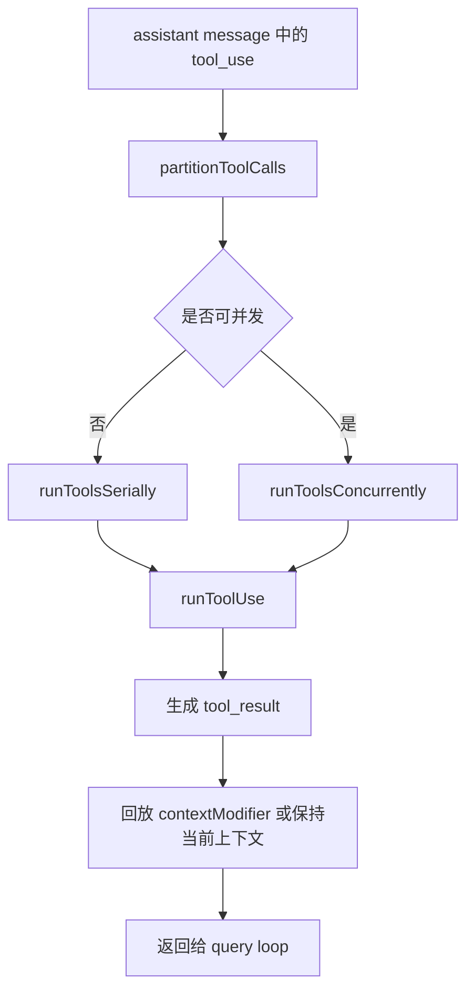
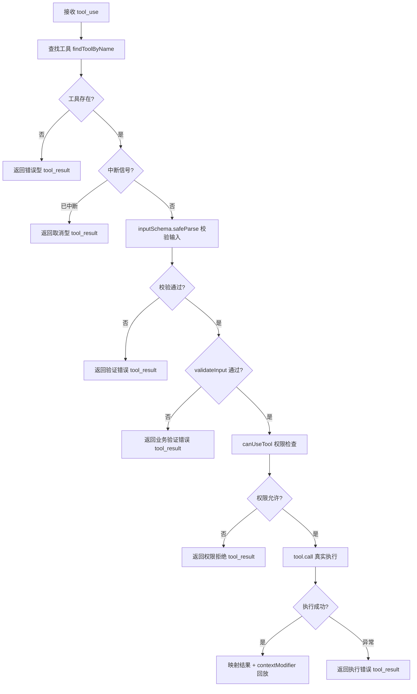
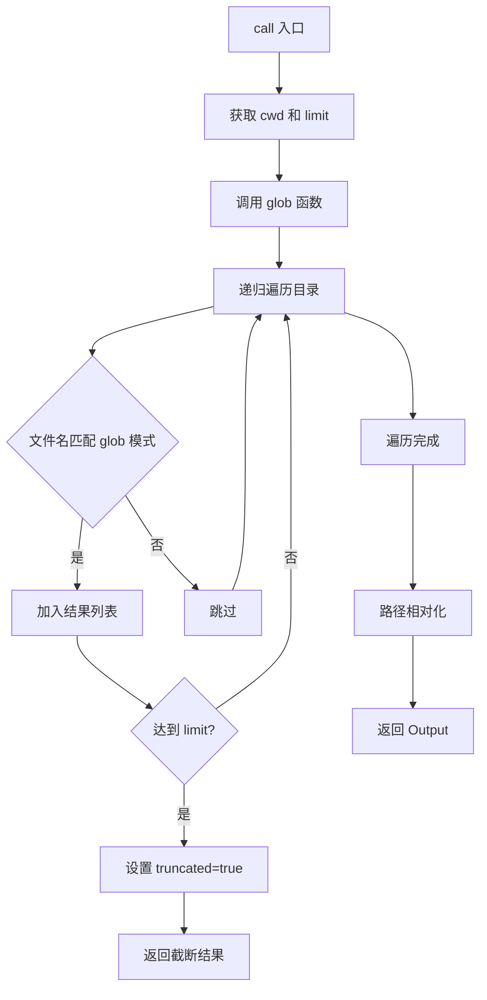

# 04. 工具编排与执行框架

## 概述

这一层负责接住模型返回的 `tool_use`，并把它们转换成下一轮可消费的 `tool_result`。当前实现已经具备完整的类型框架和编排骨架，`Tool` 接口定义覆盖了调用、权限、验证、渲染的完整链路，`buildTool` 工厂函数统一了工具创建流程。

它的核心价值不是"已经会执行很多工具"，而是"已经把工具系统的完整边界搭清楚了"。

## 关键源码

- `src/Tool.ts` — 工具类型体系 + buildTool 工厂 + 辅助函数
- `src/tools.ts` — 工具注册机制：getAllBaseTools/getTools/assembleToolPool/filterToolsByDenyRules
- `src/tools/GlobTool/GlobTool.ts` — 首个真实工具实现：文件名模式匹配
- `src/tools/GlobTool/prompt.ts` — GlobTool 名称与描述常量
- `src/constants/tools.ts` — 工具名称常量 + 代理禁用列表 + 异步代理允许列表 + 协调器模式允许列表
- `src/services/mcp/mcpStringUtils.ts` — MCP 名称解析/构建：mcpInfoFromString/buildMcpToolName/getToolNameForPermissionCheck
- `src/utils/envUtils.ts` — 环境变量判断：isEnvTruthy/hasEmbeddedSearchTools
- `src/utils/glob.ts` — Glob 文件搜索（简化实现，待 ripgrep 集成）
- `src/utils/path.ts` — 路径展开与相对化：expandPath/toRelativePath
- `src/utils/cwd.ts` — 当前工作目录管理：getCwd/runWithCwdOverride
- `src/utils/errors.ts` — 错误类型判断：isENOENT
- `src/utils/file.ts` — 文件工具函数：suggestPathUnderCwd
- `src/utils/fsOperations.ts` — 文件系统操作抽象：getFsImplementation
- `src/utils/lazySchema.ts` — 延迟 Schema 构建：lazySchema
- `src/types/permissions.ts` — 权限类型定义（独立文件，避免循环依赖）
- `src/services/tools/toolOrchestration.ts` — 批次编排
- `src/services/tools/toolExecution.ts` — 单工具执行：查找→校验→权限→调用→结果映射
- `src/utils/api.ts` — 工具输入规范化：normalizeToolInput
- `src/utils/json.ts` — 安全 JSON 解析：safeParseJSON
- `src/hooks/useCanUseTool.ts` — 权限检查函数类型：CanUseToolFn
- `src/utils/generators.ts` — 生成器工具函数

## 设计原理

### 1. 完整接口先行，工厂模式收口

`src/Tool.ts` 当前定义了完整的工具能力模型：

- `Tool<I, O, P>` — 工具完整接口（调用、权限、验证、渲染等 30+ 方法/属性）
- `ToolDef<I, O, P>` — 工具定义类型（可省略默认方法的 Partial Tool）
- `buildTool(def)` — 工厂函数，将 ToolDef 展开为完整 Tool
- `TOOL_DEFAULTS` — 安全默认值（fail-closed 原则）
- `ToolResult<T>` — 工具执行结果（含 data/newMessages/contextModifier/mcpMeta）
- `ValidationResult` — 输入验证结果（成功/失败+错误信息+错误码）
- `CanUseToolFn` — 权限检查函数（接收工具、输入、上下文，返回 allow/deny 决策）

工具系统优先稳定的是"工具长什么样、如何创建、如何校验"，而不是先急着堆实现。

### 2. buildTool 的 fail-closed 默认策略

`TOOL_DEFAULTS` 采用保守原则：

| 默认方法 | 默认值 | 设计意图 |
| --- | --- | --- |
| `isEnabled` | `() => true` | 工具默认启用 |
| `isConcurrencySafe` | `() => false` | 假设不安全，保守串行 |
| `isReadOnly` | `() => false` | 假设写入，触发权限检查 |
| `isDestructive` | `() => false` | 非破坏性，仅不可逆操作覆盖 |
| `checkPermissions` | `allow + updatedInput` | 委托通用权限系统 |
| `toAutoClassifierInput` | `() => ''` | 跳过分类器，安全工具必须覆盖 |
| `userFacingName` | `() => name` | 默认取工具名 |

### 3. 编排层与执行层分离

- `toolOrchestration.ts` 负责切批、串并行调度、上下文合并
- `toolExecution.ts` 负责单个 `tool_use` 的校验和结果生成

这让后续真实工具执行可以直接往 `runToolUse()` 深挖，而不需要重写批次调度逻辑。

### 4. 工具注册机制：单一真相源 + 按需过滤

`src/tools.ts` 提供工具注册的完整链路：

| 函数 | 作用 |
| --- | --- |
| `getAllBaseTools()` | 所有内置工具的唯一真相源，尊重环境变量标志 |
| `getTools(permissionContext)` | 根据权限上下文过滤可用工具 |
| `assembleToolPool(permissionContext, mcpTools)` | 合并内置工具和 MCP 工具，排序去重 |
| `filterToolsByDenyRules(tools, permissionContext)` | 按拒绝规则过滤工具 |

**关键设计**：
- 条件引入：`hasEmbeddedSearchTools()` 为真时，不需要独立 Glob/Grep 工具
- Simple 模式：`CLAUDE_CODE_SIMPLE=1` 时仅返回 Bash/Read/Edit
- 排序稳定性：内置工具按名称排序为连续前缀，确保 prompt cache 稳定
- 去重策略：内置工具优先，同名 MCP 工具被忽略

### 5. 并发安全优先于吞吐

是否并发执行，不由调用方拍脑袋决定，而由工具自己的 `isConcurrencySafe()` 决定。若工具缺失、schema 校验失败或判断抛错，统一保守降级为串行。

### 6. 工具常量集中管理

`src/constants/tools.ts` 集中管理工具名称常量和代理权限规则：

| 常量 | 用途 |
| --- | --- | --- |
| `AGENT_TOOL_NAME` / `BASH_TOOL_NAME` 等 | 工具名称常量，避免硬编码 |
| `ALL_AGENT_DISALLOWED_TOOLS` | 所有代理类型禁止使用的工具（TaskOutput/ExitPlanMode/Agent/AskUserQuestion/TaskStop/Workflow） |
| `ASYNC_AGENT_ALLOWED_TOOLS` | 异步代理允许使用的工具 |
| `COORDINATOR_MODE_ALLOWED_TOOLS` | 协调器模式允许的工具 |
| `SHELL_TOOL_NAMES` | Shell 工具名称列表（Bash/PowerShell） |

设计原因：工具重命名后，旧名称仍需支持（通过 `permissionRuleParser.ts` 的别名映射）。

## 主流程



## 实现原理

### 1. `partitionToolCalls()`

这一阶段做两件事：

1. 用 `findToolByName()` 找到工具定义
2. 用 `inputSchema.safeParse()` 校验输入

只有在工具存在、输入合法且 `isConcurrencySafe()` 返回真时，才会把相邻调用合并进并发批次。

### 2. 串行批次

串行模式强调"前一个工具的上下文更新，后一个工具马上可见"。因此：

- 每个工具执行前会把自己的 ID 加入 in-progress 集合
- `runToolUse()` 产出的 `contextModifier` 会立即写回当前上下文
- 工具结束后马上移除 in-progress 标记

这是最保守、最容易保证确定性的执行方式。

### 3. 并发批次

并发模式强调"结果顺序可重现，而不是谁先结束谁先生效"。因此：

- 多个工具会受 `getMaxToolUseConcurrency()` 限流并发
- 并发阶段先把 `message` 向上透传
- `contextModifier` 不立即落到共享上下文
- 等整批完成后，再按原始 `tool_use` 顺序回放 modifier

这避免了上下文结果被"完成时序"污染。

## Tool 接口能力分区

Tool 接口的方法按职责可分为以下区域：

### 调用链

`call()` → `validateInput()` → `checkPermissions()` → 执行 → `ToolResult<T>`

- `call(args, context, canUseTool, parentMessage, onProgress?)` — 执行入口
- `validateInput(input, context)` — 可选前置校验，在权限检查之前
- `checkPermissions(input, context)` — 权限检查，返回 `PermissionResult`

### 属性标记

- `name` / `aliases` — 标识与别名
- `searchHint` — ToolSearch 关键词匹配
- `inputSchema` / `inputJSONSchema` / `outputSchema` — 输入输出模式
- `isConcurrencySafe` / `isReadOnly` / `isDestructive` / `isEnabled` — 行为标记
- `interruptBehavior` — 中断策略（cancel/block）
- `isMcp` / `isLsp` — 协议标记
- `shouldDefer` / `alwaysLoad` — 延迟加载控制
- `strict` — 严格模式开关
- `maxResultSizeChars` — 结果大小上限

### UI 渲染

- `userFacingName` / `userFacingNameBackgroundColor` — 用户面向名称
- `renderToolUseMessage` / `renderToolResultMessage` / `renderToolUseTag` — 渲染方法
- `renderToolUseProgressMessage` / `renderToolUseQueuedMessage` / `renderToolUseRejectedMessage` / `renderToolUseErrorMessage` — 状态渲染
- `renderGroupedToolUse` — 分组渲染
- `getActivityDescription` / `getToolUseSummary` — 活动描述与摘要
- `isSearchOrReadCommand` — 搜索/读取标记（UI 折叠用）

### 提示与分类

- `description(input, options)` — 动态描述生成
- `prompt(options)` — 提示词生成
- `toAutoClassifierInput` — 自动分类器输入
- `isTransparentWrapper` — 透明包装器标记

### 权限辅助

- `getPath(input)` — 获取操作路径
- `preparePermissionMatcher(input)` — 准备 hook 条件匹配器
- `isOpenWorld(input)` — 开放世界操作标记

### 结果映射

- `mapToolResultToToolResultBlockParam(content, toolUseID)` — 映射到 API 块参数
- `isResultTruncated(output)` — 截断判断
- `extractSearchText(output)` — 搜索文本提取
- `backfillObservableInput(input)` — 回填可观察输入

## 单工具执行：runToolUse 完整链路

`runToolUse()` 已从桩实现升级为完整的 5 步执行链路，具备真实工具调用能力：

### 执行流程



### 5 步详细说明

| 步骤 | 函数/方法 | 失败处理 |
| --- | --- | --- |
| 1. 查找工具 | `findToolByName()` | 返回 `No such tool available` 错误 |
| 2. 输入校验 | `inputSchema.safeParse()` + `validateInput()` | 返回 `InputValidationError` 或业务验证错误 |
| 3. 权限检查 | `canUseTool(tool, input, context)` | 返回 `Permission denied` 错误 |
| 4. 真实调用 | `tool.call(input, context, canUseTool, assistantMessage)` | 捕获异常返回执行错误 |
| 5. 结果映射 | `mapToolResultToToolResultBlockParam()` + `contextModifier` 回放 | — |

### 中断信号检查

在工具存在后、输入校验前，检查 `abortController.signal.aborted`：
- 若已中断，直接返回取消型 `tool_result`，避免无效执行
- 这与查询层的 `aborted_tools` 终止原因配合

### CanUseToolFn 签名升级

`src/hooks/useCanUseTool.ts` 的 `CanUseToolFn` 已从最小签名升级为完整权限检查函数：

```typescript
type CanUseToolFn = (
  tool: { name: string; mcpInfo?: { serverName: string; toolName: string } },
  input: Record<string, unknown>,
  context: unknown,
) => Promise<{ result: true } | { result: false; message: string }>
```

- 返回 `{ result: true }` 表示允许执行
- 返回 `{ result: false, message }` 表示拒绝并附原因
- 当前 REPL 中 `canUseTool` 默认返回 `{ result: true }`，完整权限决策待后续接入

### MessageUpdateLazy 泛化

`MessageUpdateLazy` 类型从 `{ message?: Message }` 升级为 `{ message: M }` 泛化形式，确保每一步都产出确定性消息，不再允许 `message` 为 `undefined`。

## 首个真实工具：GlobTool

`src/tools/GlobTool/GlobTool.ts` 是第一个完整实现的工具，标志着工具系统从"类型框架完整，执行未满"进入"真实能力落地"阶段。

### 功能概述

GlobTool 实现文件名模式匹配搜索：

- 支持 glob 模式（如 `**/*.ts`、`src/**/*.tsx`）
- 结果按修改时间排序，最多返回 100 个文件
- 路径自动相对化以节省 token
- 只读、并发安全

### 设计原理

#### 1. buildTool 工厂模式的完整落地

GlobTool 完整实现了 Tool 接口的所有关键方法：

| 方法 | 实现 | 设计意图 |
| --- | --- | --- |
| `call()` | 执行 glob 搜索 | 核心业务逻辑 |
| `validateInput()` | 验证路径存在且为目录 | 边界防护，避免无效调用 |
| `checkPermissions()` | 委托 `checkReadPermissionForTool` | 只读工具统一权限入口 |
| `getPath()` | 路径展开 | 统一路径处理入口 |
| `preparePermissionMatcher()` | 通配符模式匹配 | 支持 `Bash(prefix:*)` 类规则 |

#### 2. 延迟 Schema 构建

使用 `lazySchema()` 延迟 Zod schema 构建：

```text
优势：
- 避免模块初始化时的 schema 构建开销
- 支持按需加载，减少启动时间
- 与 buildTool 工厂模式配合，确保 schema 只在首次访问时构建
```

#### 3. 路径相对化策略

`toRelativePath()` 将绝对路径转为相对路径：

- 基于当前工作目录计算相对路径
- 若路径不在 cwd 下，返回原始绝对路径
- 目的：节省 token（相对路径比绝对路径短）

#### 4. 输入验证边界处理

`validateInput()` 实现三层防护：

1. **UNC 路径安全检查**：跳过 `\\` 或 `//` 开头的路径，防止 NTLM 凭据泄露
2. **目录存在性检查**：路径不存在时返回友好错误 + 建议路径
3. **目录类型检查**：路径必须为目录，非目录返回错误

#### 5. 结果截断与提示

当匹配文件超过 100 个时：

- 设置 `truncated: true`
- 在 `tool_result` 末尾追加提示：建议使用更具体的路径或模式
- 保持 100 个文件的上限，避免 token 消耗过大

### 实现原理



### 关键实现链路

1. **输入验证**：`validateInput()` → `expandPath()` → `fs.stat()` → 目录存在性检查
2. **权限检查**：`checkPermissions()` → `checkReadPermissionForTool()` → 默认允许
3. **搜索执行**：`call()` → `glob()` → 递归遍历 → 模式匹配 → 截断处理
4. **结果映射**：`mapToolResultToToolResultBlockParam()` → `tool_result` 构造

### 工具函数依赖

GlobTool 依赖以下工具函数：

| 函数 | 位置 | 作用 |
| --- | --- | --- |
| `glob()` | `src/utils/glob.ts` | 执行文件搜索（简化实现） |
| `expandPath()` | `src/utils/path.ts` | 展开 ~ 和相对路径 |
| `toRelativePath()` | `src/utils/path.ts` | 绝对路径转相对路径 |
| `getCwd()` | `src/utils/cwd.ts` | 获取当前工作目录 |
| `isENOENT()` | `src/utils/errors.ts` | 判断文件不存在错误 |
| `suggestPathUnderCwd()` | `src/utils/file.ts` | 生成建议路径 |
| `getFsImplementation()` | `src/utils/fsOperations.ts` | 获取文件系统实现 |
| `lazySchema()` | `src/utils/lazySchema.ts` | 延迟 Schema 构建 |
| `checkReadPermissionForTool()` | `src/utils/permissions/filesystem.ts` | 文件读取权限检查 |
| `matchWildcardPattern()` | `src/utils/permissions/shellRuleMatching.ts` | 通配符模式匹配 |

### 当前局限

1. **glob 实现简化**：当前使用 Node.js fs 递归遍历，待 ripgrep 集成后替换
2. **.gitignore 未完全支持**：仅跳过 `.git` 目录，未读取 `.gitignore` 规则
3. **权限检查简化**：`checkReadPermissionForTool()` 当前默认允许，完整实现需检查 allowedDirectories 和 deny rules

## 伪代码

```text
1. 从 assistant 消息中收集 tool_use
2. 按工具并发安全性切分批次
3. 对串行批次逐个执行并立即提交上下文更新
4. 对并发批次并发运行并缓存上下文修改
5. 每个 tool_use 进入 runToolUse 做查找和校验
6. 生成 tool_result 消息返回给 query loop
7. 工具结果被拼回 messages 进入下一轮
```

## 关键数据结构

| 结构 | 位置 | 作用 |
| --- | --- | --- |
| `Tool<I,O,P>` | `src/Tool.ts` | 工具完整接口（30+ 方法/属性） |
| `ToolDef<I,O,P>` | `src/Tool.ts` | 工具定义类型（可省略默认方法） |
| `ToolResult<T>` | `src/Tool.ts` | 工具执行结果（data + newMessages + contextModifier + mcpMeta） |
| `ValidationResult` | `src/Tool.ts` | 输入验证结果（成功/失败+错误码） |
| `CanUseToolFn` | `src/Tool.ts` | 工具可用性检查回调 |
| `ToolUseContext` | `src/Tool.ts` | 承载工具列表、中断控制器、消息和会话 setter |
| `MessageUpdate` | `toolOrchestration.ts` | 编排层向查询层返回消息与新上下文 |
| `ContextModifier` | `toolExecution.ts` | 延迟提交的上下文修改描述 |
| `TOOL_PRESETS` | `src/tools.ts` | 预定义工具预设（当前仅 'default'） |
| `ALL_AGENT_DISALLOWED_TOOLS` | `constants/tools.ts` | 所有代理类型禁用工具集合 |
| `ASYNC_AGENT_ALLOWED_TOOLS` | `constants/tools.ts` | 异步代理允许工具集合 |
| `COORDINATOR_MODE_ALLOWED_TOOLS` | `constants/tools.ts` | 协调器模式允许工具集合 |

## 辅助函数

| 函数 | 位置 | 作用 |
| --- | --- | --- |
| `buildTool(def)` | `src/Tool.ts` | 工厂函数，将 ToolDef 展开为完整 Tool |
| `toolMatchesName(tool, name)` | `src/Tool.ts` | 按名称或别名匹配工具 |
| `findToolByName(tools, name)` | `src/Tool.ts` | 按名称查找工具 |
| `filterToolProgressMessages(msgs)` | `src/Tool.ts` | 过滤 hook_progress 类型进度消息 |
| `getEmptyToolPermissionContext()` | `src/Tool.ts` | 生成默认空权限上下文 |

## 工具注册函数

| 函数 | 位置 | 作用 |
| --- | --- | --- |
| `getAllBaseTools()` | `src/tools.ts` | 返回所有内置工具列表（真相源） |
| `getTools(context)` | `src/tools.ts` | 根据权限上下文过滤可用工具 |
| `assembleToolPool(context, mcpTools)` | `src/tools.ts` | 合并内置工具和 MCP 工具 |
| `filterToolsByDenyRules(tools, context)` | `src/tools.ts` | 按拒绝规则过滤工具 |
| `getToolsForDefaultPreset()` | `src/tools.ts` | 获取默认预设的工具名称列表 |

## MCP 名称处理函数

| 函数 | 位置 | 作用 |
| --- | --- | --- |
| `mcpInfoFromString(str)` | `mcpStringUtils.ts` | 从工具名提取 MCP 服务器信息 |
| `buildMcpToolName(server, tool)` | `mcpStringUtils.ts` | 构建完整 MCP 工具名 |
| `getToolNameForPermissionCheck(tool)` | `mcpStringUtils.ts` | 获取权限规则匹配用的名称 |
| `normalizeNameForMCP(name)` | `mcpStringUtils.ts` | 规范化 MCP 名称（兼容 API 模式） |
| `getMcpPrefix(serverName)` | `mcpStringUtils.ts` | 生成 MCP 工具名前缀 |

## 设计取舍

### 优点

- 工具系统完整边界已经稳定
- buildTool 工厂 + fail-closed 默认值确保工具行为一致性
- 串行与并发语义区分清楚
- 上下文回放顺序明确，方便后续补真实执行
- Tool 接口已预留渲染、分类器、MCP/LSP 等扩展位

### 代价

- 真实工具调用已落地，`runToolUse()` 具备完整执行链路
- GlobTool 已是首个可被真实调用的工具
- `_canUseTool` 已接入权限检查签名，当前默认允许，待完整权限决策接入
- Tool 接口方法较多，但大部分由 buildTool 填充默认值

## 关键判断

当前最重要的事实不是"工具会不会执行"，而是：

- 工具真实调用链路已打通（查找→校验→权限→调用→结果映射）
- `tool_use` 已经能被识别并真实执行
- 工具调度已经能区分串行和并发
- `tool_result` 已经能被拼回 query loop
- `contextModifier` 回放机制已与真实调用结果联动
- Tool 接口已覆盖完整的调用→验证→权限→结果链路

因此后续只需继续补足更多工具实现和完整权限决策，整个工具能力就能在现有链路上自然加深。

## 小结

工具层现在处于"类型框架完整，真实调用已落地"的阶段。它已经证明了：

- 查询层和工具层的协议是通的
- 工具上下文怎样共享和更新是明确的
- 并发执行的确定性问题已经提前被设计进来
- buildTool 工厂保证了工具创建的一致性和安全性
- `runToolUse()` 已具备完整 5 步执行链路，GlobTool 已可被真实调用

这让它成为后续继续复刻真实工具能力的天然落点。

## 组合使用

- 和 `03-query-engine-layer.md` 组合，能看清 query loop 为什么会继续下一轮
- 和 `06-session-management-layer.md` 组合，能看清 `ToolUseContext` 为什么是共享状态中心
- 和 `07-tui-rendering-layer.md` 组合，能看清 in-progress 标记未来如何驱动 UI 状态
- 和 `08-permission-system.md` 组合，能看清 `checkPermissions` → `PermissionResult` 的完整权限链路
