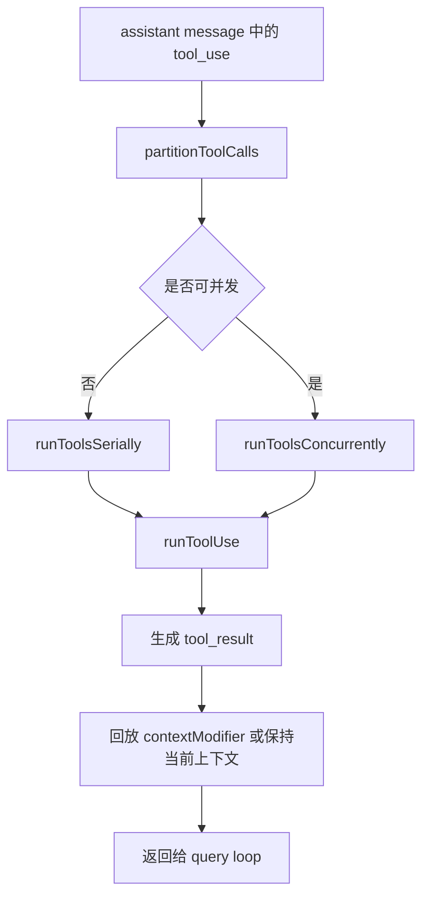

# 04. 工具编排与执行框架

## 概述

这一层负责接住模型返回的 `tool_use`，并把它们转换成下一轮可消费的 `tool_result`。当前实现已经具备完整的类型框架和编排骨架，`Tool` 接口定义覆盖了调用、权限、验证、渲染的完整链路，`buildTool` 工厂函数统一了工具创建流程。

它的核心价值不是"已经会执行很多工具"，而是"已经把工具系统的完整边界搭清楚了"。

## 关键源码

- `src/Tool.ts` — 工具类型体系 + buildTool 工厂 + 辅助函数
- `src/types/permissions.ts` — 权限类型定义（独立文件，避免循环依赖）
- `src/services/tools/toolOrchestration.ts` — 批次编排
- `src/services/tools/toolExecution.ts` — 单工具执行
- `src/utils/generators.ts` — 生成器工具函数

## 设计原理

### 1. 完整接口先行，工厂模式收口

`src/Tool.ts` 当前定义了完整的工具能力模型：

- `Tool<I, O, P>` — 工具完整接口（调用、权限、验证、渲染等 30+ 方法/属性）
- `ToolDef<I, O, P>` — 工具定义类型（可省略默认方法的 Partial Tool）
- `buildTool(def)` — 工厂函数，将 ToolDef 展开为完整 Tool
- `TOOL_DEFAULTS` — 安全默认值（fail-closed 原则）
- `ToolResult<T>` — 工具执行结果（含 data/newMessages/contextModifier/mcpMeta）
- `ValidationResult` — 输入验证结果（成功/失败+错误信息+错误码）
- `CanUseToolFn` — 工具可用性检查回调

工具系统优先稳定的是"工具长什么样、如何创建、如何校验"，而不是先急着堆实现。

### 2. buildTool 的 fail-closed 默认策略

`TOOL_DEFAULTS` 采用保守原则：

| 默认方法 | 默认值 | 设计意图 |
| --- | --- | --- |
| `isEnabled` | `() => true` | 工具默认启用 |
| `isConcurrencySafe` | `() => false` | 假设不安全，保守串行 |
| `isReadOnly` | `() => false` | 假设写入，触发权限检查 |
| `isDestructive` | `() => false` | 非破坏性，仅不可逆操作覆盖 |
| `checkPermissions` | `allow + updatedInput` | 委托通用权限系统 |
| `toAutoClassifierInput` | `() => ''` | 跳过分类器，安全工具必须覆盖 |
| `userFacingName` | `() => name` | 默认取工具名 |

### 3. 编排层与执行层分离

- `toolOrchestration.ts` 负责切批、串并行调度、上下文合并
- `toolExecution.ts` 负责单个 `tool_use` 的校验和结果生成

这让后续真实工具执行可以直接往 `runToolUse()` 深挖，而不需要重写批次调度逻辑。

### 4. 并发安全优先于吞吐

是否并发执行，不由调用方拍脑袋决定，而由工具自己的 `isConcurrencySafe()` 决定。若工具缺失、schema 校验失败或判断抛错，统一保守降级为串行。

## 主流程



## 实现原理

### 1. `partitionToolCalls()`

这一阶段做两件事：

1. 用 `findToolByName()` 找到工具定义
2. 用 `inputSchema.safeParse()` 校验输入

只有在工具存在、输入合法且 `isConcurrencySafe()` 返回真时，才会把相邻调用合并进并发批次。

### 2. 串行批次

串行模式强调"前一个工具的上下文更新，后一个工具马上可见"。因此：

- 每个工具执行前会把自己的 ID 加入 in-progress 集合
- `runToolUse()` 产出的 `contextModifier` 会立即写回当前上下文
- 工具结束后马上移除 in-progress 标记

这是最保守、最容易保证确定性的执行方式。

### 3. 并发批次

并发模式强调"结果顺序可重现，而不是谁先结束谁先生效"。因此：

- 多个工具会受 `getMaxToolUseConcurrency()` 限流并发
- 并发阶段先把 `message` 向上透传
- `contextModifier` 不立即落到共享上下文
- 等整批完成后，再按原始 `tool_use` 顺序回放 modifier

这避免了上下文结果被"完成时序"污染。

## Tool 接口能力分区

Tool 接口的方法按职责可分为以下区域：

### 调用链

`call()` → `validateInput()` → `checkPermissions()` → 执行 → `ToolResult<T>`

- `call(args, context, canUseTool, parentMessage, onProgress?)` — 执行入口
- `validateInput(input, context)` — 可选前置校验，在权限检查之前
- `checkPermissions(input, context)` — 权限检查，返回 `PermissionResult`

### 属性标记

- `name` / `aliases` — 标识与别名
- `searchHint` — ToolSearch 关键词匹配
- `inputSchema` / `inputJSONSchema` / `outputSchema` — 输入输出模式
- `isConcurrencySafe` / `isReadOnly` / `isDestructive` / `isEnabled` — 行为标记
- `interruptBehavior` — 中断策略（cancel/block）
- `isMcp` / `isLsp` — 协议标记
- `shouldDefer` / `alwaysLoad` — 延迟加载控制
- `strict` — 严格模式开关
- `maxResultSizeChars` — 结果大小上限

### UI 渲染

- `userFacingName` / `userFacingNameBackgroundColor` — 用户面向名称
- `renderToolUseMessage` / `renderToolResultMessage` / `renderToolUseTag` — 渲染方法
- `renderToolUseProgressMessage` / `renderToolUseQueuedMessage` / `renderToolUseRejectedMessage` / `renderToolUseErrorMessage` — 状态渲染
- `renderGroupedToolUse` — 分组渲染
- `getActivityDescription` / `getToolUseSummary` — 活动描述与摘要
- `isSearchOrReadCommand` — 搜索/读取标记（UI 折叠用）

### 提示与分类

- `description(input, options)` — 动态描述生成
- `prompt(options)` — 提示词生成
- `toAutoClassifierInput` — 自动分类器输入
- `isTransparentWrapper` — 透明包装器标记

### 权限辅助

- `getPath(input)` — 获取操作路径
- `preparePermissionMatcher(input)` — 准备 hook 条件匹配器
- `isOpenWorld(input)` — 开放世界操作标记

### 结果映射

- `mapToolResultToToolResultBlockParam(content, toolUseID)` — 映射到 API 块参数
- `isResultTruncated(output)` — 截断判断
- `extractSearchText(output)` — 搜索文本提取
- `backfillObservableInput(input)` — 回填可观察输入

## 单工具执行现状

`runToolUse()` 当前只覆盖三种路径：

1. 工具不存在：返回错误型 `tool_result`
2. 输入校验失败：返回错误型 `tool_result`
3. 工具存在且校验通过：返回"已调度但未真正执行"的错误型 `tool_result`

也就是说，当前工具层已经能维持 query loop 的协议闭环，但还不能产生真实业务结果。

## 伪代码

```text
1. 从 assistant 消息中收集 tool_use
2. 按工具并发安全性切分批次
3. 对串行批次逐个执行并立即提交上下文更新
4. 对并发批次并发运行并缓存上下文修改
5. 每个 tool_use 进入 runToolUse 做查找和校验
6. 生成 tool_result 消息返回给 query loop
7. 工具结果被拼回 messages 进入下一轮
```

## 关键数据结构

| 结构 | 位置 | 作用 |
| --- | --- | --- |
| `Tool<I,O,P>` | `src/Tool.ts` | 工具完整接口（30+ 方法/属性） |
| `ToolDef<I,O,P>` | `src/Tool.ts` | 工具定义类型（可省略默认方法） |
| `ToolResult<T>` | `src/Tool.ts` | 工具执行结果（data + newMessages + contextModifier + mcpMeta） |
| `ValidationResult` | `src/Tool.ts` | 输入验证结果（成功/失败+错误码） |
| `CanUseToolFn` | `src/Tool.ts` | 工具可用性检查回调 |
| `ToolUseContext` | `src/Tool.ts` | 承载工具列表、中断控制器、消息和会话 setter |
| `MessageUpdate` | `toolOrchestration.ts` | 编排层向查询层返回消息与新上下文 |
| `ContextModifier` | `toolExecution.ts` | 延迟提交的上下文修改描述 |

## 辅助函数

| 函数 | 位置 | 作用 |
| --- | --- | --- |
| `buildTool(def)` | `src/Tool.ts` | 工厂函数，将 ToolDef 展开为完整 Tool |
| `toolMatchesName(tool, name)` | `src/Tool.ts` | 按名称或别名匹配工具 |
| `findToolByName(tools, name)` | `src/Tool.ts` | 按名称查找工具 |
| `filterToolProgressMessages(msgs)` | `src/Tool.ts` | 过滤 hook_progress 类型进度消息 |
| `getEmptyToolPermissionContext()` | `src/Tool.ts` | 生成默认空权限上下文 |

## 设计取舍

### 优点

- 工具系统完整边界已经稳定
- buildTool 工厂 + fail-closed 默认值确保工具行为一致性
- 串行与并发语义区分清楚
- 上下文回放顺序明确，方便后续补真实执行
- Tool 接口已预留渲染、分类器、MCP/LSP 等扩展位

### 代价

- 真实工具还没落地，当前只能证明主回合协议能继续
- `_canUseTool` 目前没有真正参与权限决策
- Tool 接口方法较多，但大部分由 buildTool 填充默认值

## 关键判断

当前最重要的事实不是"工具会不会执行"，而是：

- `tool_use` 已经能被识别
- 工具调度已经能区分串行和并发
- `tool_result` 已经能被拼回 query loop
- Tool 接口已覆盖完整的调用→验证→权限→结果链路

因此后续只要补足 `runToolUse()` 内部真实调用，整个工具能力就能在现有骨架上自然加深。

## 小结

工具层现在处于"类型框架完整，执行未满"的阶段。它已经证明了：

- 查询层和工具层的协议是通的
- 工具上下文怎样共享和更新是明确的
- 并发执行的确定性问题已经提前被设计进来
- buildTool 工厂保证了工具创建的一致性和安全性

这让它成为后续继续复刻真实工具能力的天然落点。

## 组合使用

- 和 `03-query-engine-layer.md` 组合，能看清 query loop 为什么会继续下一轮
- 和 `06-session-management-layer.md` 组合，能看清 `ToolUseContext` 为什么是共享状态中心
- 和 `07-tui-rendering-layer.md` 组合，能看清 in-progress 标记未来如何驱动 UI 状态
- 和 `08-permission-system.md` 组合，能看清 `checkPermissions` → `PermissionResult` 的完整权限链路
