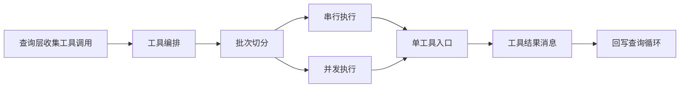

# 工具执行层

## Relevant source files
- `src/Tool.ts`
- `src/services/tools/toolOrchestration.ts`
- `src/services/tools/toolExecution.ts`
- `src/hooks/useCanUseTool.ts`
- `src/utils/generators.ts`
- `src/types/message.ts`

## 本页概述

本页回答一个核心问题：查询层识别到 `tool_use` 之后，当前仓库怎样把这些请求变成可执行批次，并把结果重新回写给 `query()`。  
本页也会明确指出，当前单工具执行仍是存根实现。

## 核心流程

代码依据：`query.ts` 在发现 `tool_use` 后调用 `runTools(...)`；编排逻辑在 `toolOrchestration.ts`，单工具入口在 `toolExecution.ts`。

## 关键机制

### 1. `Tool.ts` 先定义工具系统边界

- `Tool` 描述工具名、别名、输入 schema、并发安全判断和可选 `call`
- `Tools` 是工具数组
- `ToolUseContext` 承载工具执行时需要的共享状态、配置和消息历史
- `findToolByName()` 与 `toolMatchesName()` 提供最基本的工具匹配能力

### 2. 编排层按并发安全性切批

- `partitionToolCalls()` 会遍历每个 `tool_use`
- 先用 `findToolByName()` 找工具，再对 `toolUse.input` 做 schema 校验
- 只有当 schema 校验成功，且 `tool.isConcurrencySafe(...)` 返回真时，该调用才会进入并发安全批次
- 任何校验失败、工具缺失或并发判断抛错的情况，都会保守降级为串行

### 3. 串行批次强调“立即更新上下文”

- `runToolsSerially()` 按输入顺序逐个执行工具
- 每次执行前把 `toolUse.id` 加入 in-progress 集合
- 如果单工具执行返回 `contextModifier`，串行模式会立刻提交到 `currentContext`
- 这样后一个工具能看到前一个工具已经造成的上下文变化

### 4. 并发批次强调“先收集，再按原顺序回放”

- `runToolsConcurrently()` 借助 `all(..., concurrencyCap)` 做受限并发
- 并发上限来自环境变量 `CLAUDE_CODE_MAX_TOOL_USE_CONCURRENCY`，默认值是 `10`
- 并发阶段会先收集每个工具的 `contextModifier`
- 整个批次完成后，再按原始 `tool_use` 顺序回放 modifier，避免最终上下文依赖完成时序

### 5. 单工具执行入口目前仍是 stub

- `runToolUse()` 先查找工具
- 如果工具不存在，返回一条 `tool_result` 错误消息
- 如果 schema 校验失败，也返回一条 `tool_result` 错误消息
- 即便工具存在且校验成功，当前也只返回“已调度但尚未实现真实执行”的占位结果
- 这说明当前仓库已经打通了“编排与回灌路径”，但还没进入真实工具业务调用

## 当前实现边界

- 已实现：工具匹配、schema 校验、串并行批次切分、并发限流、上下文更新策略、结果消息回灌
- 已实现：`CanUseToolFn` 的最小函数签名
- 未实现：真实工具 `call()` 执行、权限决策细节、进度流、细粒度错误分类
- 所以当前页面的结论必须落在“调度结构已成型”，不能扩大成“工具系统已完整可用”

## 设计要点

- 工具层把“编排”和“执行”拆到两个文件，职责边界很清楚
- 串行与并发的差异不在于能不能同时跑，而在于上下文何时对后续工具可见
- `tool_result` 消息是查询层继续下一轮的关键桥梁
- 当前实现最稳定的部分是调度策略，不是真实工具能力

## 继续阅读

- [03-query-engine-layer](./03-query-engine-layer.md)：看工具结果怎样回灌并推进下一轮。
- [05-api-client-layer](./05-api-client-layer.md)：看 `tool_use` 的上游来源如何被模型层产出。
- [06-session-management-layer](./06-session-management-layer.md)：看 `ToolUseContext` 和消息历史如何作为共享状态被复用。
