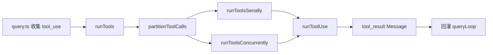

# 工具执行层

## Relevant source files

- `src/services/tools/toolOrchestration.ts`
- `src/services/tools/toolExecution.ts`
- `src/Tool.ts`
- `src/hooks/useCanUseTool.ts`
- `src/utils/generators.ts`
- `src/query.ts`

## 本页概述

工具执行层负责把 `tool_use` 请求变成可执行批次，并将执行结果以消息形式回传查询主循环。  
当前仓库已完成“编排闭环 + 最小执行入口”，但单工具真实业务执行仍是后续迭代目标。

## 执行链路

## 关键机制

### 1. 工具注册与匹配

- `Tool.ts` 提供 `Tool`、`Tools`、`toolMatchesName`、`findToolByName`。
- 工具匹配支持 `name` 与 `aliases`。
- 编排层通过 `findToolByName` 获取工具定义并校验输入 schema。

### 2. 分批策略（并发安全优先）

- `partitionToolCalls` 会先解析 `tool_use.input`。
- 仅当 schema 校验成功且 `tool.isConcurrencySafe(...)` 返回真时，进入并发安全批次。
- 任意校验失败或判断异常都会保守降级为串行，优先保证行为安全。

### 3. 串行与并发调度

- `runToolsSerially`：逐个执行，允许每次执行后立即更新上下文，后续工具可见最新状态。
- `runToolsConcurrently`：通过 `all(..., concurrencyCap)` 限流并发，默认并发上限来自 `CLAUDE_CODE_MAX_TOOL_USE_CONCURRENCY`（默认 10）。
- 并发模式先收集 `contextModifier`，再按原始 `tool_use` 顺序回放，确保上下文更新可复现。

### 4. 执行状态标记

- 每个工具执行前，通过 `setInProgressToolUseIDs` 加入 in-progress 集合。
- 完成后调用 `markToolUseAsComplete` 从集合移除，供上层中断/UI 观测。

### 5. 单工具执行入口（当前边界）

- `runToolUse` 已接入查找工具、输入校验、结果消息构建三步。
- 当前返回的是“可调度但未真实执行”的 `tool_result` 占位消息（`is_error: true`），用于打通主链路。
- 这意味着编排与回灌路径已通，但真实工具调用逻辑仍待补齐。

## 当前实现状态

- 已实现：分批、串并行调度、并发限流、上下文更新顺序控制、结果消息回传接口。
- 已实现：`CanUseToolFn` 最小函数签名（不再是 `any`）。
- 未完全实现：真实工具调用、权限决策细节、进度事件细化、完整错误分类。

## 继续阅读

- [03-query-engine-layer](./03-query-engine-layer.md) - 查看工具结果如何回灌并推进下一轮。
- [05-api-client-layer](./05-api-client-layer.md) - 查看 tool_use 的上游来源（模型响应）。
