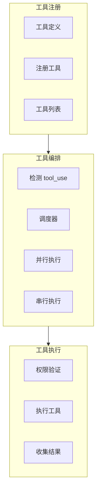
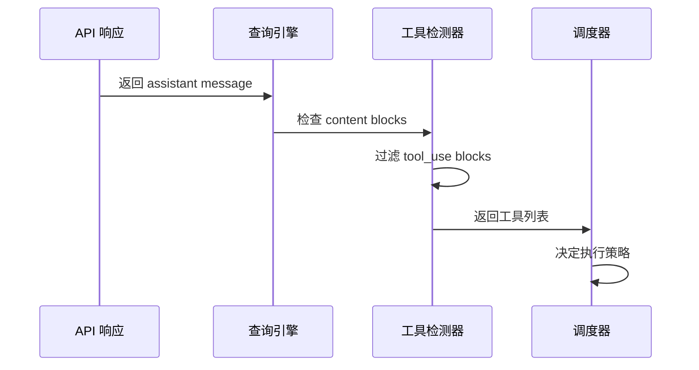
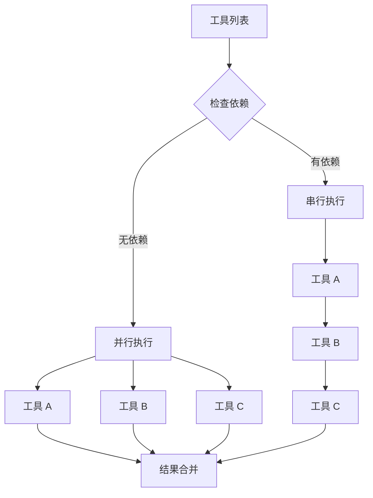
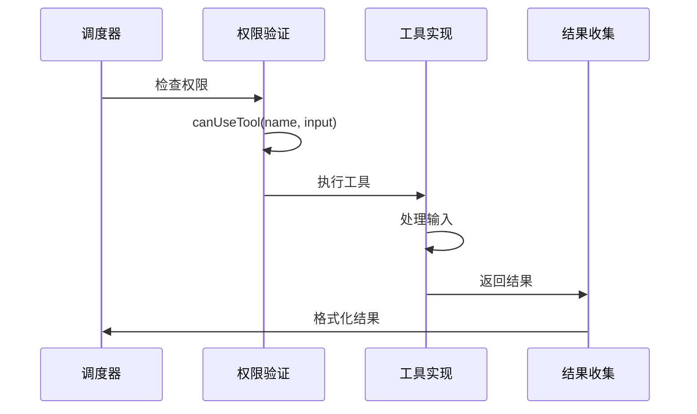

# 工具执行层

## Relevant source files

- `src/Tool.ts` - 工具系统类型定义，执行上下文
- `src/types/tools.ts` - 工具相关类型
- `src/hooks/useCanUseTool.ts` - 权限检查 Hook
- `src/types/ids.ts` - ID 类型定义

## 本页概述

工具执行层负责管理和执行 AI 可以调用的各种工具。本页深入分析工具注册与定义、工具编排（并行/串行调度）、工具执行器（单工具执行逻辑）、结果收集与格式化等核心机制。

## 核心结构

### 工具系统组成



## 工具注册与定义

### ToolUseContext 类型

工具执行上下文是工具系统的核心类型，包含执行工具所需的所有依赖和状态：

```typescript
// src/Tool.ts

export type ToolUseContext = {
  // 配置选项
  options: {
    commands: unknown[]          // 可用命令
    debug: boolean               // 调试模式
    mainLoopModel: string        // 主循环模型
    tools: unknown[]             // 可用工具列表
    verbose: boolean             // 详细模式
    isNonInteractiveSession: boolean
    maxBudgetUsd?: number        // 预算限制
    customSystemPrompt?: string  // 自定义系统提示
    appendSystemPrompt?: string  // 追加系统提示
    refreshTools?: () => unknown[] // 刷新工具列表
    [key: string]: unknown
  }
  
  // 控制器
  abortController: AbortController
  
  // 状态访问
  getAppState(): unknown
  setAppState(f: (prev: unknown) => unknown): void
  setAppStateForTasks?: (f: (prev: unknown) => unknown) => void
  
  // 消息
  messages: Message[]
  
  // 通知
  addNotification?: (notif: unknown) => void
  appendSystemMessage?: (msg: unknown) => void
  sendOSNotification?: (opts: { message: string, notificationType: string }) => void
  
  // 权限追踪
  userModified?: boolean
  setInProgressToolUseIDs: (f: (prev: Set<string>) => Set<string>) => void
  setHasInterruptibleToolInProgress?: (v: boolean) => void
  
  // 代理相关
  agentId?: AgentId              // 子代理 ID
  agentType?: string             // 代理类型
  queryTracking?: QueryChainTracking
  
  // 限制配置
  fileReadingLimits?: {
    maxTokens?: number
    maxSizeBytes?: number
  }
  globLimits?: {
    maxResults?: number
  }
  
  // 决策追踪
  toolDecisions?: Map<string, {
    source: string
    decision: 'accept' | 'reject'
    timestamp: number
  }>
  
  // 其他
  toolUseId?: string
  preserveToolUseResults?: boolean
  renderedSystemPrompt?: SystemPrompt
}
```

### QueryChainTracking 追踪

用于追踪嵌套代理调用的层级关系：

```typescript
// src/Tool.ts

export type QueryChainTracking = {
  chainId: string   // 链 ID
  depth: number     // 嵌套深度
}
```

### 工具定义结构

```typescript
// 工具定义示例 (待 tools.ts 实现后替换)

interface Tool {
  name: string                    // 工具名称
  description: string             // 工具描述
  input_schema: JSONSchema        // 输入模式
  execute: (input: any, context: ToolUseContext) => Promise<ToolResult>
}

interface ToolResult {
  content: string | ContentBlock[]
  is_error?: boolean
}
```

## 工具编排

### 工具检测流程



### 并行与串行调度



**并行执行条件**：
- 工具之间无依赖关系
- 资源不冲突（如不同文件操作）
- 安全性允许

**串行执行场景**：
- 后续工具依赖前序工具结果
- 存在资源冲突
- 需要顺序保证

### 调度策略

```typescript
// 伪代码示例

async function scheduleTools(
  toolUseBlocks: ToolUseBlock[],
  context: ToolUseContext
): Promise<ToolResult[]> {
  // 分析依赖关系
  const graph = buildDependencyGraph(toolUseBlocks)
  
  // 拓扑排序
  const batches = topologicalSort(graph)
  
  // 分批执行
  const results: ToolResult[] = []
  for (const batch of batches) {
    // 同一批次并行执行
    const batchResults = await Promise.all(
      batch.map(block => executeTool(block, context))
    )
    results.push(...batchResults)
  }
  
  return results
}
```

## 工具执行器

### 单工具执行流程



### 权限验证

```typescript
// src/hooks/useCanUseTool.ts

export type CanUseToolFn = (
  toolName: string,
  input: unknown,
  context: ToolUseContext
) => Promise<boolean>

// 权限检查逻辑
async function canUseTool(
  toolName: string,
  input: unknown,
  context: ToolUseContext
): Promise<boolean> {
  // 1. 检查跳过权限模式
  if (context.options.dangerouslySkipPermissions) {
    return true
  }
  
  // 2. 检查已有决策
  const decision = context.toolDecisions?.get(toolName)
  if (decision) {
    return decision.decision === 'accept'
  }
  
  // 3. 请求用户确认
  const userDecision = await requestUserPermission(toolName, input)
  
  // 4. 记录决策
  context.toolDecisions?.set(toolName, {
    source: 'user',
    decision: userDecision ? 'accept' : 'reject',
    timestamp: Date.now()
  })
  
  return userDecision
}
```

### 工具执行实现

```typescript
// 伪代码示例

async function executeTool(
  block: ToolUseBlock,
  context: ToolUseContext
): Promise<ToolResult> {
  const { name, input, id } = block
  
  try {
    // 1. 查找工具
    const tool = findToolByName(context.options.tools, name)
    if (!tool) {
      return {
        content: `Unknown tool: ${name}`,
        is_error: true
      }
    }
    
    // 2. 权限检查
    const allowed = await context.canUseTool(name, input, context)
    if (!allowed) {
      return {
        content: 'Tool execution denied by user',
        is_error: true
      }
    }
    
    // 3. 执行工具
    const result = await tool.execute(input, context)
    
    // 4. 返回结果
    return {
      content: result.content,
      is_error: result.is_error
    }
  } catch (error) {
    return {
      content: `Tool execution failed: ${error.message}`,
      is_error: true
    }
  }
}
```

## 结果收集与格式化

### 工具结果结构

```typescript
// 工具结果消息
interface ToolResultMessage {
  type: 'tool_result'
  tool_use_id: string        // 对应的 tool_use ID
  content: string | ContentBlock[]
  is_error?: boolean         // 是否错误
}
```

### 结果处理流程


### 结果格式化

```typescript
// 结果格式化示例

function formatToolResult(
  block: ToolUseBlock,
  result: ToolResult
): ToolResultMessage {
  return {
    type: 'tool_result',
    tool_use_id: block.id,
    content: typeof result.content === 'string'
      ? result.content
      : JSON.stringify(result.content),
    is_error: result.is_error
  }
}
```

## 工具类型示例

### 文件操作工具

| 工具名 | 功能 | 输入 |
|--------|------|------|
| `read_file` | 读取文件内容 | `{ path: string, limit?: number, offset?: number }` |
| `write_file` | 写入文件内容 | `{ path: string, content: string }` |
| `list_directory` | 列出目录内容 | `{ path: string }` |

### 搜索工具

| 工具名 | 功能 | 输入 |
|--------|------|------|
| `search_file_content` | 搜索文件内容 | `{ pattern: string, path?: string }` |
| `glob` | 文件模式匹配 | `{ pattern: string }` |

### 执行工具

| 工具名 | 功能 | 输入 |
|--------|------|------|
| `run_shell_command` | 执行 Shell 命令 | `{ command: string }` |

## 设计要点

### 1. 统一上下文

所有工具共享 `ToolUseContext`，确保一致的执行环境。

### 2. 权限优先

每个工具执行前必须通过权限检查，保护用户安全。

### 3. 错误隔离

单个工具执行失败不会影响其他工具，错误被封装在结果中。

### 4. 结果标准化

所有工具返回统一格式的结果，便于处理和追踪。

### 5. 可扩展性

新工具只需实现 `Tool` 接口并注册到工具列表。

## 继续阅读

- [03-query-engine-layer](./03-query-engine-layer.md) - 了解查询引擎如何触发工具执行
- [05-api-client-layer](./05-api-client-layer.md) - 学习 API 如何返回工具调用
- [06-session-management-layer](./06-session-management-layer.md) - 了解工具决策如何被持久化
