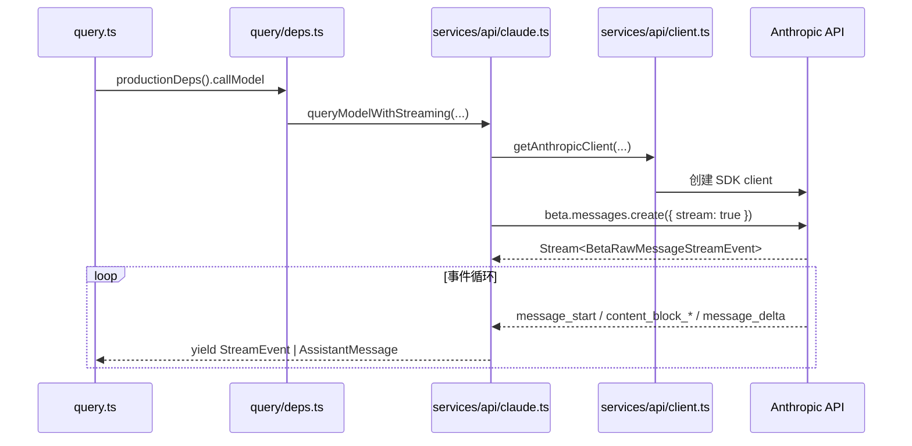
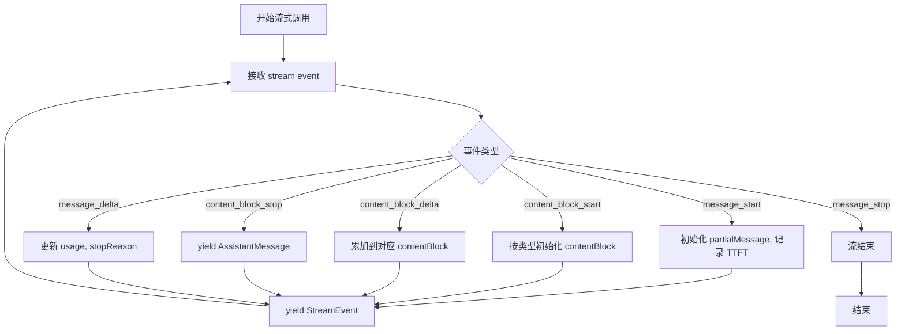

# 05. 模型调用与 Anthropic API 适配

## 概述

这一层负责把查询层的内部消息格式转换成 Anthropic API 可接受的请求，并把模型响应再还原成内部 `AssistantMessage`。当前仓库已经接通真实流式 API 路径：

`query.ts → QueryDeps.callModel → queryModelWithStreaming() → getAnthropicClient() → anthropic.beta.messages.create({ stream: true })`

核心是从上游复刻的完整流式事件处理循环，支持逐块产出消息。

## 关键源码

- `src/query/deps.ts`
- `src/services/api/claude.ts`
- `src/services/api/client.ts`
- `src/utils/systemPromptType.ts`

## 设计原理

### 1. `QueryDeps` 是查询层的模型窄口

`src/query/deps.ts` 把模型调用抽象成 `callModel`，让 `query.ts` 不需要知道 SDK、API key 或请求细节。这个设计让测试替身和生产实现都能从同一个窄口接入。

### 2. 消息归一化集中在 API 层

`src/services/api/claude.ts` 负责两次转换：

- 内部 `Message[]` → Anthropic `MessageParam[]`
- Anthropic `Message` → 内部 `AssistantMessage`

查询层只关心统一的内部消息，不关心外部协议细节。

### 3. 客户端创建与请求发送拆开

`src/services/api/client.ts` 专注客户端创建、缓存和环境变量解析；`claude.ts` 专注一次请求的组装和响应还原。这样认证策略与消息协议可以分开演进。

## 调用链



## 实现原理

### 1. 生产依赖装配

`productionDeps()` 当前做的事情非常少：

- `callModel` 绑定到 `queryModelWithStreaming`
- `uuid` 绑定到 `randomUUID`

这种"先保持依赖面窄，再逐步扩展"的方式，和当前最小闭环策略一致。

### 2. 消息归一化

`normalizeMessagesForApi()` 当前遵循的规则是：

- 只保留 `user` 与 `assistant`
- 若内容是字符串，直接传给 API
- 若内容是数组，按 `MessageParam['content']` 透传
- 其他消息类型直接忽略

这说明 API 层当前聚焦的是最小可用协议，而不是完整 transcript 兼容。

### 3. 客户端缓存

`getAnthropicClient()` 当前按 `maxRetries + apiKey` 组成缓存键：

- 先解析显式传入的 `apiKey`
- 否则回退到 `process.env.ANTHROPIC_API_KEY`
- 若没有 key，直接抛错
- 创建后放入 `clientCache`

这里的缓存目标是避免同配置下重复创建 SDK 客户端。

### 4. 流式查询主函数

`queryModelWithStreaming()` 是 API 层核心入口，负责真正的流式事件处理：

**设计动机**：
- 使用 Beta API 的流式接口实现实时响应
- 逐块处理 `message_start`、`content_block_*`、`message_delta` 等事件
- 累积 `contentBlocks` 状态以构建完整的 assistant message

**调用协议**：
```typescript
async function* queryModelWithStreaming({
  messages,           // 内部消息格式
  systemPrompt,       // 系统提示
  thinkingConfig,     // 思考配置
  tools,              // 工具配置
  signal,             // 中断信号
  options,            // 模型选项
}): AsyncGenerator<StreamEvent | AssistantMessage | SystemAPIErrorMessage, void>
```

### 5. 流式状态累积

API 层维护三类流式状态：

| 状态变量 | 类型 | 作用 |
|---------|------|------|
| `partialMessage` | `BetaMessage` | `message_start` 时的初始消息 |
| `contentBlocks` | `BetaContentBlock[]` | 累积所有内容块 |
| `usage` | `MutableUsage` | 累积 token 使用统计 |
| `stopReason` | `string \| null` | 最终停止原因 |

**状态累积时机**：
- `message_start`：初始化 `partialMessage`，记录 TTFT
- `content_block_start`：按类型初始化块（text/tool_use/thinking）
- `content_block_delta`：累加 text_delta/input_json_delta/thinking_delta
- `message_delta`：更新最终 usage 和 stop_reason

### 6. 事件处理循环



### 7. 双产出机制

API 层同时产出两种消息：

1. **`StreamEvent`**：每个原始流事件都透传给上层
   - 用途：调试、细粒度状态追踪
   - 包含 `ttftMs` 等指标

2. **`AssistantMessage`**：每个完成的 `content_block_stop` 产出
   - 用途：UI 逐步渲染每个内容块
   - 包含完整的块内容、usage、stop_reason

**设计动机**：允许上层同时消费原始事件和聚合消息，保持灵活性。

### 8. 内容块初始化策略

`content_block_start` 时按类型重置初始值：

| 块类型 | 初始化 | 原因 |
|-------|--------|------|
| `tool_use` | `input: ''` | 后续 delta 累加 JSON 片段 |
| `text` | `text: ''` | SDK 可能在 start 包含文本，需重置 |
| `thinking` | `thinking: '', signature: ''` | 累加思考内容与签名 |

### 9. Usage 累加

`updateUsage()` 支持增量累加：
- `message_start` 时只有 `input_tokens`
- `message_delta` 时追加 `output_tokens`
- 同时累加 cache 相关 token

### 10. TTFT 追踪

Time To First Token 在 `message_start` 时计算：
```typescript
ttftMs = Date.now() - start
```
随 `StreamEvent` 一并产出给上层用于性能监控。

## 伪代码

```text
1. 初始化流式状态：usage, stopReason, contentBlocks, partialMessage
2. 调用 anthropic.beta.messages.create({ stream: true })
3. for await (part of stream):
   a. message_start: 初始化 partialMessage, 记录 TTFT
   b. content_block_start: 按类型初始化 contentBlock[index]
   c. content_block_delta: 累加到 contentBlock[index]
   d. content_block_stop: yield AssistantMessage
   e. message_delta: 更新 usage, stopReason
   f. 每个事件都 yield StreamEvent
4. 流结束
```

## 关键数据结构

| 结构 | 位置 | 作用 |
| --- | --- | --- |
| `QueryDeps` | `src/query/deps.ts` | 查询层与模型调用层的抽象契约 |
| `SystemPrompt` | `src/utils/systemPromptType.ts` | 保持系统提示的品牌化数组语义 |
| `Options` | `src/services/api/claude.ts` | 承载 model 与非交互模式等查询选项 |
| `clientCache` | `src/services/api/client.ts` | 复用 Anthropic SDK 客户端 |
| `MutableUsage` | `src/services/api/claude.ts` | 支持 token 统计增量累加 |
| `BetaContentBlock` | SDK 类型 | 流式内容块（text/tool_use/thinking） |

## 当前边界

### 已落地

- 生产查询依赖已接到真实 API 适配层
- API key 缺失时会明确报错
- 消息归一化与 assistant 回填逻辑已经成形
- 查询层与 API 层的职责边界已经稳定
- **真正的流式事件处理**（message_start、content_block_*、message_delta）
- **双产出机制**（StreamEvent + AssistantMessage）
- **TTFT 追踪**
- **Usage 增量累加**

### 未落地

- retry / fallback 策略
- 多 provider 分支
- 更完整的系统提示、工具参数与 thinking 配置透传
- citations_delta 处理
- max_output_tokens 等错误消息特殊处理

## 设计取舍

### 优点

- 查询层不依赖 SDK，层次清晰
- 客户端创建与请求组装职责分离
- 流式事件处理对齐上游实现，保持协议一致性
- 双产出机制让上层有灵活的消费选择

### 代价

- 流式状态管理增加复杂度
- 部分高级特性（citations、错误处理）仍为 TODO
- provider、header、认证等复杂路径尚未接入

## 小结

这一层已经证明：

- 查询引擎和外部模型之间的窄口是稳定的
- 完整流式事件处理已从上游复刻落地
- 双产出机制支持 UI 细粒度反馈与调试
- 后续 retry、fallback、多 provider 都应继续落在这层

## 组合使用

- 和 `03-query-engine-layer.md` 组合，能看清 `callModel` 如何成为 query loop 的唯一模型出口
- 和 `06-session-management-layer.md` 组合，能看清 transcript 消息是如何被 API 层重新编码的
- 和 `02-core-interaction-layer.md` 组合，能看清 REPL 输入最终怎样走到外部模型