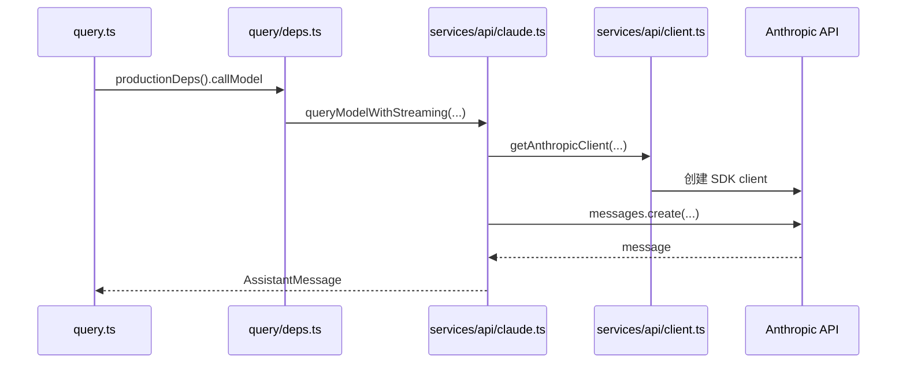

# 05. 模型调用与 Anthropic API 适配

## 概述

这一层负责把查询层的内部消息格式转换成 Anthropic API 可接受的请求，并把模型响应再还原成内部 `AssistantMessage`。当前仓库已经接通最小真实 API 路径：

`query.ts → QueryDeps.callModel → queryModelWithStreaming() → getAnthropicClient() → anthropic.messages.create()`

它的重点不是“功能很多”，而是“查询层与外部模型 I/O 的边界已经清楚”。

## 关键源码

- `src/query/deps.ts`
- `src/services/api/claude.ts`
- `src/services/api/client.ts`
- `src/utils/systemPromptType.ts`

## 设计原理

### 1. `QueryDeps` 是查询层的模型窄口

`src/query/deps.ts` 把模型调用抽象成 `callModel`，让 `query.ts` 不需要知道 SDK、API key 或请求细节。这个设计让测试替身和生产实现都能从同一个窄口接入。

### 2. 消息归一化集中在 API 层

`src/services/api/claude.ts` 负责两次转换：

- 内部 `Message[]` → Anthropic `MessageParam[]`
- Anthropic `Message` → 内部 `AssistantMessage`

查询层只关心统一的内部消息，不关心外部协议细节。

### 3. 客户端创建与请求发送拆开

`src/services/api/client.ts` 专注客户端创建、缓存和环境变量解析；`claude.ts` 专注一次请求的组装和响应还原。这样认证策略与消息协议可以分开演进。

## 调用链



## 实现原理

### 1. 生产依赖装配

`productionDeps()` 当前做的事情非常少：

- `callModel` 绑定到 `queryModelWithStreaming`
- `uuid` 绑定到 `randomUUID`

这种“先保持依赖面窄，再逐步扩展”的方式，和当前最小闭环策略一致。

### 2. 消息归一化

`normalizeMessagesForApi()` 当前遵循的规则是：

- 只保留 `user` 与 `assistant`
- 若内容是字符串，直接传给 API
- 若内容是数组，按 `MessageParam['content']` 透传
- 其他消息类型直接忽略

这说明 API 层当前聚焦的是最小可用协议，而不是完整 transcript 兼容。

### 3. 客户端缓存

`getAnthropicClient()` 当前按 `maxRetries + apiKey` 组成缓存键：

- 先解析显式传入的 `apiKey`
- 否则回退到 `process.env.ANTHROPIC_API_KEY`
- 若没有 key，直接抛错
- 创建后放入 `clientCache`

这里的缓存目标是避免同配置下重复创建 SDK 客户端。

### 4. 响应回填

`queryModelWithStreaming()` 当前并没有真正做 streaming 事件拆分，而是：

1. 一次性调用 `anthropic.messages.create()`
2. 把最终响应转换成内部 `AssistantMessage`
3. 以生成器形式 `yield` 给查询层

因此“带 streaming 接口形态的最小非流式实现”是当前这层的真实状态。

## 伪代码

```text
1. query loop 调用 deps.callModel
2. productionDeps 把调用转发给 queryModelWithStreaming
3. API 层把 Message[] 归一化为 MessageParam[]
4. 读取或创建 Anthropic client
5. 组装 model、max_tokens、messages、system 参数
6. 调用 anthropic.messages.create()
7. 把返回值转换成 AssistantMessage
8. 产出给 query loop
```

## 关键数据结构

| 结构 | 位置 | 作用 |
| --- | --- | --- |
| `QueryDeps` | `src/query/deps.ts` | 查询层与模型调用层的抽象契约 |
| `SystemPrompt` | `src/utils/systemPromptType.ts` | 保持系统提示的品牌化数组语义 |
| `Options` | `src/services/api/claude.ts` | 承载 model 与非交互模式等查询选项 |
| `clientCache` | `src/services/api/client.ts` | 复用 Anthropic SDK 客户端 |

## 当前边界

### 已落地

- 生产查询依赖已接到真实 API 适配层
- API key 缺失时会明确报错
- 消息归一化与 assistant 回填逻辑已经成形
- 查询层与 API 层的职责边界已经稳定

### 未落地

- 真正的 streaming 事件拆分
- retry / fallback / usage 细节处理
- 多 provider 分支
- 更完整的系统提示、工具参数与 thinking 配置透传

## 设计取舍

### 优点

- 查询层不依赖 SDK，层次清晰
- 客户端创建与请求组装职责分离
- 未来补 streaming 时不需要改动 query loop 的外部接口

### 代价

- 当前函数名带 `Streaming`，但实现仍是单次请求
- 消息归一化规则还比较窄
- provider、header、认证等复杂路径尚未接入

## 小结

这一层已经证明：

- 查询引擎和外部模型之间的窄口是稳定的
- 最小真实 Anthropic 请求已经可达
- 后续更复杂的 streaming、retry、fallback 都应继续落在这层，而不是回流到 `query.ts`

## 组合使用

- 和 `03-query-engine-layer.md` 组合，能看清 `callModel` 如何成为 query loop 的唯一模型出口
- 和 `06-session-management-layer.md` 组合，能看清 transcript 消息是如何被 API 层重新编码的
- 和 `02-core-interaction-layer.md` 组合，能看清 REPL 输入最终怎样走到外部模型
