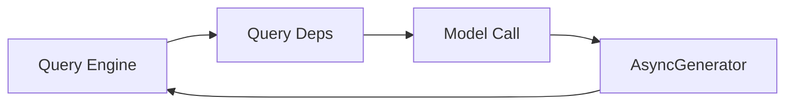

# API 客户端层

## Relevant source files
- `src/query/deps.ts`
- `src/query.ts`
- `src/types/message.ts`
- `src/utils/systemPromptType.ts`
- `package.json`

## 本页概述

本页只讨论当前仓库里“模型调用抽象”这一层已经落地到哪里。  
结论很明确：接口边界已经有了，但真实 API 客户端还没有接入，当前 `callModel` 仍是 mock 流式实现。

## 核心结构

代码依据：`query.ts` 通过 `params.deps ?? productionDeps()` 获取依赖，再调用 `deps.callModel(...)`；`src/query/deps.ts` 提供生产工厂。

## 关键机制

### 1. 查询层通过 `QueryDeps` 间接调用模型

- `QueryDeps` 当前至少声明了两个依赖：`callModel` 和 `uuid`
- `callModel` 的签名是“接收消息参数，返回 `AsyncGenerator<unknown>`”
- 这种写法让 `query.ts` 不需要知道底层究竟是 Anthropic SDK、测试假对象还是其它实现

### 2. `productionDeps()` 目前返回 mock 版本

- `productionDeps()` 没有接入真实 `services/api/claude.ts`
- 当前 `callModel` 是内联的 `mockCallModel`
- 它会从传入消息里反向查找最后一条 `user` 消息
- 然后产出一条 `assistant` 消息，内容是 `Mock response from query loop:\n<userText>`

### 3. mock 实现的价值是验证主链路，而不是模拟完整 API

- 它证明 `REPL -> query() -> callModel -> assistant message` 已经接通
- 它也让今日的最小闭环可以不依赖真实网络请求完成验证
- 但它没有实现真实流式事件分片、重试、预算控制、多模型切换或错误恢复

### 4. 模型配置仍通过查询层参数透传

- `query.ts` 会把 `messages`、`systemPrompt`、`signal` 和 `options` 传给 `callModel`
- `options.model` 当前来自 `toolUseContext.options.mainLoopModel`
- `isNonInteractiveSession` 也会被一起透传
- 这说明模型层边界已经开始和交互态、查询态对齐

### 5. 外部依赖已经预埋到工程里

- `package.json` 已声明 `@anthropic-ai/sdk`
- 但当前仓库没有对应的真实 API 调用模块落地
- 所以更准确的判断是“依赖已准备，接线待补”

## 当前实现边界

- 已实现：查询层调用抽象、生产依赖工厂、mock `assistant` 流式产出
- 已实现：从最后一条 `user` 消息反推 mock 响应内容，便于验证接线
- 未实现：真实 Claude API 请求、流事件细分、重试、fallback、预算与统计
- 当前页面不能写成“多后端适配已完成”，因为源码还没有这个事实

## 设计要点

- `QueryDeps` 是当前最重要的扩展点，未来真实 API 接入也会复用这个边界
- mock 实现的目的不是“像真的一样复杂”，而是“足够证明 query loop 已经跑起来”
- 模型层目前仍然服务于主链路验证，而不是产品级稳定性

## 继续阅读

- [03-query-engine-layer](./03-query-engine-layer.md)：看 `query()` 如何消费 `callModel` 的产出。
- [02-core-interaction-layer](./02-core-interaction-layer.md)：看 REPL 怎样触发这一层。
- [04-tool-execution-layer](./04-tool-execution-layer.md)：看模型响应中的 `tool_use` 怎样进入工具编排层。
