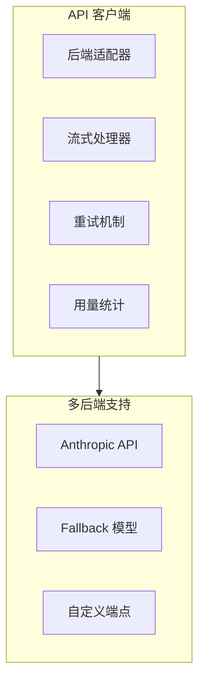
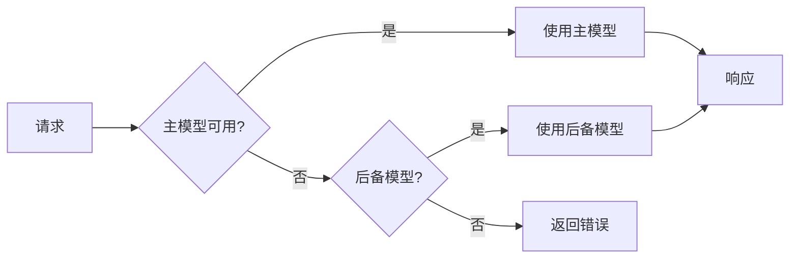
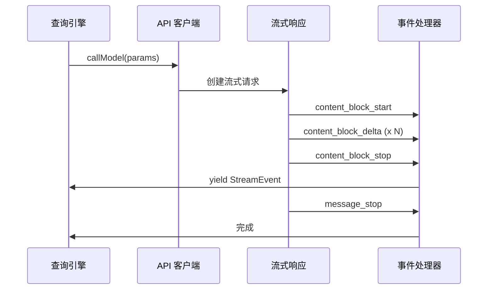
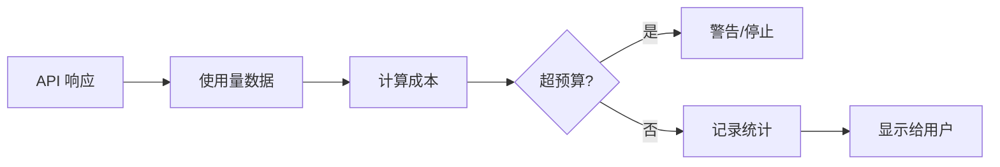

# API 客户端层

## Relevant source files

- `src/query/deps.ts` - 依赖注入，包含 callModel
- `package.json` - Anthropic SDK 依赖配置
- `src/types/message.ts` - 消息类型定义

## 本页概述

API 客户端层负责与 Anthropic Claude API 的通信，是多后端适配的核心。本页分析多后端适配、流式响应处理、用量统计与计费、错误重试机制等关键功能，揭示系统如何高效可靠地与 AI 模型交互。

## 核心结构

### API 客户端组成



## 多后端适配

### Anthropic SDK 集成

项目使用 `@anthropic-ai/sdk` 作为主要 API 客户端：

```json
// package.json
{
  "dependencies": {
    "@anthropic-ai/sdk": "^0.82.0"
  }
}
```

### API 配置

```typescript
// API 配置示例

interface APIConfig {
  apiKey: string              // API 密钥
  baseUrl?: string            // 自定义端点
  model: string               // 模型名称
  maxTokens?: number          // 最大输出令牌
  temperature?: number        // 温度参数
}
```

### 模型选择



**模型参数**：
- `--model <model>`: 指定模型
- `fallbackModel`: 后备模型配置

## 流式响应处理

### 流式 API 调用



### 流事件类型

```typescript
// 流事件定义

type StreamEvent =
  | { type: 'content_block_start'; index: number; content_block: ContentBlock }
  | { type: 'content_block_delta'; index: number; delta: Delta }
  | { type: 'content_block_stop'; index: number }
  | { type: 'message_start'; message: Message }
  | { type: 'message_delta'; delta: MessageDelta }
  | { type: 'message_stop' }
  | { type: 'ping' }
  | { type: 'error'; error: Error }
```

### 流式处理实现

```typescript
// 流式处理伪代码

async function* streamAPIResponse(
  params: APIParams
): AsyncGenerator<StreamEvent> {
  const stream = await client.messages.stream({
    model: params.model,
    messages: params.messages,
    system: params.systemPrompt,
    max_tokens: params.maxTokens,
    tools: params.tools,
    stream: true
  })
  
  for await (const event of stream) {
    yield event
  }
}
```

### 流式响应优势

- **实时反馈**: 用户可以立即看到 AI 开始响应
- **降低延迟感知**: 无需等待完整响应
- **资源高效**: 逐步处理，无需缓存完整响应
- **用户体验**: 打字机效果更自然

## 用量统计与计费

### Token 统计

```typescript
// Token 使用统计

interface TokenUsage {
  input_tokens: number         // 输入令牌数
  output_tokens: number        // 输出令牌数
  cache_creation_input_tokens?: number  // 缓存创建令牌
  cache_read_input_tokens?: number      // 缓存读取令牌
}
```

### 成本追踪



### 预算控制

```typescript
// 预算配置

interface BudgetConfig {
  maxBudgetUsd?: number        // 最大预算（美元）
  warnThreshold?: number       // 警告阈值（百分比）
  stopThreshold?: number       // 停止阈值（百分比）
}

// 预算检查
function checkBudget(
  currentUsage: number,
  budget: BudgetConfig
): 'ok' | 'warn' | 'stop' {
  if (!budget.maxBudgetUsd) return 'ok'
  
  const percentage = (currentUsage / budget.maxBudgetUsd) * 100
  
  if (percentage >= budget.stopThreshold) return 'stop'
  if (percentage >= budget.warnThreshold) return 'warn'
  return 'ok'
}
```

## 错误重试机制

### 错误类型

| 错误类型 | HTTP 状态码 | 重试策略 |
|----------|-------------|----------|
| Rate Limit | 429 | 指数退避重试 |
| Server Error | 500-503 | 指数退避重试 |
| Timeout | - | 固定间隔重试 |
| Invalid Request | 400 | 不重试 |
| Auth Error | 401 | 不重试 |

### 重试策略

```mermaid
stateDiagram-v2
    [*] --> Request: 发送请求
    Request --> Success: 成功
    Request --> Error: 失败
    Error --> Check{可重试?}
    Check -->|是| Wait: 等待
    Check -->|否| Fail: 返回错误
    Wait --> Retry: 重试
    Retry --> Request
    Success --> [*]: 返回结果
    Fail --> [*]: 返回错误
```

### 指数退避实现

```typescript
// 指数退避重试

async function withRetry<T>(
  fn: () => Promise<T>,
  options: {
    maxRetries: number
    baseDelay: number
    maxDelay: number
  }
): Promise<T> {
  let lastError: Error
  
  for (let attempt = 0; attempt < options.maxRetries; attempt++) {
    try {
      return await fn()
    } catch (error) {
      lastError = error
      
      if (!isRetryable(error)) {
        throw error
      }
      
      const delay = Math.min(
        options.baseDelay * Math.pow(2, attempt),
        options.maxDelay
      )
      
      await sleep(delay)
    }
  }
  
  throw lastError
}
```

### max_output_tokens 恢复

特殊处理 `max_output_tokens` 错误：

```typescript
// max_output_tokens 恢复机制

function isWithheldMaxOutputTokens(msg: Message | StreamEvent): boolean {
  return msg?.type === 'assistant' && msg.apiError === 'max_output_tokens'
}

// 恢复计数限制
const MAX_OUTPUT_TOKENS_RECOVERY_LIMIT = 3

// 恢复逻辑
if (isWithheldMaxOutputTokens(response)) {
  if (state.maxOutputTokensRecoveryCount < MAX_OUTPUT_TOKENS_RECOVERY_LIMIT) {
    // 减少输出令牌限制，重试
    state.maxOutputTokensOverride = Math.floor(
      (state.maxOutputTokensOverride ?? defaultMaxTokens) * 0.8
    )
    state.maxOutputTokensRecoveryCount++
    continue  // 继续循环
  }
}
```

## API 请求构建

### 消息规范化

```typescript
// 将内部消息格式转换为 API 格式

function normalizeMessagesForAPI(
  messages: Message[]
): APIMessage[] {
  return messages
    .filter(msg => msg.type !== 'tombstone')  // 过滤墓碑消息
    .map(msg => {
      switch (msg.type) {
        case 'user':
          return { role: 'user', content: msg.content }
        case 'assistant':
          return { role: 'assistant', content: msg.message.content }
        case 'tool_result':
          return {
            role: 'user',
            content: [{
              type: 'tool_result',
              tool_use_id: msg.tool_use_id,
              content: msg.content
            }]
          }
        default:
          throw new Error(`Unknown message type: ${msg.type}`)
      }
    })
}
```

### 系统提示构建

```typescript
// 构建系统提示

function buildSystemPrompt(
  basePrompt: SystemPrompt,
  userContext: Record<string, string>,
  systemContext: Record<string, string>
): string {
  let prompt = asSystemPrompt(basePrompt)
  
  // 添加用户上下文
  for (const [key, value] of Object.entries(userContext)) {
    prompt += `\n\n${key}: ${value}`
  }
  
  // 添加系统上下文
  for (const [key, value] of Object.entries(systemContext)) {
    prompt += `\n\n${key}: ${value}`
  }
  
  return prompt
}
```

## 设计要点

### 1. 抽象层

通过 `QueryDeps` 抽象 API 调用，便于测试和替换实现。

### 2. 流式优先

所有 API 调用都采用流式响应，提供最佳用户体验。

### 3. 错误恢复

完善的错误处理和重试机制，确保请求可靠性。

### 4. 预算透明

实时统计用量，帮助用户控制成本。

### 5. 安全性

API 密钥通过安全存储管理，不在代码中硬编码。

## 继续阅读

- [03-query-engine-layer](./03-query-engine-layer.md) - 了解查询引擎如何使用 API 客户端
- [04-tool-execution-layer](./04-tool-execution-layer.md) - 学习工具结果如何反馈给 API
- [06-session-management-layer](./06-session-management-layer.md) - 了解 API 配置如何管理
