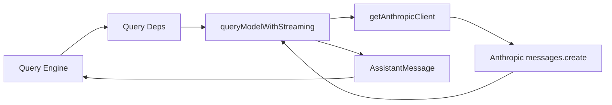

# API 客户端层

## Relevant source files
- `src/query/deps.ts`
- `src/services/api/claude.ts`
- `src/services/api/client.ts`
- `src/screens/REPL.tsx`
- `src/query.ts`
- `src/types/message.ts`
- `src/utils/systemPromptType.ts`
- `package.json`

## 本页概述

本页只讨论当前仓库里“模型调用抽象”这一层已经落地到哪里。  
当前结论是：查询层和真实 Anthropic API 之间的最小生产边界已经接通，`QueryDeps.callModel` 不再停留在 mock，而是进入 `queryModelWithStreaming() -> getAnthropicClient()` 这条实际适配链路。

## 核心结构

代码依据：`query.ts` 通过 `params.deps ?? productionDeps()` 获取依赖，再调用 `deps.callModel(...)`；`src/query/deps.ts` 已把 `callModel` 直接绑定到 `queryModelWithStreaming`；`src/services/api/claude.ts` 负责参数归一化与请求发送；`src/services/api/client.ts` 负责客户端创建。

## 关键机制

### 1. 查询层通过 `QueryDeps` 间接调用模型

- `QueryDeps` 当前至少声明了两个依赖：`callModel` 和 `uuid`
- `callModel` 的类型直接对齐 `typeof queryModelWithStreaming`
- 这种写法让 `query.ts` 继续不知道底层是 SDK 调用、测试替身还是未来的多提供商实现，只依赖稳定函数边界

### 2. `productionDeps()` 已切到真实 API 适配层

- `productionDeps()` 现在直接返回 `callModel: queryModelWithStreaming`
- 查询层的生产依赖已经不再自己拼 mock 响应，而是把模型调用委托给 `src/services/api/claude.ts`
- 这让 `REPL -> query() -> productionDeps.callModel` 进入真实外部 I/O 边界，但又没有把 SDK 细节泄漏回 `query.ts`

### 3. `queryModelWithStreaming()` 负责窄口适配，不负责上游所有能力

- 该函数先把内部 `Message[]` 归一化成 Anthropic `MessageParam[]`
- 再把 `SystemPrompt` 折叠成 `messages.create()` 可接受的 `system` 字段
- 请求返回后，它当前只 `yield` 一条完整 `AssistantMessage`，还没有展开成更细粒度的流事件
- 这说明“真实请求边界已打通”和“完整 streaming 能力已复刻”是两件不同的事

### 4. 模型配置仍通过查询层参数透传

- `query.ts` 会把 `messages`、`systemPrompt`、`signal` 和 `options` 传给 `callModel`
- `options.model` 当前来自 `toolUseContext.options.mainLoopModel`
- `isNonInteractiveSession` 也会被一起透传
- `REPL.tsx` 会优先从 `ANTHROPIC_MODEL`、`ANTHROPIC_DEFAULT_SONNET_MODEL` 读取默认模型名，最后才回退到 `'claude-sonnet-4-6'`
- 这说明交互层、查询层和 API 层已经围绕同一套模型参数边界对齐

### 5. `getAnthropicClient()` 只实现最小客户端创建职责

- `src/services/api/client.ts` 直接从显式参数或 `ANTHROPIC_API_KEY` 解析认证信息
- 它按 `maxRetries + apiKey` 做简单缓存，避免重复创建 SDK 客户端
- 目前只覆盖第一方 API key 直连场景，没有展开 OAuth、Bedrock、Vertex、Foundry 或自定义 header 分支

### 6. 错误可见性已经回到 REPL 交互层

- `REPL.tsx` 在回合终态为 `model_error` 时，会把错误文本追加到 transcript
- 这让当前环境即使缺少 `ANTHROPIC_API_KEY`，也能证明主链路已经真正走到 API 适配层，而不是停在静默 mock
- 它解决的是“失败可见”，不是“请求必然成功”

## 当前实现边界

- 已实现：`QueryDeps` 与真实 API 适配函数对齐，生产依赖进入 `queryModelWithStreaming`
- 已实现：消息归一化、`SystemPrompt` 折叠、Anthropic SDK 客户端最小创建与缓存
- 已实现：REPL 在 `model_error` 时回写错误文本，便于验证真实调用边界
- 未实现：真实流式事件拆分、usage 深度处理、重试、fallback、多提供商分支与真实 key 成功响应证据
- 当前页面不能写成“完整 API 客户端已复刻完成”，因为源码只证明了最小链路已打通

## 设计要点

- `QueryDeps` 是当前最重要的扩展点，未来真实 API 接入也会复用这个边界
- `queryModelWithStreaming()` 的职责应保持狭窄：做内部消息与外部 SDK 之间的窄口转换
- `getAnthropicClient()` 单独拆出后，认证、缓存和 provider 扩展可以独立演进
- 模型层当前已经进入真实生产边界，但稳定性能力仍明显落后于上游完整实现

## 继续阅读

- [03-query-engine-layer](./03-query-engine-layer.md)：看 `query()` 如何消费 `callModel` 的产出。
- [02-core-interaction-layer](./02-core-interaction-layer.md)：看 REPL 怎样触发这一层。
- [04-tool-execution-layer](./04-tool-execution-layer.md)：看模型响应中的 `tool_use` 怎样进入工具编排层。
