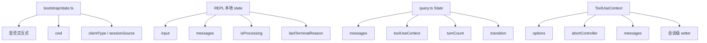

# 06. 会话状态与消息类型

## 概述

当前仓库还没有完整的全局 AppState，但已经形成了三层稳定状态结构：

1. 进程级状态：`bootstrap/state.ts`
2. 回合级状态：`query.ts` 内部 `State`
3. 交互级状态：`REPL.tsx` 本地 React state

而把它们串起来的共同载体，是 `Message[]` 和 `ToolUseContext`。

## 关键源码

- `src/bootstrap/state.ts`
- `src/types/message.ts`
- `src/Tool.ts`
- `src/screens/REPL.tsx`
- `src/query.ts`
- `src/types/ids.ts`

## 状态分层



## 设计原理

### 1. 进程态和会话态分开

`bootstrap/state.ts` 负责进程启动后的稳定环境信息，例如：

- 当前是否交互模式
- 原始 cwd 和当前 cwd
- clientType
- sessionSource

这些状态与单次 query turn 无关，因此不应该放进 `query.ts` 或 REPL 组件内部。

### 2. transcript 作为跨层统一语义

无论是 REPL、query loop、工具层还是 API 层，最终都围绕 `Message[]` 协作。这样不同层共享的不是零散字段，而是统一的消息历史。

### 3. `ToolUseContext` 作为共享上下文中心

`ToolUseContext` 不是单纯的工具参数包，而是一个会话级共享上下文：

- 里面有工具列表
- 有中断控制器
- 有消息数组
- 有多个与 UI / 状态联动的 setter

这说明它承担的是“查询层与工具层的共享运行时环境”。

## 消息模型

### 1. `Message` 是最基础的 transcript 载体

`src/types/message.ts` 通过判别联合和宽松扩展字段，统一承载：

- `user`
- `assistant`
- `system`
- `attachment`
- `progress`
- `grouped_tool_use`
- `collapsed_read_search`

对当前仓库而言，最关键的仍然是 `user`、`assistant`、`system` 三类。

### 2. message content 的三种形态

当前类型定义允许 `message.content` 是：

- `string`
- `ContentBlockParam[]`
- `ContentBlock[]`

这让内部消息既能容纳纯文本，也能容纳 Anthropic 风格的结构化内容块。

### 3. branded type 辅助语义隔离

`ids.ts` 和 `systemPromptType.ts` 都采用 branded type：

- `SessionId`
- `AgentId`
- `SystemPrompt`

这类设计没有运行时成本，但可以在类型层面避免语义混用。

## 实现原理

### 1. 启动期状态写入

`main.tsx` 在判断交互模式后，会通过 `setIsInteractive()` 写入全局状态。这是当前进程态与入口层的主要接点。

### 2. REPL 本地状态

`REPL.tsx` 当前维护：

- `input`
- `messages`
- `isProcessing`
- `lastTerminalReason`

这些状态天然属于界面层，因为它们决定输入框内容、消息列表和界面反馈。

### 3. query loop 状态

`query.ts` 内部 `State` 负责跨轮次保存：

- 本轮之前的消息历史
- 当前 `ToolUseContext`
- 轮次计数
- 恢复/压缩相关标记
- 上一轮为何继续

这层状态直接决定代理循环是否还能往下跑。

## 伪代码

```text
1. 启动时写入全局进程态
2. REPL 维护当前输入和展示用 transcript
3. 提交时把 messages 与 ToolUseContext 交给 query()
4. query loop 用内部 State 保存跨轮次状态
5. 工具层通过 ToolUseContext 读取和更新共享上下文
6. 产出的 Message 再回写给 REPL 展示
```

## 当前边界

### 已落地

- 进程级状态 getter / setter
- transcript 统一消息模型
- `ToolUseContext` 大量字段占位但结构已稳定
- REPL 本地状态与 query loop 状态分工清晰

### 未落地

- 真正的全局 AppState provider
- 更具体的权限、hooks、任务基础设施状态
- 更严格的 `QuerySource`、`ToolProgressData`、`Terminal` 类型

## 设计取舍

### 优点

- 状态按作用域分层，后续扩展空间充足
- `Message[]` 作为主线，跨层沟通成本低
- `ToolUseContext` 已预留大量未来能力挂点

### 代价

- 当前状态分散在多个层次，初读时容易混淆
- 很多类型还是占位，语义还未完全收窄
- React 全局状态尚未接入，部分共享状态仍靠手工透传

## 小结

当前仓库的状态管理关键词不是“集中式 store”，而是“按作用域拆层”：

- 进程态放在 `bootstrap/state.ts`
- 回合态放在 `query.ts`
- 界面态放在 `REPL.tsx`
- 共享上下文放在 `ToolUseContext`

理解这四层，就能读清大多数状态为什么出现在那个位置。

## 组合使用

- 和 `03-query-engine-layer.md` 组合，能看清哪些状态决定回合是否继续
- 和 `04-tool-execution-layer.md` 组合，能看清 `ToolUseContext` 为什么是工具层核心
- 和 `07-tui-rendering-layer.md` 组合，能看清当前哪些状态仍停留在界面层而未进入全局 provider
