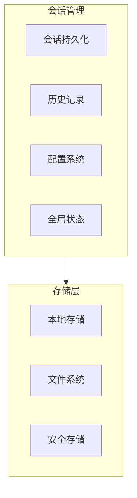
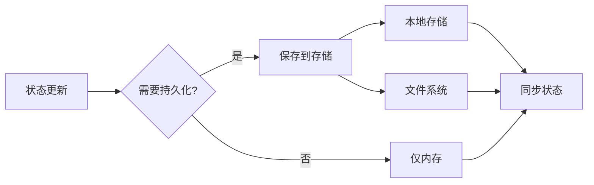
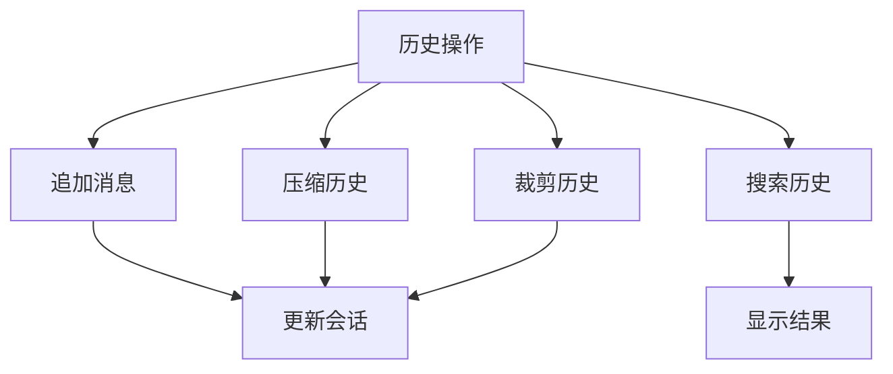
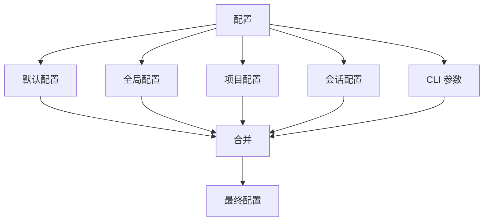
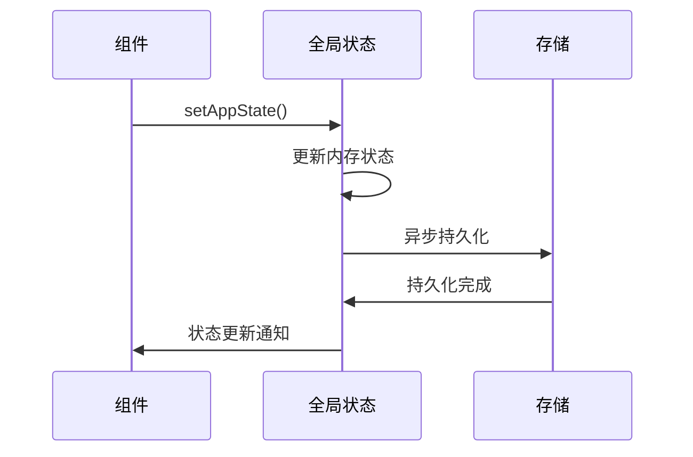

# 会话管理层

## Relevant source files

- `src/bootstrap/state.ts` - 全局状态管理
- `src/types/message.ts` - 消息类型定义
- `src/types/ids.ts` - ID 类型定义

## 本页概述

会话管理层负责用户会话的生命周期管理，包括会话持久化、历史记录管理、配置系统和全局状态同步。本页分析这些关键机制，揭示系统如何维护用户会话的连续性和一致性。

## 核心结构

### 会话管理组成



## 会话持久化

### 会话数据结构

```typescript
// 会话定义

interface Session {
  id: SessionId                // 会话 ID
  messages: Message[]          // 消息历史
  createdAt: number            // 创建时间
  updatedAt: number            // 更新时间
  metadata?: SessionMetadata   // 元数据
}

interface SessionMetadata {
  model?: string               // 使用的模型
  tokenUsage?: TokenUsage      // Token 使用量
  title?: string               // 会话标题
  tags?: string[]              // 标签
}
```

### 持久化策略



**持久化时机**：
- 每轮对话结束后
- 用户手动保存时
- 会话切换时
- 程序退出前

### 会话恢复

```typescript
// 会话恢复流程

async function resumeSession(sessionId: string): Promise<Session> {
  // 1. 从存储加载会话
  const session = await loadSession(sessionId)
  
  // 2. 验证会话完整性
  if (!validateSession(session)) {
    throw new Error('Invalid session')
  }
  
  // 3. 恢复状态
  restoreState(session)
  
  // 4. 返回会话
  return session
}
```

### --resume 参数实现

```typescript
// CLI 参数处理

program.option(
  '--resume <sessionId>',
  'Resume a previous session by ID',
  String
)

// action handler 中
if (options.resume) {
  const session = await resumeSession(options.resume)
  initialMessages = session.messages
}
```

### -c/--continue 参数实现

```typescript
// 继续最近会话

program.option(
  '-c, --continue',
  'Continue the most recent conversation',
  false
)

// action handler 中
if (options.continue) {
  const recentSession = await getMostRecentSession()
  if (recentSession) {
    initialMessages = recentSession.messages
  }
}
```

## 历史记录管理

### 消息历史结构

```typescript
// 消息类型

type Message =
  | UserMessage
  | AssistantMessage
  | ToolResultMessage
  | SystemMessage
  | TombstoneMessage

// 消息数组
messages: Message[]
```

### 历史记录操作



### 历史压缩机制

```typescript
// 自动压缩条件

function shouldCompact(messages: Message[]): boolean {
  const tokenCount = estimateTokens(messages)
  return tokenCount > COMPACTION_THRESHOLD
}

// 压缩实现
async function compactHistory(
  messages: Message[]
): Promise<Message[]> {
  // 1. 保留关键消息（系统提示、最近对话）
  // 2. 将中间消息压缩为摘要
  // 3. 返回压缩后的消息列表
}
```

### 历史裁剪

```typescript
// 裁剪过长消息

function trimMessage(message: Message, maxTokens: number): Message {
  if (estimateTokens(message) <= maxTokens) {
    return message
  }
  
  // 裁剪内容
  return {
    ...message,
    content: truncateContent(message.content, maxTokens)
  }
}
```

## 配置系统

### 配置层级



**优先级**（从低到高）：
1. 默认配置（代码中定义）
2. 全局配置（~/.claude/config.json）
3. 项目配置（.claude/config.json）
4. 会话配置（会话特定）
5. CLI 参数（命令行）

### 配置结构

```typescript
// 配置定义

interface Config {
  // 模型配置
  model: string
  fallbackModel?: string
  maxTokens?: number
  
  // 权限配置
  permissionMode: 'auto' | 'accept' | 'review'
  dangerouslySkipPermissions?: boolean
  
  // 输出配置
  outputFormat?: 'text' | 'json' | 'stream-json'
  verbose?: boolean
  debug?: boolean
  
  // 预算配置
  maxBudgetUsd?: number
  
  // 自定义配置
  customSystemPrompt?: string
  appendSystemPrompt?: string
  
  // 其他配置
  [key: string]: unknown
}
```

### 配置加载

```typescript
// 配置加载流程

async function loadConfig(): Promise<Config> {
  // 1. 默认配置
  let config = defaultConfig()
  
  // 2. 全局配置
  const globalConfig = await loadGlobalConfig()
  config = merge(config, globalConfig)
  
  // 3. 项目配置
  const projectConfig = await loadProjectConfig()
  config = merge(config, projectConfig)
  
  // 4. CLI 参数覆盖
  const cliConfig = parseCLIOptions()
  config = merge(config, cliConfig)
  
  return config
}
```

### 配置文件位置

| 配置类型 | 位置 | 说明 |
|----------|------|------|
| 全局配置 | `~/.claude/config.json` | 用户级别配置 |
| 项目配置 | `.claude/config.json` | 项目级别配置 |
| 安全存储 | Keychain / Secret Storage | API 密钥等敏感信息 |

## 全局状态同步

### Bootstrap State

```typescript
// src/bootstrap/state.ts

// 全局状态访问接口
export function getAppState(): AppState
export function setAppState(f: (prev: AppState) => AppState): void

// 交互模式标志
export function setIsInteractive(value: boolean): void
export function isInteractive(): boolean
```

### 状态结构

```typescript
// 全局状态定义

interface AppState {
  // 会话状态
  currentSession?: SessionId
  messages: Message[]
  
  // 配置状态
  config: Config
  
  // UI 状态
  isInteractive: boolean
  isLoading: boolean
  
  // 统计状态
  tokenUsage: TokenUsage
  budgetUsage: number
  
  // 其他状态
  [key: string]: unknown
}
```

### 状态更新模式

```typescript
// 原子更新

setAppState(prev => ({
  ...prev,
  messages: [...prev.messages, newMessage],
  updatedAt: Date.now()
}))

// 批量更新
setAppState(prev => ({
  ...prev,
  messages: newMessages,
  tokenUsage: newUsage,
  config: newConfig
}))
```

### 状态同步机制



## 设计要点

### 1. 分层持久化

会话数据、配置、安全信息分别存储，职责清晰。

### 2. 渐进式加载

配置按优先级加载，后加载覆盖前加载。

### 3. 原子更新

状态更新采用原子操作，避免竞态条件。

### 4. 异步持久化

存储操作异步执行，不阻塞主流程。

### 5. 会话恢复

支持多种恢复方式，保证用户体验连续性。

## 继续阅读

- [02-core-interaction-layer](./02-core-interaction-layer.md) - 了解 CLI 如何触发会话恢复
- [03-query-engine-layer](./03-query-engine-layer.md) - 学习消息历史如何被处理
- [05-api-client-layer](./05-api-client-layer.md) - 了解配置如何影响 API 调用
