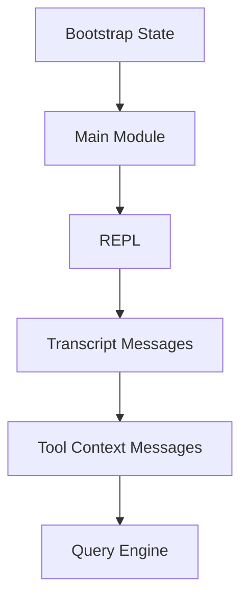

# 会话管理层

## Relevant source files
- `src/bootstrap/state.ts`
- `src/Tool.ts`
- `src/types/message.ts`
- `src/screens/REPL.tsx`
- `src/main.tsx`

## 本页概述

本页讨论“当前仓库里会话和状态到底由谁承载”。  
结论是：已经有最小全局状态和消息历史载体，但持久化、恢复、配置分层等完整会话系统还没有落地。

## 核心结构

代码依据：`main.tsx` 写入交互态；`REPL.tsx` 维护本地 `messages` 并把它传进 `ToolUseContext.messages`；`types/message.ts` 定义 transcript 的基础结构。

## 关键机制

### 1. `bootstrap/state.ts` 管的是全局启动态，不是完整会话存储

- 当前全局状态包含 `originalCwd`、`cwd`、`isInteractive`、`clientType`、`sessionSource`、`startTime`
- 它提供成对的 getter/setter，例如 `getIsInteractive()` / `setIsInteractive()`
- 还提供 `resetStateForTests_ONLY()` 供测试重置
- 这说明它更像“运行时基础状态容器”，而不是“完整 transcript store”

### 2. `Message` 类型体系是会话历史的真正载体

- `src/types/message.ts` 定义了统一的 `Message` 结构
- 当前复刻里常用的消息子类型包括 `user`、`assistant`、`system`
- `uuid` 是每条消息的稳定标识
- `message.content` 支持字符串或 content block 数组，因此同一套 transcript 可以兼容普通文本与 `tool_result`

### 3. REPL 本地状态承担了当前会话历史

- `src/screens/REPL.tsx` 用 `useState<Message[]>` 持有当前 transcript
- `appendMessage()` 会同时更新 React state 和 `messagesRef`
- 提交一条输入时，REPL 先把用户消息写进 transcript，再启动 `query()`
- 之后 `query()` 产出的消息也会持续追加回同一份 transcript

### 4. `ToolUseContext.messages` 是查询层和工具层共享的状态桥梁

- `createReplToolUseContext()` 会把当前消息快照注入 `ToolUseContext`
- `queryLoop()` 每轮又会把 `messagesForQuery` 写回 `toolUseContext.messages`
- 这使得工具层、查询层和 REPL 在“当前看到的消息历史”上保持最小同步

### 5. 会话恢复能力目前只停留在 CLI 选项层

- `main.tsx` 已声明 `--resume` 和 `--continue`
- 但当前 action handler 还没有实现真实恢复逻辑
- 所以不能把“会话恢复已支持”写成当前仓库事实

## 当前实现边界

- 已实现：全局交互态、cwd 状态、消息类型体系、REPL 本地 transcript、消息跨层透传
- 已实现：`ToolUseContext` 作为共享状态容器的最小版本
- 未实现：持久化存储、历史检索、完整会话恢复、配置分层、预算与统计累积
- 因此此层当前更接近“状态承载层”，而不是“完整会话系统”

## 设计要点

- 全局状态和 transcript 被刻意分离：前者保运行时基础信息，后者保对话历史
- `Message` 类型比任何单独 store 都更关键，因为它跨 UI、查询、工具三层流动
- 当前仓库优先打通“状态能在一轮代理回合里流动”，还没进入“长期会话管理”

## 继续阅读

- [02-core-interaction-layer](./02-core-interaction-layer.md)：看 REPL 怎样写入和维护 transcript。
- [03-query-engine-layer](./03-query-engine-layer.md)：看 `messages` 怎样参与每一轮 `queryLoop`。
- [04-tool-execution-layer](./04-tool-execution-layer.md)：看 `ToolUseContext` 怎样在工具编排中被复用。
