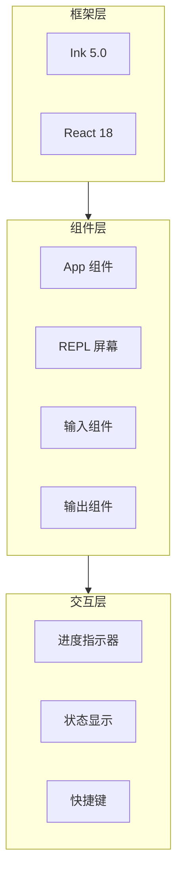
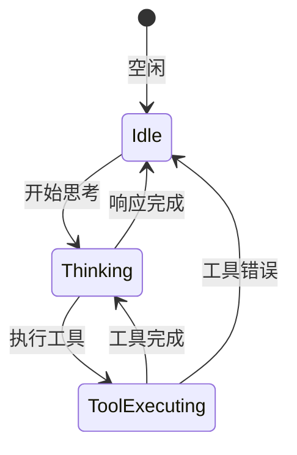
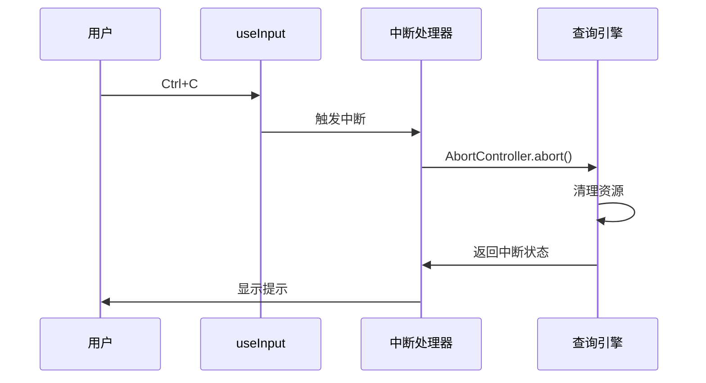

# TUI 渲染层

## Relevant source files

- `src/ink.ts` - Ink 封装，React 终端渲染
- `src/components/App.tsx` - 主应用组件
- `src/screens/REPL.tsx` - REPL 屏幕
- `src/interactiveHelpers.tsx` - 交互辅助函数
- `package.json` - Ink 和 React 依赖

## 本页概述

TUI 渲染层负责终端用户界面的渲染和交互。本页深入分析 Ink 组件系统、交互反馈（进度、状态）、快捷键绑定、样式与主题等核心机制，揭示系统如何在终端中提供现代化的交互体验。

## 核心结构

### TUI 渲染组成



## Ink 组件系统

### Ink 框架介绍

Ink 是一个基于 React 的终端 UI 框架，使用 Flexbox 布局：

```json
// package.json
{
  "dependencies": {
    "ink": "^5.0.1",
    "react": "^18.3.1"
  }
}
```

**核心特性**：
- React 组件模型
- Flexbox 布局
- 内置组件（`<Box>`, `<Text>`, `<Newline>` 等）
- Hooks 支持
- 流式渲染

### Ink 封装

```typescript
// src/ink.ts

import { render, type RenderOptions } from 'ink'
import type { Root } from './ink.js'

// 创建 React root
export async function createRoot(
  options: RenderOptions
): Promise<Root> {
  return render(options)
}
```

### App 组件

```typescript
// src/components/App.tsx

import { Box, Text } from 'ink'

export function App() {
  return (
    <Box flexDirection="column">
      <Text>Claude Code Annotated</Text>
      {/* 更多组件 */}
    </Box>
  )
}
```

### REPL 屏幕

```typescript
// src/screens/REPL.tsx

export function REPLScreen() {
  return (
    <Box flexDirection="column" height="100%">
      {/* 消息列表 */}
      <MessagesList />
      
      {/* 输入区域 */}
      <InputArea />
      
      {/* 状态栏 */}
      <StatusBar />
    </Box>
  )
}
```

### 常用 Ink 组件

| 组件 | 用途 |
|------|------|
| `<Box>` | 容器，Flexbox 布局 |
| `<Text>` | 文本显示，支持颜色和样式 |
| `<Newline>` | 换行 |
| `<Spacer>` | 弹性空白 |
| `<Static>` | 静态内容，不重新渲染 |
| `<Focus>` | 焦点管理 |

## 交互反馈

### 进度指示器



**Spinner 类型**：
- 旋转动画
- 脉冲动画
- 点动画
- 自定义字符序列

```typescript
// Spinner 组件示例

import { Text } from 'ink'
import { useState, useEffect } from 'react'

function Spinner({ type = 'dots' }) {
  const frames = ['⠋', '⠙', '⠹', '⠸', '⠼', '⠴', '⠦', '⠧', '⠇', '⠏']
  const [frame, setFrame] = useState(0)
  
  useEffect(() => {
    const timer = setInterval(() => {
      setFrame(f => (f + 1) % frames.length)
    }, 80)
    return () => clearInterval(timer)
  }, [])
  
  return <Text>{frames[frame]}</Text>
}
```

### 状态显示

```typescript
// 状态栏组件

function StatusBar({ status, usage }: StatusBarProps) {
  return (
    <Box flexDirection="row">
      <Text dimColor>{status}</Text>
      <Spacer />
      <Text dimColor>
        Tokens: {usage.input} in / {usage.output} out
      </Text>
    </Box>
  )
}
```

### 消息渲染

```typescript
// 消息渲染组件

function MessageList({ messages }: { messages: Message[] }) {
  return (
    <Box flexDirection="column">
      {messages.map(msg => (
        <MessageItem key={msg.uuid} message={msg} />
      ))}
    </Box>
  )
}

function MessageItem({ message }: { message: Message }) {
  switch (message.type) {
    case 'user':
      return <UserMessage message={message} />
    case 'assistant':
      return <AssistantMessage message={message} />
    case 'tool_result':
      return <ToolResultMessage message={message} />
    default:
      return null
  }
}
```

## 快捷键绑定

### 快捷键类型

| 快捷键 | 功能 |
|--------|------|
| `Ctrl+C` | 中断当前操作 |
| `Ctrl+D` | 退出程序 |
| `Ctrl+L` | 清屏 |
| `↑/↓` | 历史消息导航 |
| `Tab` | 自动补全 |

### 键盘事件处理

```typescript
// 使用 Ink 的 useInput hook

import { useInput } from 'ink'

function useKeyboard() {
  useInput((input, key) => {
    if (key.ctrl && input === 'c') {
      // 中断操作
      handleInterrupt()
    }
    
    if (key.ctrl && input === 'd') {
      // 退出程序
      process.exit(0)
    }
    
    if (key.upArrow) {
      // 上一条历史消息
      navigateHistory(-1)
    }
    
    if (key.downArrow) {
      // 下一条历史消息
      navigateHistory(1)
    }
  })
}
```

### 中断处理



## 样式与主题

### 文本样式

Ink 提供丰富的文本样式选项：

```typescript
import { Text } from 'ink'

// 颜色
<Text color="green">绿色文本</Text>
<Text color="#ff0000">自定义颜色</Text>

// 背景色
<Text backgroundColor="blue">蓝色背景</Text>

// 样式
<Text bold>粗体</Text>
<Text italic>斜体</Text>
<Text underline>下划线</Text>
<Text strikethrough>删除线</Text>
<Text dimColor>暗淡</Text>
<Text inverse>反色</Text>
```

### 布局系统

Ink 使用 Flexbox 布局：

```typescript
import { Box } from 'ink'

// 垂直布局
<Box flexDirection="column">
  <Text>第一行</Text>
  <Text>第二行</Text>
</Box>

// 水平布局
<Box flexDirection="row">
  <Text>左侧</Text>
  <Text>右侧</Text>
</Box>

// 对齐
<Box justifyContent="center">
  <Text>居中</Text>
</Box>

// 填充
<Box flexGrow={1}>
  <Text>填充剩余空间</Text>
</Box>
```

### 主题配置

```typescript
// 主题定义

interface Theme {
  colors: {
    primary: string
    secondary: string
    error: string
    warning: string
    success: string
    text: string
    textDim: string
  }
  spinner: string[]
}

// 默认主题
const defaultTheme: Theme = {
  colors: {
    primary: 'cyan',
    secondary: 'gray',
    error: 'red',
    warning: 'yellow',
    success: 'green',
    text: 'white',
    textDim: 'gray'
  },
  spinner: ['⠋', '⠙', '⠹', '⠸', '⠼', '⠴', '⠦', '⠧', '⠇', '⠏']
}
```

## 渲染上下文

### getRenderContext

```typescript
// src/interactiveHelpers.tsx

export function getRenderContext(
  isNonInteractive: boolean
): RenderContext {
  const renderOptions: RenderOptions = {
    // 配置渲染选项
  }
  
  return {
    renderOptions,
    // 其他上下文信息
  }
}
```

### renderAndRun

```typescript
// src/interactiveHelpers.tsx

export async function renderAndRun(
  root: Root,
  props: RenderProps
): Promise<void> {
  // 渲染 UI
  // 运行主循环
  // 处理交互
}
```

## 组件示例

### 用户消息组件

```typescript
function UserMessage({ message }: { message: UserMessage }) {
  return (
    <Box flexDirection="column" marginBottom={1}>
      <Text bold color="cyan">You:</Text>
      <Text>{message.content}</Text>
    </Box>
  )
}
```

### 助手消息组件

```typescript
function AssistantMessage({ message }: { message: AssistantMessage }) {
  return (
    <Box flexDirection="column" marginBottom={1}>
      <Text bold color="green">Claude:</Text>
      <Text>{message.content}</Text>
      {message.toolUse && <ToolUseDisplay toolUse={message.toolUse} />}
    </Box>
  )
}
```

### 工具结果组件

```typescript
function ToolResultMessage({ message }: { message: ToolResultMessage }) {
  return (
    <Box flexDirection="column" marginBottom={1}>
      <Text bold color="yellow">Tool Result:</Text>
      <Text dimColor>{message.content}</Text>
    </Box>
  )
}
```

## 设计要点

### 1. React 模型

使用 React 组件模型，状态管理和 UI 渲染分离。

### 2. Flexbox 布局

Ink 的 Flexbox 布局适应不同终端尺寸。

### 3. 实时更新

通过 React 的状态更新机制，实现实时 UI 刷新。

### 4. 无障碍支持

使用文本样式而非 ANSI 控制码，提高兼容性。

### 5. 性能优化

使用 `<Static>` 组件避免不必要的重渲染。

## 继续阅读

- [02-core-interaction-layer](./02-core-interaction-layer.md) - 了解 REPL 如何使用 UI 组件
- [03-query-engine-layer](./03-query-engine-layer.md) - 学习查询状态如何映射到 UI
- [04-tool-execution-layer](./04-tool-execution-layer.md) - 了解工具执行状态如何显示
