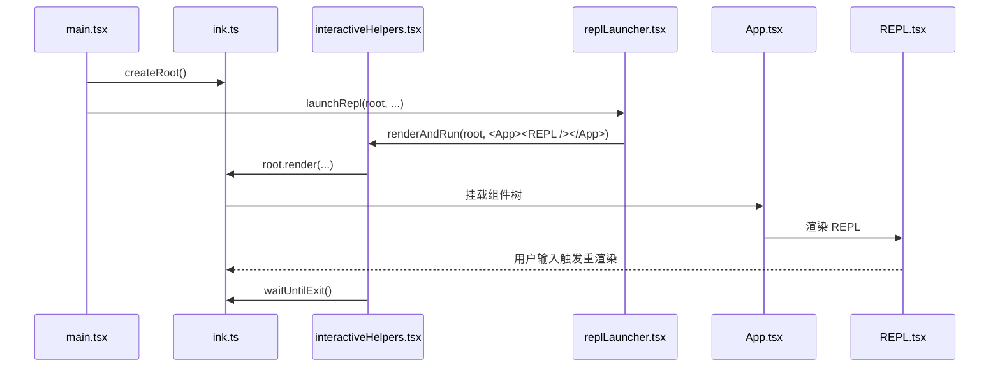

# 07. TUI 渲染与终端运行时

## 概述

这一层负责把“CLI 会话”变成“可显示、可退出、可持续重渲染的终端 React 应用”。它覆盖：

- Ink root 的创建与复用
- 主界面的渲染与退出
- `App` 包装层的挂载位
- `REPL` 在终端里的展示形式

当前实现已经足够支撑最小交互闭环，但复杂 UI 基础设施仍未接入。

## 关键源码

- `src/ink.ts`
- `src/interactiveHelpers.tsx`
- `src/components/App.tsx`
- `src/replLauncher.tsx`
- `src/screens/REPL.tsx`
- `src/utils/handlePromptSubmit.ts`

## 设计原理

### 1. 先抽象 root，再谈组件

`src/ink.ts` 没有直接在各处调用 `ink.render()`，而是先封装 `createRoot()` 与 `render()`。这让终端渲染拥有接近 `react-dom` 的 root 语义：

- 可以先创建实例
- 再多次 `render`
- 最后 `unmount`

### 2. 渲染运行与页面组件分离

`interactiveHelpers.tsx` 负责：

- `renderAndRun()`
- `gracefulShutdown()`
- `exitWithError()`
- `exitWithMessage()`
- `showDialog()`

而真正的页面内容则由 `App` 和 `REPL` 提供。这样运行时控制与界面结构不会混在一起。

### 3. `App` 是未来 Provider 的装配位

`src/components/App.tsx` 当前几乎不做事，只是透传 `children`。但它的存在非常重要，因为它预留了未来的 FPS、统计、应用状态 provider 挂载点。

## 渲染链路



## 实现原理

### 1. `createRoot()`

`src/ink.ts` 中的 `createRoot()` 通过闭包维护 `instance`：

- 第一次 `render` 时调用 `inkRender`
- 后续 `render` 时调用 `instance.rerender`
- `unmount()` 时清空实例
- `waitUntilExit()` 则等待 Ink 生命周期结束

这让上层不必关心底层实例细节。

### 2. `renderAndRun()`

`renderAndRun()` 当前的职责很明确：

1. 调用 `root.render(element)`
2. 等待 `root.waitUntilExit()`
3. 退出前调用 `gracefulShutdown(0)`

也就是说，它是交互模式的统一“渲染并驻留”入口。

### 3. 错误与消息式退出

`exitWithError()` 和 `exitWithMessage()` 的意义在于：

- Ink 开启 `patchConsole` 后，直接 `console.error` 不一定能得到理想输出
- 因此错误更适合先作为 React 节点渲染，再退出

这说明终端 UI 层已经开始考虑“输出方式也属于渲染协议”的问题。

### 4. REPL 视图

`REPL.tsx` 当前的界面结构很直接：

- 标题和提示
- transcript 列表
- 带原始输入回显的处理中提示
- terminal reason
- 输入行与光标

界面本身不复杂，但已经足够承载最小对话闭环。当前这几个 UI 反馈分别由 REPL 提交编排层驱动：`handlePromptSubmit/executeUserInput` 写入处理中输入文本和共享中断控制器，`onQueryEvent` 回写消息，`onQueryImpl` 写入 `lastTerminalReason`，ESC 则先触发中断再退出 REPL。

## 伪代码

```text
1. main.tsx 创建 Ink root
2. replLauncher.tsx 组合 App 和 REPL
3. renderAndRun 把组件树挂到 root
4. REPL 通过本地 state 驱动终端重渲染，并在处理中提示里显示当前输入
5. 若用户按下 ESC，先中断当前查询再退出
6. 用户退出后等待 Ink 生命周期结束
7. 统一执行 gracefulShutdown
```

## 当前边界

### 已落地

- Ink root 抽象
- 交互模式统一渲染入口
- 基础退出与消息式错误输出
- 最小 REPL 终端界面

### 未落地

- App 级 provider 体系
- 更复杂的弹窗、选择器和状态联动 UI
- FPS / stats 等运行指标
- 更完整的优雅关闭清理逻辑

## 设计取舍

### 优点

- 渲染运行时和界面组件职责清晰
- `App` 预留了未来扩展位
- `createRoot()` 让终端渲染接口更接近 React 常见心智模型

### 代价

- 当前 UI 能力仍然很薄
- `gracefulShutdown()` 还没有真正的清理逻辑
- `showDialog()` 已有接口，但实际复杂交互还未接入

## 小结

这一层证明了当前仓库已经不只是“能在终端里跑脚本”，而是已经具备一个最小可重渲染的 TUI 运行时：

- 入口层能创建 root
- 运行时层能托管渲染和退出
- 组件层能显示对话和输入

后续补任何复杂 UI，都应该继续建立在这套 root → helper → App → screen 的结构上。

## 组合使用

- 和 `02-core-interaction-layer.md` 组合，能看清 REPL 为什么能被挂载、重渲染和退出
- 和 `06-session-management-layer.md` 组合，能看清哪些状态属于 UI 本地态
- 和 `01-architecture-and-core-flow.md` 组合，能把 TUI 运行时放回整体分层中理解
