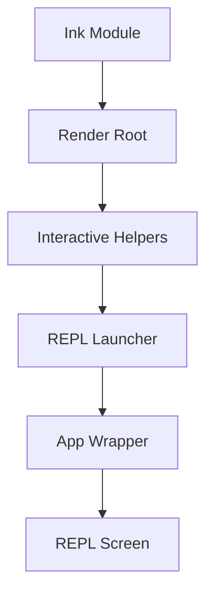

# TUI 渲染层

## Relevant source files
- `src/ink.ts`
- `src/interactiveHelpers.tsx`
- `src/components/App.tsx`
- `src/screens/REPL.tsx`
- `src/replLauncher.tsx`
- `package.json`

## 本页概述

本页只讨论当前仓库里的终端运行时和渲染装配，不讨论查询引擎或工具业务。  
当前实现的重点是把 Ink root、顶层包装组件和 REPL 屏幕连接起来，形成可运行的终端界面。

## 核心结构

代码依据：`ink.ts` 提供 `createRoot()` 与组件导出；`interactiveHelpers.tsx` 提供 `renderAndRun()`；`replLauncher.tsx` 负责把 `App` 与 `REPL` 组合并挂载到 root。

## 关键机制

### 1. `ink.ts` 封装了最小 root API

- `createRoot()` 内部调用 `ink` 的 `render`
- 返回的 `Root` 暴露 `render()`、`unmount()`、`waitUntilExit()`
- 这让上层代码不需要直接操作 Ink 实例细节
- 文件同时二次导出了 `Box`、`Text`、`useApp`、`useInput` 等常用组件和 hooks

### 2. `interactiveHelpers.tsx` 管渲染运行和退出路径

- `renderAndRun(root, element)` 先 `root.render(element)`，再 `await root.waitUntilExit()`
- 结束后调用 `gracefulShutdown(0)`
- `getRenderContext()` 当前只返回 `renderOptions`，其中固定开启 `patchConsole: true`
- `exitWithError()`、`exitWithMessage()` 提供了基于 React 树输出错误消息的退出方式

### 3. `App` 现在是最薄的一层包装组件

- `src/components/App.tsx` 当前几乎只做 `children` 透传
- 文件里已经明确预留了 FPS、统计、AppState 等 provider 的位置
- 这说明顶层包装边界已经搭好，但真正的上下文系统还未补齐

### 4. `replLauncher.tsx` 负责把 UI 树拼起来

- `launchRepl()` 动态导入 `App` 和 `REPL`
- 然后执行 `<App {...appProps}><REPL {...replProps} /></App>`
- 这是交互层和渲染层之间的直接装配点

### 5. REPL 组件本身承担当前终端界面

- `src/screens/REPL.tsx` 使用 `Box` 和 `Text` 组织界面
- 顶部有标题和提示语
- 中间按消息数组逐条渲染 transcript
- 底部显示输入光标、快捷键提示和处理中状态
- `useApp()` 提供 `exit()`，`useInput()` 提供键盘事件接入

## 当前实现边界

- 已实现：Ink root 创建、render/rerender、退出等待、REPL 基础界面、键盘输入接线
- 已实现：渲染辅助函数与文本型错误退出
- 未实现：复杂布局组件、主题系统、状态栏、性能指标面板、完整 provider 树
- 因此当前渲染层的准确定位是“可运行的最小终端壳”

## 设计要点

- 渲染层和交互业务层解耦，业务不直接碰底层 Ink 实例
- `App` 保持极薄，有利于后续逐步补 provider 而不改 REPL 主逻辑
- 当前 UI 价值在于承接代理循环验证，而不是复刻全部终端体验

## 继续阅读

- [02-core-interaction-layer](./02-core-interaction-layer.md)：看输入事件怎样从 REPL 进入 `query()`。
- [06-session-management-layer](./06-session-management-layer.md)：看 REPL 渲染的消息数组由什么数据结构承载。
- [01-architecture-and-core-flow](./01-architecture-and-core-flow.md)：回到全局视角看这一层在整体链路里的位置。
