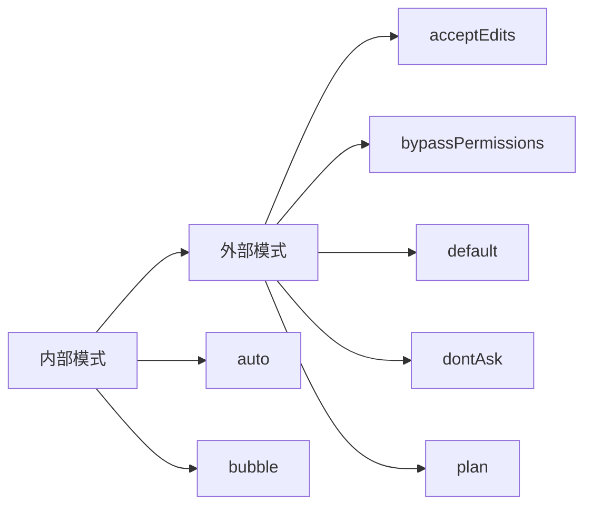
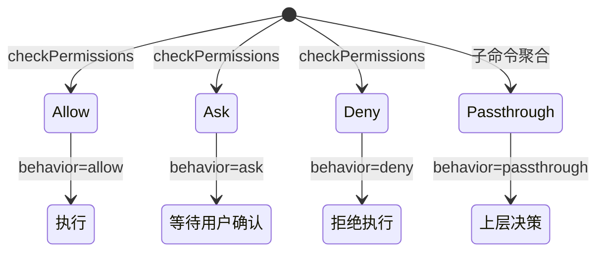

# 08. 权限类型与决策体系

## 概述

这一层定义了工具执行前的权限检查所需的全部类型和运行时逻辑。类型定义独立于实现（`src/types/permissions.ts`），避免循环依赖；运行时逻辑在 `src/utils/permissions/` 实现，包括规则提取、工具匹配和规则字符串解析。

当前已落地类型定义和规则匹配运行时，分类器评估、用户提示等高级能力仍待复刻。`CanUseToolFn` 已从最小签名升级为完整权限检查函数类型，REPL 中默认返回允许。

## 关键源码

- `src/types/permissions.ts` — 权限类型定义（纯类型文件，无运行时依赖）
- `src/utils/permissions/permissions.ts` — 规则提取与工具匹配运行时
- `src/utils/permissions/permissionRuleParser.ts` — 规则字符串解析器（转义/反转义/别名映射）

## 设计原理

### 1. 类型与实现分离

`permissions.ts` 故意只放类型和常量，实现代码在 `src/utils/permissions/`。原因是权限类型被 `Tool.ts`、`ToolUseContext`、消息层等多处引用，若与实现耦合会产生循环依赖。

### 2. 三态决策 + passthrough

权限决策不是简单的 allow/deny 二态，而是 allow/ask/deny 三态 + passthrough 透传：

- **allow** — 直接放行，可附带 updatedInput 修改输入
- **ask** — 需要用户确认，附带询问消息和建议
- **deny** — 拒绝，附带原因
- **passthrough** — 透传到上层决策（用于子命令聚合场景）

### 3. 决策溯源

每个决策都附带 `PermissionDecisionReason`，覆盖 10 种溯源类型，确保权限审计可追溯。

## 权限模式



| 层级 | 模式 | 说明 |
| --- | --- | --- |
| 外部 | `acceptEdits` | 接受所有编辑 |
| 外部 | `bypassPermissions` | 跳过所有权限检查 |
| 外部 | `default` | 默认权限 |
| 外部 | `dontAsk` | 不询问用户 |
| 外部 | `plan` | 计划模式 |
| 内部 | `auto` | 自动模式（TRANSCRIPT_CLASSIFIER feature flag 未实现时不可用） |
| 内部 | `bubble` | 冒泡模式 |

运行时验证集合 `INTERNAL_PERMISSION_MODES` 当前仅包含外部模式，`auto` 待 feature flag 实现后追加。

## 权限决策模型



### PermissionAllowDecision

- `updatedInput?` — 可修改输入（如规范化路径）
- `userModified?` — 标记用户是否手动修改
- `acceptFeedback?` — 用户反馈
- `contentBlocks?` — 附加内容块（如图片）
- `pendingClassifierCheck?` — 待处理分类器检查（非阻塞允许分类器评估）

### PermissionAskDecision

- `message` — 询问消息
- `suggestions?` — 建议的权限更新列表
- `blockedPath?` — 被阻塞的路径
- `isBashSecurityCheckForMisparsing?` — bash 安全检查标记
- `pendingClassifierCheck?` — 分类器可能在用户响应前自动批准
- `contentBlocks?` — 用户粘贴图片反馈时使用

### PermissionDenyDecision

- `message` — 拒绝消息
- `decisionReason` — 必须附带决策原因（不允许无理由拒绝）

### PermissionResult (passthrough)

- 用于子命令聚合：子命令权限决策不独立生效，而是透传到父级统一判定

## 决策溯源

`PermissionDecisionReason` 覆盖 10 种溯源类型：

| 类型 | 用途 | 关键字段 |
| --- | --- | --- |
| `rule` | 权限规则命中 | `rule: PermissionRule` |
| `mode` | 权限模式决定 | `mode: PermissionMode` |
| `subcommandResults` | 子命令结果聚合 | `reasons: Map<string, PermissionResult>` |
| `permissionPromptTool` | 权限提示工具 | `permissionPromptToolName`, `toolResult` |
| `hook` | 钩子拦截 | `hookName`, `hookSource?`, `reason?` |
| `asyncAgent` | 异步代理 | `reason` |
| `sandboxOverride` | 沙箱覆盖 | `reason: 'excludedCommand' \| 'dangerouslyDisableSandbox'` |
| `classifier` | 分类器决策 | `classifier`, `reason` |
| `workingDir` | 工作目录限制 | `reason` |
| `safetyCheck` | 安全检查 | `reason`, `classifierApprovable` |
| `other` | 其他 | `reason` |

其中 `safetyCheck.classifierApprovable` 区分：`true` = 敏感文件路径，分类器可见上下文并决策；`false` = 路径绕过尝试等，不允许分类器覆盖。

## 权限规则体系

### 规则来源

`PermissionRuleSource` 包含 8 种来源：`userSettings`、`projectSettings`、`localSettings`、`flagSettings`、`policySettings`、`cliArg`、`command`、`session`。

### 规则结构

```text
PermissionRule = {
  source: PermissionRuleSource    // 来源
  ruleBehavior: 'allow'|'deny'|'ask'  // 行为
  ruleValue: {
    toolName: string              // 工具名称
    ruleContent?: string          // 规则内容（如路径模式）
  }
}
```

### 按来源分组的规则映射

`ToolPermissionRulesBySource` 为每种来源维护规则列表，用于快速查找。

### 规则来源遍历顺序

`PERMISSION_RULE_SOURCES` 定义 8 种来源的遍历顺序：

```text
userSettings → projectSettings → localSettings → flagSettings → policySettings → cliArg → command → session
```

顺序影响规则优先级：先匹配的规则优先级更高。

### 规则匹配逻辑

`toolMatchesRule(tool, rule)` 实现整个工具级别的匹配：

1. 规则不能有 `ruleContent`（即只匹配 "Bash" 不匹配 "Bash(prefix:*)"）
2. 使用 `getToolNameForPermissionCheck()` 获取工具的权限匹配名（MCP 工具使用 `mcp__server__tool` 全限定名）
3. 直接工具名匹配：`rule.toolName === toolNameForMatch`
4. MCP 服务器级匹配：规则 "mcp__server" 匹配 "mcp__server__tool"，通配符 "mcp__server__*" 同效

### 规则字符串解析

`permissionRuleValueFromString(ruleString)` 解析规则字符串：

| 格式 | 解析结果 |
| --- | --- |
| `"Bash"` | `{ toolName: 'Bash' }` |
| `"Bash(npm install)"` | `{ toolName: 'Bash', ruleContent: 'npm install' }` |
| `"Bash()"` | `{ toolName: 'Bash' }`（空内容视为工具级规则） |
| `"Bash(*)"` | `{ toolName: 'Bash' }`（通配符同空内容） |

**转义规则**：
- 括号需转义：`\(` 和 `\)`
- 转义顺序：先转义反斜杠，再转义括号
- 反转义顺序相反

**旧工具名别名**：
```text
Task → Agent
KillShell → TaskStop
AgentOutputTool → TaskOutput
BashOutputTool → TaskOutput
```

别名映射确保用户持久化的旧规则名仍能匹配到当前规范名。

## 权限更新操作

`PermissionUpdate` 支持 6 种操作：

| 操作 | 说明 |
| --- | --- |
| `addRules` | 添加规则到指定目的地 |
| `replaceRules` | 替换指定目的地的规则 |
| `removeRules` | 从指定目的地移除规则 |
| `setMode` | 设置权限模式 |
| `addDirectories` | 添加额外工作目录 |
| `removeDirectories` | 移除额外工作目录 |

更新目的地 `PermissionUpdateDestination` 包含 5 个位置：`userSettings`、`projectSettings`、`localSettings`、`session`、`cliArg`。

## ToolPermissionContext

权限检查所需完整上下文：

| 字段 | 类型 | 说明 |
| --- | --- | --- |
| `mode` | `PermissionMode` | 当前权限模式 |
| `additionalWorkingDirectories` | `ReadonlyMap<string, AdditionalWorkingDirectory>` | 额外工作目录 |
| `alwaysAllowRules` | `ToolPermissionRulesBySource` | 总是允许的规则 |
| `alwaysDenyRules` | `ToolPermissionRulesBySource` | 总是拒绝的规则 |
| `alwaysAskRules` | `ToolPermissionRulesBySource` | 总是询问的规则 |
| `isBypassPermissionsModeAvailable` | `boolean` | 是否可用绕过权限模式 |
| `strippedDangerousRules?` | `ToolPermissionRulesBySource` | 被剥离的危险规则 |
| `shouldAvoidPermissionPrompts?` | `boolean` | 自动拒绝权限提示（后台代理用） |
| `awaitAutomatedChecksBeforeDialog?` | `boolean` | 等待自动检查后再弹对话框 |
| `prePlanMode?` | `PermissionMode` | 进入 plan 模式前的权限模式（退出时恢复） |

`getEmptyToolPermissionContext()` 提供默认空上下文，`Tool.ts` 中导出。

## 关键数据结构

| 结构 | 位置 | 作用 |
| --- | --- | --- |
| `PermissionMode` | `permissions.ts` | 权限模式（7 种） |
| `PermissionBehavior` | `permissions.ts` | 权限行为（allow/deny/ask） |
| `PermissionRule` | `permissions.ts` | 权限规则（来源+行为+值） |
| `PermissionUpdate` | `permissions.ts` | 权限更新操作（6 种） |
| `PermissionResult` | `permissions.ts` | 权限检查结果（allow/ask/deny/passthrough） |
| `PermissionDecisionReason` | `permissions.ts` | 决策溯源（10 种） |
| `ToolPermissionContext` | `permissions.ts` | 权限检查上下文 |
| `AdditionalWorkingDirectory` | `permissions.ts` | 额外工作目录定义 |
| `PermissionRuleValue` | `permissions.ts` | 规则值（toolName + 可选 ruleContent） |

## 关键运行时函数

| 函数 | 位置 | 作用 |
| --- | --- | --- |
| `getAllowRules(context)` | `permissions.ts` | 从上下文提取所有允许规则 |
| `getDenyRules(context)` | `permissions.ts` | 从上下文提取所有拒绝规则 |
| `getAskRules(context)` | `permissions.ts` | 从上下文提取所有询问规则 |
| `toolMatchesRule(tool, rule)` | `permissions.ts` | 检查工具是否匹配规则 |
| `getDenyRuleForTool(context, tool)` | `permissions.ts` | 获取工具的拒绝规则（供 filterToolsByDenyRules 使用） |
| `getAskRuleForTool(context, tool)` | `permissions.ts` | 获取工具的询问规则 |
| `getDenyRuleForAgent(context, name, type)` | `permissions.ts` | 获取代理类型的拒绝规则 |
| `permissionRuleValueFromString(str)` | `permissionRuleParser.ts` | 解析规则字符串为 PermissionRuleValue |
| `permissionRuleValueToString(value)` | `permissionRuleParser.ts` | 将 PermissionRuleValue 转回字符串 |
| `escapeRuleContent(content)` | `permissionRuleParser.ts` | 转义规则内容中的括号 |
| `unescapeRuleContent(content)` | `permissionRuleParser.ts` | 反转义规则内容 |
| `normalizeLegacyToolName(name)` | `permissionRuleParser.ts` | 旧工具名规范化 |
| `checkReadPermissionForTool(tool, input, context)` | `filesystem.ts` | 只读工具统一权限检查入口 |
| `checkWritePermissionForTool(tool, input, context)` | `filesystem.ts` | 写入工具统一权限检查入口 |
| `matchingRuleForInput(input, context, accessType, ruleType)` | `filesystem.ts` | 匹配输入的权限规则（deny/allow） |
| `matchWildcardPattern(rulePattern, input)` | `shellRuleMatching.ts` | 通配符模式匹配（支持 `*`） |

## 文件系统权限检查

`src/utils/permissions/filesystem.ts` 为文件操作工具提供统一权限检查入口，当前包含读取和写入两个检查函数。

### checkReadPermissionForTool

```text
输入：
  - tool: Pick<Tool, 'name' | 'mcpInfo'>  // 工具标识
  - input: Record<string, unknown>         // 工具输入参数
  - context: ToolPermissionContext         // 权限上下文

输出：
  - PermissionResult { behavior, updatedInput }
```

**当前实现**：简化版，默认返回 `{ behavior: 'allow', updatedInput: input }`

**完整实现路径**（TODO）：
1. 检查 `allowedDirectories` — 路径是否在允许目录内
2. 检查 `deny rules` — 是否命中拒绝规则
3. 返回 allow/ask/deny 决策

**设计意图**：
- 只读工具（Glob、Grep、Read）统一使用此入口
- 与 `Tool.checkPermissions()` 配合，形成完整权限链路
- 为后续目录白名单、拒绝规则检查预留扩展点

### checkWritePermissionForTool

```text
输入：
  - tool: Pick<Tool, 'name' | 'mcpInfo'> & { getPath?(input): string }  // 含路径提取的工具
  - input: Record<string, unknown>           // 工具输入参数
  - context: ToolPermissionContext           // 权限上下文

输出：
  - PermissionDecision { behavior, message? }
```

**当前实现**：
1. 工具无 `getPath` 函数 → 返回 `{ behavior: 'ask' }`（无法确定路径，需用户确认）
2. 有 `getPath` 函数 → 默认返回 `{ behavior: 'allow' }`

**完整实现路径**（TODO）：
1. 检查 `deny rules` — `matchingRuleForInput(path, context, 'edit', 'deny')` 命中则拒绝
2. 检查 `checkEditableInternalPath` — 内部可编辑路径（plan 文件、scratchpad）
3. 检查 `isDangerousFilePathToAutoEdit` — 安全路径（.claude 目录等）
4. 无匹配规则时返回 `{ behavior: 'ask' }`

**设计意图**：
- 写入工具（Edit、Write）统一使用此入口
- deny 规则优先，确保显式拒绝始终生效
- 内部路径和安全路径的自动允许避免频繁弹确认
- `getPath` 前置检查防止无路径信息的工具绕过权限

### matchingRuleForInput

```text
输入：
  - input: string                             // 待检查的输入（通常是文件路径）
  - permissionContext: ToolPermissionContext   // 权限上下文
  - accessType: 'read' | 'write' | 'edit'     // 访问类型
  - ruleType: 'allow' | 'deny'                // 规则类型

输出：
  - PermissionRule | null                      // 匹配的规则，或 null
```

**当前实现**：简化版，始终返回 `null`（无匹配规则）

**完整实现路径**（TODO）：遍历权限规则做模式匹配，结合 `preparePermissionMatcher` 的通配符匹配

**使用方**：
- `FileEditTool.validateInput` — 检查写入 deny 规则
- `FileWriteTool.validateInput` — 检查编辑 deny 规则

## 通配符模式匹配

`src/utils/permissions/shellRuleMatching.ts` 实现权限规则中的通配符匹配。

### matchWildcardPattern

```text
输入：
  - rulePattern: string  // 规则模式（如 "Bash(prefix:*"）
  - input: string        // 待匹配字符串

输出：
  - boolean
```

**当前实现**：仅支持 `*` 通配符，转为 `.*` 正则匹配

**使用场景**：
- `GlobTool.preparePermissionMatcher()` — 支持 `Glob(pattern:*.ts)` 类规则
- 未来扩展到其他工具的规则内容匹配

**实现原理**：
1. 转义正则特殊字符（除 `*` 外）
2. 将 `*` 替换为 `.*`
3. 构建正则并测试匹配

## 设计取舍

### 优点

- 类型与实现分离，打破循环依赖
- 三态 + passthrough 覆盖真实权限决策场景
- 决策溯源保证审计可追溯
- `ToolPermissionContext` 使用 `ReadonlyMap` 保证不可变性
- 规则来源遍历顺序明确，优先级可预测
- 旧工具名别名映射确保向后兼容
- MCP 服务器级权限简化批量配置

### 局限

- 分类器评估、用户提示、hook 执行等高级运行时逻辑未实现
- `auto` 模式受 feature flag 控制暂不可用
- `contentBlocks` 依赖 SDK 类型，当前以 `unknown[]` 占位

## 小结

权限体系已完整定义了从模式、规则、决策到更新的全链路类型，并落地了规则提取、字符串解析和工具匹配运行时。`getDenyRuleForTool()` 已被 `filterToolsByDenyRules()` 使用，实现了工具池组装时的拒绝规则过滤。后续只需补足分类器评估和用户提示逻辑，即可在现有框架上自然运转。

## 组合使用

- 和 `04-tool-execution-layer.md` 组合，能看清 `Tool.checkPermissions()` → `PermissionResult` 的完整调用链
- 和 `06-session-management-layer.md` 组合，能看清 `ToolPermissionContext` 如何被注入到 `ToolUseContext`
