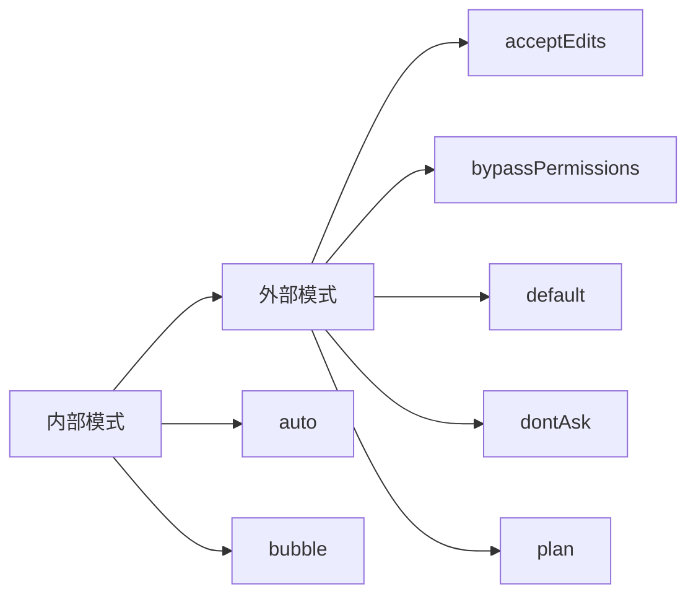
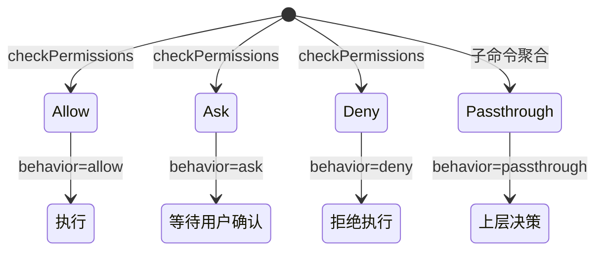

# 08. 权限类型与决策体系

## 概述

这一层定义了工具执行前的权限检查所需的全部类型。它独立于权限运行时实现（`src/utils/permissions/`），仅包含类型定义和常量，目的是打破循环依赖。

当前仅落地类型定义，权限运行时逻辑仍待复刻。

## 关键源码

- `src/types/permissions.ts` — 权限类型定义（纯类型文件，无运行时依赖）

## 设计原理

### 1. 类型与实现分离

`permissions.ts` 故意只放类型和常量，实现代码在 `src/utils/permissions/`。原因是权限类型被 `Tool.ts`、`ToolUseContext`、消息层等多处引用，若与实现耦合会产生循环依赖。

### 2. 三态决策 + passthrough

权限决策不是简单的 allow/deny 二态，而是 allow/ask/deny 三态 + passthrough 透传：

- **allow** — 直接放行，可附带 updatedInput 修改输入
- **ask** — 需要用户确认，附带询问消息和建议
- **deny** — 拒绝，附带原因
- **passthrough** — 透传到上层决策（用于子命令聚合场景）

### 3. 决策溯源

每个决策都附带 `PermissionDecisionReason`，覆盖 10 种溯源类型，确保权限审计可追溯。

## 权限模式



| 层级 | 模式 | 说明 |
| --- | --- | --- |
| 外部 | `acceptEdits` | 接受所有编辑 |
| 外部 | `bypassPermissions` | 跳过所有权限检查 |
| 外部 | `default` | 默认权限 |
| 外部 | `dontAsk` | 不询问用户 |
| 外部 | `plan` | 计划模式 |
| 内部 | `auto` | 自动模式（TRANSCRIPT_CLASSIFIER feature flag 未实现时不可用） |
| 内部 | `bubble` | 冒泡模式 |

运行时验证集合 `INTERNAL_PERMISSION_MODES` 当前仅包含外部模式，`auto` 待 feature flag 实现后追加。

## 权限决策模型



### PermissionAllowDecision

- `updatedInput?` — 可修改输入（如规范化路径）
- `userModified?` — 标记用户是否手动修改
- `acceptFeedback?` — 用户反馈
- `contentBlocks?` — 附加内容块（如图片）
- `pendingClassifierCheck?` — 待处理分类器检查（非阻塞允许分类器评估）

### PermissionAskDecision

- `message` — 询问消息
- `suggestions?` — 建议的权限更新列表
- `blockedPath?` — 被阻塞的路径
- `isBashSecurityCheckForMisparsing?` — bash 安全检查标记
- `pendingClassifierCheck?` — 分类器可能在用户响应前自动批准
- `contentBlocks?` — 用户粘贴图片反馈时使用

### PermissionDenyDecision

- `message` — 拒绝消息
- `decisionReason` — 必须附带决策原因（不允许无理由拒绝）

### PermissionResult (passthrough)

- 用于子命令聚合：子命令权限决策不独立生效，而是透传到父级统一判定

## 决策溯源

`PermissionDecisionReason` 覆盖 10 种溯源类型：

| 类型 | 用途 | 关键字段 |
| --- | --- | --- |
| `rule` | 权限规则命中 | `rule: PermissionRule` |
| `mode` | 权限模式决定 | `mode: PermissionMode` |
| `subcommandResults` | 子命令结果聚合 | `reasons: Map<string, PermissionResult>` |
| `permissionPromptTool` | 权限提示工具 | `permissionPromptToolName`, `toolResult` |
| `hook` | 钩子拦截 | `hookName`, `hookSource?`, `reason?` |
| `asyncAgent` | 异步代理 | `reason` |
| `sandboxOverride` | 沙箱覆盖 | `reason: 'excludedCommand' \| 'dangerouslyDisableSandbox'` |
| `classifier` | 分类器决策 | `classifier`, `reason` |
| `workingDir` | 工作目录限制 | `reason` |
| `safetyCheck` | 安全检查 | `reason`, `classifierApprovable` |
| `other` | 其他 | `reason` |

其中 `safetyCheck.classifierApprovable` 区分：`true` = 敏感文件路径，分类器可见上下文并决策；`false` = 路径绕过尝试等，不允许分类器覆盖。

## 权限规则体系

### 规则来源

`PermissionRuleSource` 包含 8 种来源：`userSettings`、`projectSettings`、`localSettings`、`flagSettings`、`policySettings`、`cliArg`、`command`、`session`。

### 规则结构

```text
PermissionRule = {
  source: PermissionRuleSource    // 来源
  ruleBehavior: 'allow'|'deny'|'ask'  // 行为
  ruleValue: {
    toolName: string              // 工具名称
    ruleContent?: string          // 规则内容（如路径模式）
  }
}
```

### 按来源分组的规则映射

`ToolPermissionRulesBySource` 为每种来源维护规则列表，用于快速查找。

## 权限更新操作

`PermissionUpdate` 支持 6 种操作：

| 操作 | 说明 |
| --- | --- |
| `addRules` | 添加规则到指定目的地 |
| `replaceRules` | 替换指定目的地的规则 |
| `removeRules` | 从指定目的地移除规则 |
| `setMode` | 设置权限模式 |
| `addDirectories` | 添加额外工作目录 |
| `removeDirectories` | 移除额外工作目录 |

更新目的地 `PermissionUpdateDestination` 包含 5 个位置：`userSettings`、`projectSettings`、`localSettings`、`session`、`cliArg`。

## ToolPermissionContext

权限检查所需完整上下文：

| 字段 | 类型 | 说明 |
| --- | --- | --- |
| `mode` | `PermissionMode` | 当前权限模式 |
| `additionalWorkingDirectories` | `ReadonlyMap<string, AdditionalWorkingDirectory>` | 额外工作目录 |
| `alwaysAllowRules` | `ToolPermissionRulesBySource` | 总是允许的规则 |
| `alwaysDenyRules` | `ToolPermissionRulesBySource` | 总是拒绝的规则 |
| `alwaysAskRules` | `ToolPermissionRulesBySource` | 总是询问的规则 |
| `isBypassPermissionsModeAvailable` | `boolean` | 是否可用绕过权限模式 |
| `strippedDangerousRules?` | `ToolPermissionRulesBySource` | 被剥离的危险规则 |
| `shouldAvoidPermissionPrompts?` | `boolean` | 自动拒绝权限提示（后台代理用） |
| `awaitAutomatedChecksBeforeDialog?` | `boolean` | 等待自动检查后再弹对话框 |
| `prePlanMode?` | `PermissionMode` | 进入 plan 模式前的权限模式（退出时恢复） |

`getEmptyToolPermissionContext()` 提供默认空上下文，`Tool.ts` 中导出。

## 关键数据结构

| 结构 | 位置 | 作用 |
| --- | --- | --- |
| `PermissionMode` | `permissions.ts` | 权限模式（7 种） |
| `PermissionBehavior` | `permissions.ts` | 权限行为（allow/deny/ask） |
| `PermissionRule` | `permissions.ts` | 权限规则（来源+行为+值） |
| `PermissionUpdate` | `permissions.ts` | 权限更新操作（6 种） |
| `PermissionResult` | `permissions.ts` | 权限检查结果（allow/ask/deny/passthrough） |
| `PermissionDecisionReason` | `permissions.ts` | 决策溯源（10 种） |
| `ToolPermissionContext` | `permissions.ts` | 权限检查上下文 |
| `AdditionalWorkingDirectory` | `permissions.ts` | 额外工作目录定义 |

## 设计取舍

### 优点

- 类型与实现分离，打破循环依赖
- 三态 + passthrough 覆盖真实权限决策场景
- 决策溯源保证审计可追溯
- `ToolPermissionContext` 使用 `ReadonlyMap` 保证不可变性

### 局限

- 仅落地类型定义，运行时逻辑（规则匹配、分类器评估、用户提示）未实现
- `auto` 模式受 feature flag 控制暂不可用
- `contentBlocks` 依赖 SDK 类型，当前以 `unknown[]` 占位

## 小结

权限类型体系已完整定义了从模式、规则、决策到更新的全链路类型。它为工具执行的 `checkPermissions()` 提供了类型基础，后续只需实现 `src/utils/permissions/` 中的运行时逻辑，即可在现有类型框架上自然运转。

## 组合使用

- 和 `04-tool-execution-layer.md` 组合，能看清 `Tool.checkPermissions()` → `PermissionResult` 的完整调用链
- 和 `06-session-management-layer.md` 组合，能看清 `ToolPermissionContext` 如何被注入到 `ToolUseContext`
