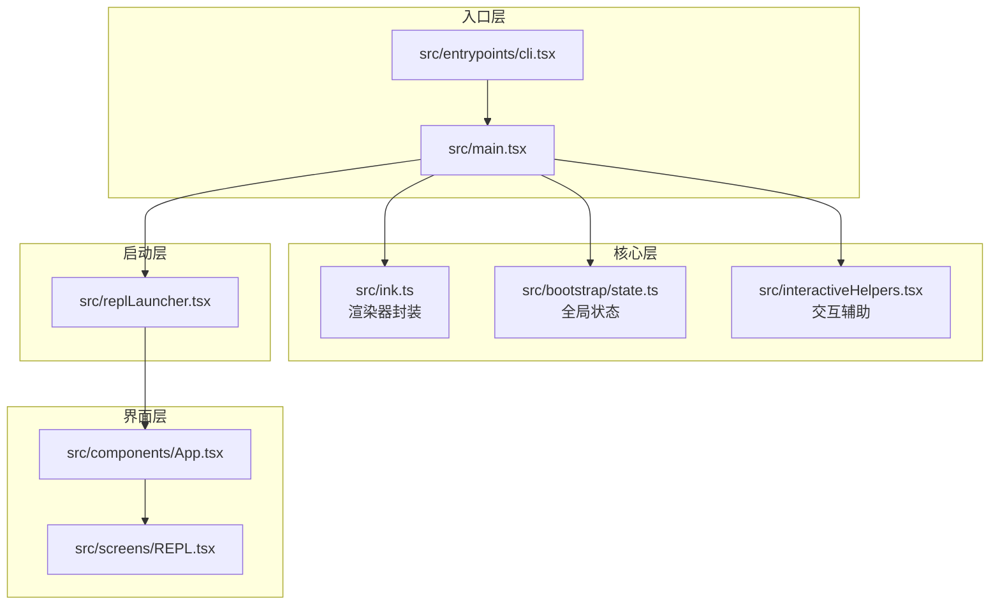
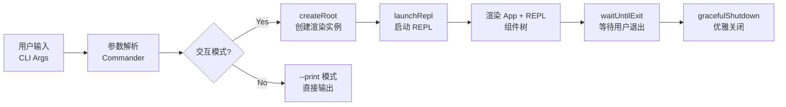

# Ink REPL 渲染框架

## Relevant source files

- `src/ink.ts` — Ink 渲染器封装，createRoot/render API
- `src/bootstrap/state.ts` — 全局状态管理单例
- `src/interactiveHelpers.tsx` — 交互辅助函数（renderAndRun, exitWithError）
- `src/replLauncher.tsx` — REPL 启动器
- `src/components/App.tsx` — 顶层包装组件
- `src/screens/REPL.tsx` — REPL 主界面组件
- `src/main.tsx` — 命令入口与 REPL 启动逻辑

## 概述

Ink REPL 渲染框架是 Claude Code 交互式会话的核心基础设施。它将 React 组件模型引入终端 UI，通过 `createRoot` API 分离实例创建与渲染，使用单例模式管理全局状态（交互模式、工作目录、会话源），并通过 `useInput`/`useApp` hooks 实现键盘事件处理与应用生命周期控制。整个框架以「渲染器 → 状态 → 启动器 → 界面组件」的层次组织，支撑用户输入、消息显示、命令处理等交互能力。

## Architecture and Runtime

### 运行时与构建

| 层级 | 技术 | 说明 |
|------|------|------|
| 运行时 | Node.js 20+ / Bun | ESM 模块格式 |
| UI 框架 | React 18 + Ink v5 | 终端 TUI 渲染 |
| 构建工具 | Bun.build / esbuild | 支持 external 配置 |
| 包管理 | Bun | lockfile 格式 |

### 核心层次



## Technical Foundation

### 1. createRoot API

类似 `react-dom` 的 `createRoot`，分离实例创建与渲染：

```typescript
// src/ink.ts
export async function createRoot(options?: RenderOptions): Promise<Root> {
  await Promise.resolve() // 微任务边界
  let instance: Instance | null = null
  return {
    render: (node) => { instance ??= inkRender(node, options); instance.rerender(node) },
    unmount: () => { instance?.unmount(); instance = null },
    waitUntilExit: () => instance?.waitUntilExit() ?? Promise.resolve(),
  }
}
```

**设计意图**：支持同一 root 被多次 rerender，避免重复创建实例。

### 2. 全局状态单例

使用模块级变量 `STATE` 管理全局状态，避免状态分散：

```typescript
// src/bootstrap/state.ts
const STATE: State = getInitialState()

export function getIsInteractive(): boolean { return STATE.isInteractive }
export function setIsInteractive(value: boolean): void { STATE.isInteractive = value }
```

**关键状态字段**：
- `isInteractive` — 是否交互模式
- `cwd` / `originalCwd` — 工作目录
- `clientType` — 客户端类型
- `sessionSource` — 会话源
- `startTime` — 启动时间

### 3. 微任务边界

在 `createRoot` 和 `render` 中保留 `await Promise.resolve()`：

```typescript
export async function render(node: ReactNode, options?: RenderOptions): Promise<Instance> {
  await Promise.resolve() // 确保异步初始化完成
  return inkRender(node, options)
}
```

**设计意图**：与源码行为一致，确保异步初始化完成后再执行渲染。

### 4. Ink Hooks 集成

| Hook | 来源 | 用途 |
|------|------|------|
| `useInput` | `ink` | 键盘事件处理 |
| `useApp` | `ink` | 应用退出控制 |
| `useStdin` | `ink` | 标准输入访问 |

**导入方式**：ink v5 只暴露主入口，使用命名导入：

```typescript
import { useInput, useApp, Box, Text } from 'ink' // 正确
import { useInput } from 'ink/build/hooks/use-input' // 错误
```

## High-Level System Flow



### 启动流程详解

1. **CLI 入口** (`cli.tsx`) — 快速路径检测（`--version`/`--help`）
2. **主模块** (`main.tsx`) — 参数解析、交互模式检测、创建 Ink root
3. **启动器** (`replLauncher.tsx`) — 动态导入组件，调用 `renderAndRun`
4. **渲染循环** — 用户输入 → 消息列表更新 → re-render

## Key Capabilities

| 能力域 | 关键实体 | 作用 | 代表文件 |
|--------|----------|------|----------|
| 渲染管理 | `createRoot`, `render` | 创建/管理 Ink 渲染实例 | `src/ink.ts` |
| 状态管理 | `STATE` 单例 | 集中管理全局状态 | `src/bootstrap/state.ts` |
| 交互辅助 | `renderAndRun`, `exitWithError` | 渲染主 UI、错误退出 | `src/interactiveHelpers.tsx` |
| 键盘输入 | `useInput` hook | 处理 Enter/Backspace/ESC | `src/screens/REPL.tsx` |
| 应用控制 | `useApp` hook | 控制应用退出 | `src/screens/REPL.tsx` |
| 消息显示 | `messages` state | 用户/助手消息列表 | `src/screens/REPL.tsx` |

## System Integration Map

```
┌─────────────────────────────────────────────────────────────┐
│                      Interface Layer                         │
│  ┌─────────────┐  ┌─────────────┐  ┌─────────────────────┐  │
│  │   REPL.tsx  │  │   App.tsx   │  │ interactiveHelpers  │  │
│  │ (主界面组件) │  │ (顶层包装)  │  │ (对话框/退出辅助)   │  │
│  └─────────────┘  └─────────────┘  └─────────────────────┘  │
└─────────────────────────────────────────────────────────────┘
                              │
                              ▼
┌─────────────────────────────────────────────────────────────┐
│                       Core Layer                             │
│  ┌─────────────┐  ┌─────────────┐  ┌─────────────────────┐  │
│  │   ink.ts    │  │  state.ts   │  │  replLauncher.tsx   │  │
│  │ (渲染器封装) │  │ (全局状态)  │  │ (REPL 启动器)      │  │
│  └─────────────┘  └─────────────┘  └─────────────────────┘  │
└─────────────────────────────────────────────────────────────┘
                              │
                              ▼
┌─────────────────────────────────────────────────────────────┐
│                   Infrastructure Layer                       │
│  ┌─────────────┐  ┌─────────────┐  ┌─────────────────────┐  │
│  │   main.tsx  │  │  cli.tsx    │  │     ink (npm)       │  │
│  │ (命令定义)  │  │ (CLI 入口)  │  │ (React for CLI)    │  │
│  └─────────────┘  └─────────────┘  └─────────────────────┘  │
└─────────────────────────────────────────────────────────────┘
```

## 设计要点

### 1. 快速路径优先

CLI 入口在 import 任何模块前完成快速路径检测：

```typescript
// src/entrypoints/cli.tsx
if (args.includes('--version') || args.includes('-v')) {
  console.log('0.1.0 (Claude Code)')
  process.exit(0)
}
// 之后才 import 模块
```

**收益**：避免不必要的模块加载，`--version` 响应几乎零延迟。

### 2. 动态导入组件

启动器使用动态 import，减少启动时加载：

```typescript
// src/replLauncher.tsx
export async function launchRepl(...) {
  const { App } = await import('./components/App.js')
  const { REPL } = await import('./screens/REPL.js')
  // ...
}
```

### 3. External 配置

构建时将 `ink`、`react` 标记为 external：

```typescript
// build.ts
external: ['ink', 'react', 'react-devtools-core']
```

**原因**：
- ink 内部依赖 `react-devtools-core`，打包会报错
- 运行时从 `node_modules` 加载，保持兼容性

### 4. 状态隔离

`resetStateForTests_ONLY()` 仅用于测试重置状态：

```typescript
export function resetStateForTests_ONLY(): void {
  Object.assign(STATE, getInitialState())
}
```

**约束**：命名明确警告，生产代码禁止调用。

## 代码锚点索引

| 概念 | 文件 | 关键代码位置 |
|------|------|-------------|
| createRoot API | `src/ink.ts` | L40-60 |
| 全局状态定义 | `src/bootstrap/state.ts` | L25-35 |
| 交互模式检测 | `src/main.tsx` | L110-120 |
| 键盘事件处理 | `src/screens/REPL.tsx` | L70-85 |
| 消息状态管理 | `src/screens/REPL.tsx` | L45-50 |
| 渲染并等待退出 | `src/interactiveHelpers.tsx` | L25-35 |
| 优雅关闭 | `src/interactiveHelpers.tsx` | L40-50 |

## 复刻进度

| 阶段 | 状态 | 说明 |
|------|------|------|
| CLI 入口与快速路径 | ✅ 完成 | `--version`/`--help` 零加载 |
| Ink 渲染框架 | ✅ 完成 | createRoot/render API |
| 全局状态管理 | ✅ 完成 | 单例模式 |
| REPL 主界面 | ⚠️ 基础完成 | 输入处理、消息显示 |
| LLM 集成 | 📋 待实现 | TODO 占位响应 |
| 上下文提供者 | 📋 待实现 | FpsMetrics, Stats, AppState |
| MCP 连接管理 | 📋 待实现 | 会话清理 |

## 继续阅读

- **CLI 入口设计** — 快速路径、零模块加载原则（参考 `notes/daily/2026-04-05.md`）
- **消息类型系统** — Message、Tool 类型定义（下一步实现）
- **工具系统** — Tool 注册与执行框架（计划中）

---

*本文档基于 2026-04-05 ~ 2026-04-06 源码复刻记录整理，遵循 DeepWiki 风格。*
