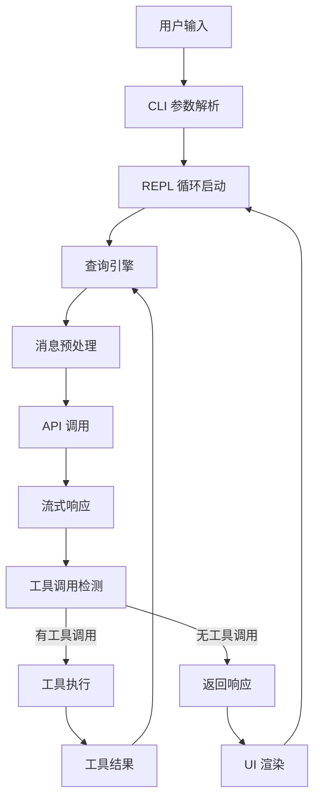

# Claude Code Annotated - 源码文档总览

## Relevant source files

- `src/main.tsx` - CLI 主入口，命令行参数解析，REPL 启动
- `src/query.ts` - 代理循环核心，查询引擎主流程
- `src/Tool.ts` - 工具系统类型定义，执行上下文
- `src/types/index.ts` - 核心类型定义体系
- `src/bootstrap/state.ts` - 全局状态管理
- `src/entrypoints/cli.tsx` - CLI 入口点
- `package.json` - 项目配置与依赖

## 项目概述

Claude Code Annotated 是一个交互式 AI 编码助手终端工具的源码复刻项目。它基于 Anthropic Claude API，使用 TypeScript + Bun + Ink 构建，提供命令行交互界面和 REPL 循环机制。项目通过 Agent Loop 模式实现用户与 AI 的持续对话，支持工具调用、权限控制、会话管理等核心能力。

## Architecture and Runtime

### 运行时与构建

- **运行时**: Bun >= 1.2.0 (高性能 TypeScript/JavaScript 运行时)
- **构建工具**: Bun.build (宏替换、打包优化)
- **UI 框架**: Ink 5.0+ (React-based terminal UI)
- **包管理**: Bun lockfile

### 仓库组织

项目采用单体仓库结构，核心代码位于 `src/` 目录：

```
src/
├── entrypoints/    # 入口点 (CLI)
├── bootstrap/      # 启动状态初始化
├── types/          # 类型定义
├── query/          # 查询引擎
├── components/     # Ink UI 组件
├── screens/        # REPL 屏幕
├── hooks/          # React Hooks
├── constants/      # 常量定义
└── utils/          # 工具函数
```

### 系统分层

```text
┌─────────────────────────────────────────┐
│         TUI 渲染层 (Ink)                │
├─────────────────────────────────────────┤
│       核心交互层 (REPL + CLI)            │
├─────────────────────────────────────────┤
│      查询引擎层 (Query Engine)           │
├─────────────────────────────────────────┤
│      工具执行层 (Tool System)            │
├─────────────────────────────────────────┤
│     API 客户端层 (Anthropic SDK)         │
├─────────────────────────────────────────┤
│     会话管理层 (Session + State)         │
└─────────────────────────────────────────┘
```

## Technical Foundation

### 1. Agent Loop 模式

查询引擎采用无限循环 (`while(true)`) 实现 Agent Loop，通过 `yield` 流式输出中间状态，通过 `return` 返回终止状态。这是系统的核心执行模型。

### 2. 状态管理机制

- **State 类型**: 跨迭代可变状态，包含消息历史、工具上下文、追踪数据等
- **Bootstrap State**: 启动时初始化的全局状态，通过 `getAppState/setAppState` 访问
- **ToolUseContext**: 工具执行上下文，包含权限、配置、回调等完整信息

### 3. 类型驱动设计

项目采用严格的 TypeScript 类型定义，核心类型包括：
- `Message` - 消息类型（用户、助手、工具结果等）
- `ToolUseContext` - 工具执行上下文
- `QueryParams` - 查询参数
- `State` - 循环状态

### 4. 宏注入机制

Bun.build 通过 `define` 选项在构建时注入版本号等常量：
```typescript
declare const MACRO: { VERSION: string }
```

### 5. 流式响应处理

API 调用采用流式响应，通过 `AsyncGenerator` 逐步 yield 中间事件，支持实时反馈。

### 6. 权限控制模型

工具执行前需通过 `canUseTool` 检查，支持交互式确认和自动批准模式。

## High-Level System Flow



### 主链路说明

1. **入口**: `src/main.tsx` 定义 CLI 命令，解析参数
2. **启动**: `launchRepl()` 创建 Ink root，启动 REPL 循环
3. **查询**: `query()` 生成器函数执行 Agent Loop
4. **API**: 调用 Anthropic API 获取 AI 响应
5. **工具**: 检测 `tool_use` blocks，执行对应工具
6. **循环**: 将工具结果追加到消息历史，继续下一轮查询
7. **输出**: 流式输出到终端 UI

## Key Capabilities

| 能力域 | 关键实体 | 作用 | 代表文件 |
|--------|----------|------|----------|
| 核心交互 | main, REPL, CLI | 处理用户输入，管理会话循环 | `src/main.tsx`, `src/replLauncher.tsx` |
| 查询引擎 | query, State, queryLoop | Agent Loop 主流程，状态管理 | `src/query.ts`, `src/query/transitions.ts` |
| 工具执行 | ToolUseContext, tools | 工具注册、调度、执行 | `src/Tool.ts` |
| 消息处理 | Message, AssistantMessage | 消息类型定义、规范化 | `src/types/message.ts` |
| 类型系统 | QueryParams, State | 核心类型定义 | `src/types/index.ts` |
| 状态管理 | bootstrap/state | 全局状态初始化与访问 | `src/bootstrap/state.ts` |
| UI 渲染 | Ink, App component | 终端 UI 渲染 | `src/components/App.tsx`, `src/ink.ts` |

## System Integration Map

### Interface Layer (界面层)

- **CLI 入口**: `src/entrypoints/cli.tsx`
- **REPL 屏幕**: `src/screens/REPL.tsx`
- **Ink 组件**: `src/components/App.tsx`
- **交互助手**: `src/interactiveHelpers.tsx`

### Core Layer (核心层)

- **查询引擎**: `src/query.ts`, `src/query/`
- **工具系统**: `src/Tool.ts`
- **状态管理**: `src/bootstrap/state.ts`
- **REPL 启动**: `src/replLauncher.tsx`

### Type System (类型层)

- **核心类型**: `src/types/index.ts`
- **消息类型**: `src/types/message.ts`
- **ID 类型**: `src/types/ids.ts`
- **工具类型**: `src/types/tools.ts`

### Infrastructure Layer (基础设施层)

- **常量定义**: `src/constants/`
- **工具函数**: `src/utils/`
- **React Hooks**: `src/hooks/`

### External Dependencies (外部依赖)

- **Anthropic SDK**: `@anthropic-ai/sdk` - API 客户端
- **Commander**: `@commander-js/extra-typings` - CLI 框架
- **Ink**: `ink` + `react` - Terminal UI

## Wiki Navigation

- [01-architecture-and-core-flow](./01-architecture-and-core-flow.md) - 深入理解系统架构与核心执行流程
- [02-core-interaction-layer](./02-core-interaction-layer.md) - CLI、REPL、命令解析等交互层机制
- [03-query-engine-layer](./03-query-engine-layer.md) - Agent Loop、状态管理、消息预处理核心逻辑
- [04-tool-execution-layer](./04-tool-execution-layer.md) - 工具注册、调度、执行与结果收集
- [05-api-client-layer](./05-api-client-layer.md) - API 调用、流式处理、错误恢复机制
- [06-session-management-layer](./06-session-management-layer.md) - 会话持久化、历史管理、配置系统
- [07-tui-rendering-layer](./07-tui-rendering-layer.md) - Ink 组件、交互反馈、样式主题
