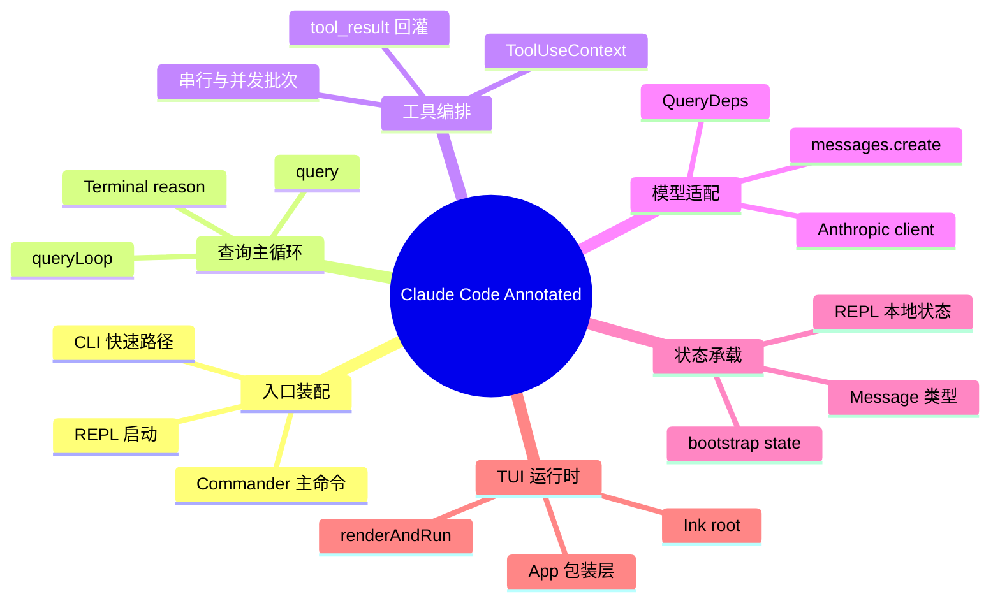

# Claude Code Annotated 源码总览

## 项目定位

`claude-code-annotated` 是一个围绕 Claude Code 主链路做源码复刻与注释化沉淀的 Bun + TypeScript 工程。当前仓库已经打通最小交互闭环：CLI 启动后进入 Ink 驱动的 REPL，用户输入先经过 REPL 提交编排层，再进入 `query()` 代理循环；模型响应若包含 `tool_use` 则进入工具编排层，再把 `tool_result` 回灌到下一轮。

阅读这套文档时，建议先看本页建立目录地图，再看 `01-architecture-and-core-flow.md` 建立分层认知，最后按能力域阅读 02-07 专题页。

## 仓库组织

- 单包工程，核心源码集中在 `src/`
- 构建脚本是 `build.ts`，打包入口是 `src/entrypoints/cli.tsx`
- 运行依赖以 `@commander-js/extra-typings`、`ink`、`react`、`@anthropic-ai/sdk` 为主
- `notes/reviews/` 只沉淀当前仓库已经被源码证明的能力，不把上游完整特性提前写成已实现

## 目录地图

```text
.
├── src/
│   ├── bootstrap/
│   │   └── state.ts
│   ├── components/
│   │   └── App.tsx
│   ├── constants/
│   │   └── querySource.ts
│   ├── entrypoints/
│   │   └── cli.tsx
│   ├── hooks/
│   │   └── useCanUseTool.ts
│   ├── query/
│   │   ├── deps.ts
│   │   └── transitions.ts
│   ├── screens/
│   │   └── REPL.tsx
│   ├── services/
│   │   ├── api/
│   │   │   ├── claude.ts
│   │   │   └── client.ts
│   │   └── tools/
│   │       ├── toolExecution.ts
│   │       └── toolOrchestration.ts
│   ├── types/
│   │   ├── global.d.ts
│   │   ├── ids.ts
│   │   ├── index.ts
│   │   ├── message.ts
│   │   ├── tools.ts
│   │   └── utils.ts
│   ├── utils/
│   │   ├── generators.ts
│   │   └── systemPromptType.ts
│   ├── Tool.ts
│   ├── ink.ts
│   ├── interactiveHelpers.tsx
│   ├── main.tsx
│   ├── query.ts
│   └── replLauncher.tsx
├── build.ts
├── bun.lock
├── package.json
└── tsconfig.json
```

## 目录职责

| 路径 | 作用 | 下一步读哪里 |
| --- | --- | --- |
| `src/entrypoints/cli.tsx` | CLI 快速路径与主模块动态导入入口 | `src/main.tsx` |
| `src/main.tsx` | Commander 主命令、参数定义、Ink root 创建、REPL 启动 | `src/replLauncher.tsx`、`src/screens/REPL.tsx` |
| `src/screens/REPL.tsx` | 输入采集、消息展示、提交编排层与 `query()` 接线 | `src/query.ts` |
| `src/query.ts` | 代理主循环、模型调用、工具分支与终止判断 | `src/query/deps.ts`、`src/services/tools/` |
| `src/services/api/` | 模型请求归一化、Anthropic 客户端与最小 API 适配 | `src/services/api/claude.ts` |
| `src/services/tools/` | `tool_use` 分批、串并行调度与结果回传 | `src/services/tools/toolOrchestration.ts` |
| `src/bootstrap/state.ts` | 进程级状态，如交互模式、cwd、session source | `src/types/message.ts` |
| `src/ink.ts` / `src/interactiveHelpers.tsx` | TUI root/render 抽象、退出与消息式收尾 | `src/components/App.tsx` |

## 源码阅读入口

### 1. 想先看程序怎么跑起来

先读：

1. `package.json`
2. `build.ts`
3. `src/entrypoints/cli.tsx`
4. `src/main.tsx`

这条路径先回答“命令从哪里进来、如何创建交互环境、最终为什么会进入 REPL”。

### 2. 想看用户输入如何进入代理循环

先读：

1. `src/screens/REPL.tsx`
2. `src/query.ts`
3. `src/query/deps.ts`

这条路径回答“消息怎样先进入提交编排层、怎样被追加到 transcript、模型调用怎样发生、什么时候进入下一轮”。

### 3. 想看工具调用怎样被处理

先读：

1. `src/Tool.ts`
2. `src/services/tools/toolOrchestration.ts`
3. `src/services/tools/toolExecution.ts`

这条路径回答“工具如何被匹配、如何按并发安全性切批、为什么当前返回的是 stub `tool_result`”。

### 4. 想看模型适配与状态边界

先读：

1. `src/services/api/client.ts`
2. `src/services/api/claude.ts`
3. `src/bootstrap/state.ts`
4. `src/types/message.ts`

这条路径回答“查询层如何和 Anthropic SDK 解耦、消息形态如何统一、状态分别落在哪一层”。

## 当前稳定能力域



## 当前实现边界

- 已实现的是最小主链路，不是完整 Claude Code 全量能力
- `query.ts` 保留了大量 TODO，占位于压缩、token budget、stop hooks、fallback 等增强能力
- 工具系统已具备类型边界、批次调度和结果回传框架，但单工具真实执行仍未落地
- `App.tsx`、`query/transitions.ts`、`constants/querySource.ts`、`types/tools.ts` 仍以占位实现为主
- 文档结论只以当前仓库源码为准，不把目标仓库里尚未复刻的能力写进现状

## 文档导航

- `01-architecture-and-core-flow.md`：看整体分层、核心协作关系和阅读顺序
- `02-core-interaction-layer.md`：看 CLI、Commander、REPL 怎样接出最小交互闭环
- `03-query-engine-layer.md`：看 `queryLoop` 怎样推进一轮代理回合
- `04-tool-execution-layer.md`：看 `tool_use` 怎样分批、调度、回传 `tool_result`
- `05-api-client-layer.md`：看查询层怎样通过 `QueryDeps` 进入 Anthropic API 适配层
- `06-session-management-layer.md`：看进程态、查询态、消息态和 REPL 本地态如何分工
- `07-tui-rendering-layer.md`：看 Ink root、渲染辅助和终端界面如何装配
