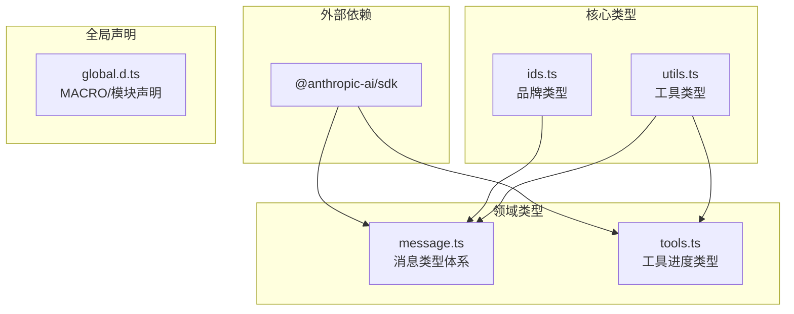
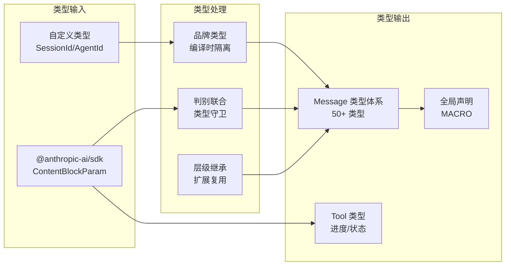

# TypeScript 类型系统设计

## Relevant source files

- `src/types/ids.ts` — 品牌类型定义（SessionId/AgentId）
- `src/types/message.ts` — 消息类型体系（50+ 类型）
- `src/types/tools.ts` — 工具进度类型
- `src/types/utils.ts` — 通用工具类型
- `src/types/global.d.ts` — 全局声明（MACRO 命名空间）
- `src/types/index.ts` — 统一导出入口

## 概述

Claude Code 的类型系统是整个项目的基础设施，采用 TypeScript 高级类型模式构建。核心设计包括：品牌类型（Branded Type）实现名义类型，判别联合（Discriminated Union）实现类型守卫，层级继承实现 Message 类型体系，全局声明文件支持构建时常量注入。整个类型系统遵循「编译时安全 + 零运行时开销」原则，为后续工具系统、消息处理、状态管理等模块提供类型基础。

## Architecture and Runtime

### 类型系统层次

```
src/types/
│
├── index.ts          ← 统一导出入口
│   └── re-export from ids, message, tools, utils
│
├── global.d.ts       ← 全局声明（无需导入）
│   ├── MACRO 命名空间（构建时常量）
│   ├── 内部标识符（Anthropic 内部）
│   └── 模块声明（.md/.txt/.html/.css）
│
├── ids.ts            ← ID 品牌类型
│   ├── SessionId     会话 ID
│   └── AgentId       代理 ID
│
├── message.ts        ← 消息类型体系
│   ├── Message       基础消息
│   ├── UserMessage   用户消息
│   ├── AssistantMessage  助手消息
│   └── ... 50+ 类型
│
├── tools.ts          ← 工具进度类型
│   └── ToolProgressData
│
└── utils.ts          ← 工具类型
    ├── DeepImmutable<T>
    └── Permutations<T>
```

### 类型依赖关系



## Technical Foundation

### 1. 品牌类型（Branded Type）

使用交叉类型创建名义类型，实现编译时 ID 类型隔离：

```typescript
// src/types/ids.ts
export type SessionId = string & { readonly __brand: 'SessionId' }
export type AgentId = string & { readonly __brand: 'AgentId' }

// 设计原因：使用品牌类型在编译时防止 ID 混用
// 这是一个纯类型层面的设计，不引入运行时开销
```

**核心特性**：
- `& { readonly __brand: '...' }` 创建品牌标记
- 编译时检查，防止 `SessionId` 和 `AgentId` 混用
- 零运行时开销，品牌标记在编译后消失

**验证函数**：

```typescript
// 对齐上游实现：使用正则验证 AgentId 格式
const AGENT_ID_REGEX = /^agent_[a-zA-Z0-9]{24}$/

export function toAgentId(id: string): AgentId | Error {
  if (!AGENT_ID_REGEX.test(id)) {
    return new Error(`Invalid agent ID: ${id}`)
  }
  return id as AgentId
}
```

### 2. 判别联合（Discriminated Union）

使用 `type` 字段作为判别式，实现类型守卫：

```typescript
// src/types/message.ts
export type Message =
  | UserMessage
  | AssistantMessage
  | SystemMessage
  | ResultMessage

export interface UserMessage {
  type: 'user'  // 判别式
  content: ContentItem[]
  // ...
}

export interface AssistantMessage {
  type: 'assistant'  // 判别式
  content: ContentBlock[]
  // ...
}
```

**使用方式**：

```typescript
function handleMessage(msg: Message) {
  switch (msg.type) {
    case 'user':
      // TypeScript 自动推断 msg 为 UserMessage
      console.log(msg.content) // ContentItem[]
      break
    case 'assistant':
      // TypeScript 自动推断 msg 为 AssistantMessage
      console.log(msg.content) // ContentBlock[]
      break
  }
}
```

### 3. 层级继承设计

Message 类型采用「基类型 → 子类型」层级设计：

```typescript
// 基础消息接口
export interface MessageBase {
  type: MessageType
  role: MessageRole
  content: unknown
  [key: string]: unknown  // 边界处理：允许未知字段
}

// 用户消息（继承基类型）
export interface UserMessage extends MessageBase {
  type: 'user'
  role: 'user'
  content: ContentItem[]
}
```

### 4. 全局声明文件

`global.d.ts` 提供无需导入的全局类型：

```typescript
// MACRO 命名空间 — 构建时常量注入
declare namespace MACRO {
  const VERSION: string
  const ANTHROPIC_PACKAGE_DIR: string
  const IS_INTERNAL: boolean
}

// 模块声明 — 支持非 JS 文件作为字符串导入
declare module '*.md' {
  const content: string
  export default content
}
```

**设计意图**：
- MACRO 命名空间：构建工具（如 esbuild）在编译时替换常量
- 模块声明：支持 `.md`、`.txt`、`.html`、`.css` 作为字符串导入
- 内部标识符：Anthropic 内部功能标记，dead-code eliminated

### 5. 工具类型

通用工具类型增强类型安全性：

```typescript
// src/types/utils.ts

// 深度不可变类型
export type DeepImmutable<T> = {
  readonly [K in keyof T]: T[K] extends Function
    ? T[K]
    : DeepImmutable<T[K]>
}

// 排列组合类型
export type Permutations<T extends string> =
  T extends infer U ? (U extends any ? [U, ...Permutations<Exclude<T, U>>] : never) : never
```

## High-Level System Flow



### 类型使用流程

1. **入口导入** — 从 `src/types/index.ts` 统一导入
2. **品牌验证** — 使用 `toAgentId()` 验证 ID 格式
3. **类型守卫** — 使用 `switch (msg.type)` 区分消息类型
4. **字段访问** — TypeScript 自动推断可用字段

## Key Capabilities

| 能力域 | 关键实体 | 作用 | 代表文件 |
|--------|----------|------|----------|
| ID 类型安全 | `SessionId`, `AgentId` | 编译时防止 ID 混用 | `src/types/ids.ts` |
| 消息类型体系 | `Message`, `UserMessage`, ... | 统一消息类型定义 | `src/types/message.ts` |
| 判别联合 | `type` 字段 | 类型守卫与自动推断 | `src/types/message.ts` |
| 全局声明 | `MACRO`, 模块声明 | 构建时常量、文件导入 | `src/types/global.d.ts` |
| 工具类型 | `DeepImmutable` | 深度只读约束 | `src/types/utils.ts` |

## System Integration Map

```
┌─────────────────────────────────────────────────────────────┐
│                    External Dependencies                     │
│  ┌─────────────────────────────────────────────────────┐   │
│  │           @anthropic-ai/sdk                          │   │
│  │  ContentBlockParam, ContentBlock, BetaUsage, ...    │   │
│  └─────────────────────────────────────────────────────┘   │
└─────────────────────────────────────────────────────────────┘
                              │
                              ▼
┌─────────────────────────────────────────────────────────────┐
│                       Core Types                             │
│  ┌─────────────┐  ┌─────────────┐  ┌─────────────────────┐  │
│  │   ids.ts    │  │  utils.ts   │  │    global.d.ts      │  │
│  │ (品牌类型)  │  │ (工具类型)  │  │ (全局声明)          │  │
│  └─────────────┘  └─────────────┘  └─────────────────────┘  │
└─────────────────────────────────────────────────────────────┘
                              │
                              ▼
┌─────────────────────────────────────────────────────────────┐
│                      Domain Types                            │
│  ┌─────────────┐  ┌─────────────┐  ┌─────────────────────┐  │
│  │ message.ts  │  │  tools.ts   │  │     index.ts        │  │
│  │ (消息体系)  │  │ (工具类型)  │  │ (统一导出)          │  │
│  └─────────────┘  └─────────────┘  └─────────────────────┘  │
└─────────────────────────────────────────────────────────────┘
                              │
                              ▼
┌─────────────────────────────────────────────────────────────┐
│                    Consumer Modules                          │
│  ┌─────────────┐  ┌─────────────┐  ┌─────────────────────┐  │
│  │  REPL.tsx   │  │  tools/*    │  │   services/*        │  │
│  │ (消息显示)  │  │ (工具执行)  │  │ (消息处理)          │  │
│  └─────────────┘  └─────────────┘  └─────────────────────┘  │
└─────────────────────────────────────────────────────────────┘
```

## 设计要点

### 1. 编译时安全原则

所有类型设计遵循「编译时安全 + 零运行时开销」：

```typescript
// 品牌类型：纯编译时，无运行时验证
type SessionId = string & { readonly __brand: 'SessionId' }

// 运行时验证仅在边界进行
function toAgentId(id: string): AgentId | Error {
  if (!AGENT_ID_REGEX.test(id)) {
    return new Error(`Invalid agent ID: ${id}`)
  }
  return id as AgentId
}
```

### 2. 开放类型扩展

使用 `[key: string]: unknown` 允许未知字段：

```typescript
// 边界处理：允许未知字段，保持与上游行为一致
export interface MessageBase {
  type: MessageType
  role: MessageRole
  content: unknown
  [key: string]: unknown
}
```

**设计意图**：上游 API 可能添加新字段，保持类型兼容性。

### 3. 判别式命名约定

判别式字段统一使用 `type`：

```typescript
// 统一使用 type 字段作为判别式
export interface UserMessage {
  type: 'user'  // ✅ 正确
  // kind: 'user'  // ❌ 避免
}
```

### 4. 导出结构

```typescript
// src/types/index.ts
export type { SessionId, AgentId, toAgentId } from './ids.js'
export type { Message, UserMessage, ... } from './message.js'
export type { ToolProgressData, ... } from './tools.js'
export type { DeepImmutable, Permutations } from './utils.js'
```

## 代码锚点索引

| 概念 | 文件 | 关键代码位置 |
|------|------|-------------|
| 品牌类型定义 | `src/types/ids.ts` | L10-20 |
| AgentId 验证函数 | `src/types/ids.ts` | L25-35 |
| Message 判别联合 | `src/types/message.ts` | L80-95 |
| UserMessage 定义 | `src/types/message.ts` | L100-120 |
| MACRO 命名空间 | `src/types/global.d.ts` | L15-30 |
| 模块声明 | `src/types/global.d.ts` | L60-80 |
| DeepImmutable | `src/types/utils.ts` | L5-12 |
| 统一导出 | `src/types/index.ts` | L10-40 |

## 复刻进度

| 类型模块 | 状态 | 说明 |
|----------|------|------|
| 品牌类型 | ✅ 完成 | SessionId/AgentId |
| Message 类型体系 | ✅ 完成 | 50+ 类型 |
| 工具进度类型 | ⚠️ Stub | 待实现完整工具系统 |
| 工具类型 | ✅ 完成 | DeepImmutable/Permutations |
| 全局声明 | ✅ 完成 | MACRO/模块声明 |
| Hook 类型 | 📋 待实现 | 计划中 |
| Permission 类型 | 📋 待实现 | 计划中 |

## 学习要点

### TypeScript 高级类型模式

1. **品牌类型** — 实现名义类型，编译时隔离
2. **判别联合** — 使用 `type` 字段作为判别式
3. **层级继承** — 基类型 → 子类型的扩展设计
4. **全局声明** — `.d.ts` 文件的正确使用方式
5. **工具类型** — 深度不可变、排列组合等高级模式

### Anthropic SDK 集成

| SDK 类型 | 用途 |
|----------|------|
| `ContentBlockParam` | 用户输入内容块 |
| `ContentBlock` | 助手响应内容块 |
| `BetaUsage` | API 使用量统计 |
| `ImageBlockParam` | 图像内容块 |

## 继续阅读

- **Ink REPL 框架** — 消息如何渲染到终端界面
- **工具系统** — Tool 类型与工具执行流程（计划中）
- **权限系统** — Permission 类型与安全机制（计划中）

---

*本文档基于 2026-04-07 源码复刻记录整理，遵循 DeepWiki 风格。*
